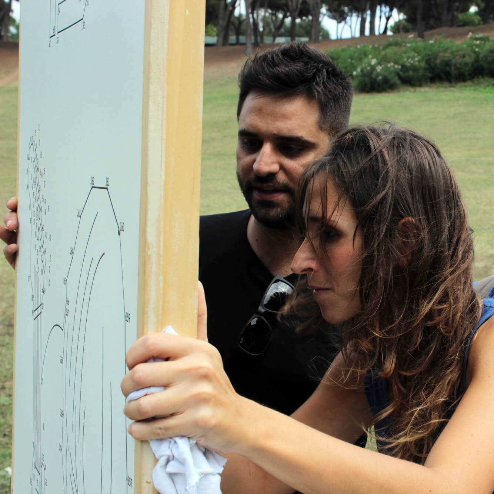

**Francesca Andreone** e **Angelo Perna** hanno un chiodo fisso: il restauro e riciclo creativo.
Gli intervistati di questa settimana amano l'arte, la grafica e il design. Insieme formano il team di Our Design Concept, una realtà che opera nel mondo del restauro e riciclo, ma con stile.

Pensate che il design dei vostri arredi e oggetti di casa non rispecchi del tutto il vostro modo di essere? E allora _no panic_, personalizzatelo!
Francesca e Angelo progettano da zero e trasformano gli spazi. Ecco che gli oggetti di casa, magicamente, assumono nuove funzionalità!

### Ciao, ragazzi! Perché dar vita a una realtà di restauro e riciclo creativo?

> Ciao, Anna! _Our Design Concept_ nasce dalla passione per l'arte, per la creatività e per il fai da te. Sono questi gli elementi che hanno dato vita a questo progetto.

### Il vostro motto è _Your Dream: Our Design_: in cosa consiste il vostro lavoro, e secondo quali fasi di sviluppo?

> Vogliamo trasformare un'idea o un desiderio in realtà. Non vuole essere lo spot di una banca, è davvero il modo di rendere concreto quello che è solo un pensiero.

> **Valutiamo i vecchi mobili con un occhio differente**, pensandoli in una veste nuova o ricollocandoli in un ambiente diverso rispetto a quello originale. Ci occupiamo, per l'appunto, di restauro e riciclo creativo.
>
> Dalla progettazione alla realizzazione, ogni lavoro si sviluppa in più fasi successive al sopralluogo. C'è una fase di **studio** per comprendere i materiali e le tecniche migliori da utilizzare. Poi subentra la seconda fase, quella di **elaborazione grafica**, che valuta la miglior possibiltà di realizzazione. La terza è la fase di **preparazione dei materiali** e la quarta, infine, è quella di **realizzazione del progetto**. In ultimo, ma non certo in fatto di importanza, troviamo la **messa in opera**.
>
> Questo modo di concepire ogni progetto, realizzato sempre a mano, rende il nostro prodotto finale unico e originale.

### Qual è il lato green del vostro restauro e riciclo creativo? In che modo può essere definito ecofriendly?

> Il lato green riguarda sicuramente il restauro e riciclo creativo di **mobili fermi o abbandonati, inutilizzati o dimenticati**. Usando legno già esistente si evitano davvero molti sprechi.

### Su quali oggetti lavorate e in che modo li personalizzate?

> **Lavoriamo su qualsiasi tipo di oggetto**, personalizzandolo ogni volta con tecniche diverse in base alle esigenze o alle richieste.

### È giunto il momento di salutarci. Prima, però, vorrei conoscere i vostri programmi futuri. Quali saranno?

> Stiamo portando avanti la progettazione e la creazione di **una nostra linea di prodotti di design**. Incrociamo le dita!
