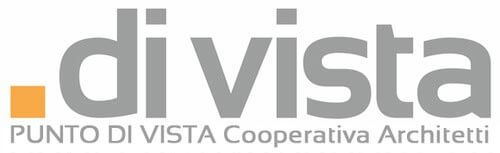
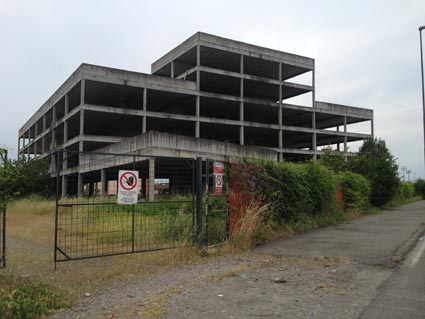
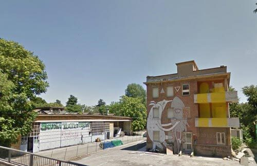
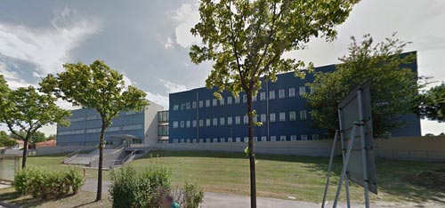

Si sente sempre parlare di come riutilizzare un prodotto, un tessuto, oppure di come differenziare i rifiuti selezionandoli a seconda del materiale.

Il tema della raccolta dei rifiuti è, senza dubbio, un argomento di estrema attualità ed è bene che entri a far parte sempre di più del nostro *modus vivendi* quotidiano.

E per quanto riguarda un centro abitato? È possibile, ad esempio, riciclare una città? Ci avete mai pensato?

Bene, la risposta a questa domanda è "Sì". E adesso vi spiego in che modo.

Prima, però, facciamo un piccolo passo indietro per acquisire alcune informazioni importanti: dovete sapere che il consumo giornaliero di suolo previsto per i prossimi 20 anni, in Italia, è di oltre 75 ettari al giorno e l'urbanizzazione pro-capite è pari a 230 mq per abitante. Nel nostro Paese, mediamente, non si può tracciare un cerchio del diametro di 10 km senza intercettare un nucleo urbano (fonte: [WWF Campagna RiutilizziAMO l'Italia](http://www.wwf.it/404error.cfm)).

Nel 2012, in 15 regioni italiane è stato superato il 5% di suolo consumato, con le percentuali più elevate in Lombardia e in Veneto (oltre il 10%) e in Emilia Romagna, Lazio, Campania, Puglia e Sicilia dove i valori sono compresi tra l'8% e il 10% (fonte: ISPRA, 2014).

E qui subentra [Pop Hub](http://www.pophub.it), uno strumento tecnico che focalizza l'attenzione sugli spazi abbandonati e sottoutilizzati per favorire il loro recupero.

La mission di Pop Hub è quella di ridare vita ai cosiddetti "scarti urbani", trasformandoli in luoghi di innovazione sociale, di produzione culturale e di imprenditorialità locale diffusa.

Volto alla rilevazione urbana e al servizio delle amministrazioni locali, può essere utilizzato direttamente dagli utenti (abitanti, studenti, professionisti, operatori economici, ecc.) per produrre idee di riutilizzo.

Forse non tutti sanno che Pop Hub è vincitore del bando "Smart Cities and Social Innovation" nell'ambito del PON "Ricerca e Competitività" 2007-2013, finanziato dal Ministero dell'Istruzione, dell'Università e della Ricerca. È inoltre vincitore della "Call for Ideas - Spazio pubblico/networks/social Innovation" promossa dalla Biennale dello Spazio Pubblico, edizione 2013.

Pop Hub intende creare un network nazionale di progetti virtuosi e di buone pratiche. Sviluppatosi inizialmente in Puglia, ora si estende anche ad altre regioni italiane come, ad esempio, la nostra Emilia Romagna.

Insieme a [Punto di Vista - Cooperativa Architetti](http://www.puntodivista.eu), Pop Hub intende realizzare un censimento degli edifici dismessi, pubblici e privati, nei capoluoghi di provincia dell'Emilia Romagna.

Voglio proprio saperne di più, quindi mi rivolgo a Davide Carluccio, architetto che collabora con la cooperativa "Punto di Vista".

### Ciao Davide! Dimmi, quando e come nasce Pop Hub?

> Ciao Anna! Come tu hai giustamente detto, PopHub è un progetto di ricerca vincitore del bando "Smart Cities and Social Innovation" nell'ambito del PON "Ricerca e Competitività" 2007-2013 per le Regioni dell'Obiettivo Convergenza, finanziato dal Ministero dell'Istruzione Università e Ricerca.
> 
> Pop Hub vuole rivoluzionare la maniera di vedere e di intendere il patrimonio dismesso di una città, trasformandolo in una risorsa.
> 
> In che modo? Attraverso una piattaforma on line e mobile in cui poter segnalare nuovi edifici e spazi abbandonati intorno a te o nella tua città e visualizzare quanto già segnalato dagli altri utenti.
> 
> L'idea di mappare gli edifici e di farli rivivere in occasione di eventi aperti alla cittadinanza si inserisce all'interno di un progetto che prevede la partecipazione delle persone nella determinazione di eventuali nuove destinazioni d'uso e la possibilità di innescare nuovi processi di gestione e di rivitalizzazione di intere aree abbandonate.
> 
> Puntare i riflettori sui luoghi dimenticati, abbandonati e caduti in disuso, mostrandone le potenzialità di riutilizzo, favorirà un nuovo interesse collettivo verso questi spazi.
> 
> Dal virtuale al reale, da un'infrastruttura tecnologica ad eventi legati all'architettura, al design e all'arte che accendano i riflettori sugli spazi abbandonati delle città.

### Come si articola il vostro lavoro e quali sono i vostri strumenti?

> PopHub è uno strumento per osservare, per conoscere, per interpretare e per riattivare.
> 
> Il nostro lavoro si articola su più livelli e include diversi ambiti operativi per offrire uno strumento di rilevazione urbana al servizio delle città, delle amministrazioni locali e dei tecnici: un *database* popolato direttamente dai fruitori della città e accessibile a tutti.
> 
> Abbiamo realizzato una piattaforma web, [www.pophub.it](http://www.pophub.it), ed un'app per dispositivi mobili (smartphone e tablet), per consentire a chiunque di segnalare spazi ed edifici, condividerne contenuti (dati tecnici, foto, link di approfondimento) e contribuire alla costruzione progressiva di specifiche schede operative e di azioni reali.
> 
> Parallelamente, cerchiamo di offrire una nuova chance ad alcuni di questi spazi, organizzando eventi collettivi e interventi pubblici temporanei (azioni architettoniche e artistiche, attività sociali e culturali), che nascono dall'incontro delle energie creative presenti sul territorio per favorire nuove forme di interazione tra abitanti e beni comuni e per attrarre l'attenzione di attori pubblici o privati per un pieno recupero di questi spazi.

### In Emilia Romagna a che punto siamo? Quali città sono state censite, finora?

> Io rappresento "Punto di Vista", una cooperativa fondata nel 2012 da soli architetti.
> 
> Stiamo conducendo l'esperienza, qui in Emilia Romagna, per Pop Hub, che ha scelto di collaborare con noi per l'esperienza maturata nella pianificazione urbana e architettonica, con speciale attenzione alle problematiche connesse alla riqualificazione del costruito e alla verifica di sostenibilità ambientale delle nuove previsioni edilizie nei piani urbanistici.
> 
> Tutti temi di grande attualità, se visti nell'ottica delle future disposizioni normative che limiteranno sempre più l'uso e la cementificazione di nuovo suolo naturale per scopi edificatori a favore di città che crescano riutilizzando edifici e aree dismesse.
> 
> Il censimento, in Emilia Romagna, ha raggiunto un ottimo livello. In pochi mesi sono stati mappati circa 500 spazi dismessi, sottoutilizzati o dimenticati nelle città capoluogo (interi palazzi destinati a residenza o a uffici, fabbriche, edifici pubblici e religiosi, immobili anche di notevole pregio storico e culturale, casolari, strutture per lo svago e il tempo libero, ecc.), attivando un insieme di azioni sul territorio regionale.
> 
> Abbiamo organizzato tre giornate di divulgazione dell'iniziativa (a Bologna, a Parma e a Ravenna) per favorire un primo contatto con le realtà attive sul territorio, pubbliche e private.
> 
> Sui principali social network abbiamo creato pagine dedicate per favorire le segnalazioni spontanee. Abbiamo raccolto tutti i documenti pubblicati in rete dalle pubbliche amministrazioni in relazione al patrimonio pubblico posseduto, cercando di inserire nella piattaforma quelle situazioni evidentemente riconducibili alla ricerca effettuata.
> 
> Nelle ultime settimane stiamo esplorando tutte le città allo scopo di verificare le segnalazioni ricevute e di individuare nuovi edifici e spazi da ricomprendere nel censimento.
> 
> Sono state censite quasi tutte le città capoluogo e, nei prossimi giorni, saremo in grado di caricare tutte le informazioni raccolte sulla piattaforma, rendendo finalmente possibile l'aggregazione dei dati, finora frammentati e di difficile consultazione, che consenta a chiunque di acquisire un quadro immediato e complessivo della situazione e constatare la dimensione del problema.

### Quanta partecipazione state riscontrando da parte di cittadini, amministrazioni e istituzioni?

> Personalmente, penso che la partecipazione debba essere valutata solo in un arco temporaneo più ampio.
> 
> Siamo attivi in Emilia Romagna da soli tre mesi e i risultati sono stati, nel complesso, positivi.
> 
> Se le giornate di divulgazione dell'iniziativa hanno riscontrato soprattutto l'interesse dei rappresentanti delle pubbliche amministrazioni, gli strumenti e le azioni attivate successivamente hanno permesso di includere sempre più attori nel processo, alcuni dei quali partecipano attivamente e ormai costantemente all'implementazione dei dati e alla verifica delle informazioni ottenute sul territorio. Così come è plausibile prevedere che nuovi edifici entreranno nella rete.
> 
> L'utente, quindi, potrà sempre interagire con la piattaforma, contribuendo a costruire costantemente un'istantanea aggiornata della sua città.
> 
> Stiamo inoltre costruendo, con la Regione, un percorso condiviso che ci consenta di contare sul supporto concreto delle pubbliche amministrazioni per la validazione e l'aggiornamento delle informazioni presenti sulla piattaforma e per studiare forme di sviluppo dello strumento che attivino più velocemente processi di rivitalizzazione del patrimonio dismesso.
> 
> Ci auspichiamo di poter costruire, nell'immediato futuro, anche collaborazioni con i principali stakeholders locali.

### Siete gli unici, in Italia, a ridare vita agli edifici dismessi? E all'estero?

> No, in Italia il tema è molto sentito ed esiste un buon numero di gruppi che affronta la problematica del dismesso, seppur con diverse declinazioni.
> 
> Possiamo citare una rete di gruppi, in tutta Italia, che hanno aderito al manifesto [RE-BEL ITALY](http://www.temporiuso.org/?p=3560) lanciato da [Tempo Riuso](http://www.temporiuso.org) di Milano, manifesto per il riuso di spazi in abbandono e sottoutilizzati tra cui [Manifetso 2020](http://www.manifetso2020.com/M2020/Home_-_M2020.html) (Trieste), [Spazi Indecisi](http://www.spaziindecisi.it) (Forlì).
> 
> Un'altra iniziativa importante è quella portata avanti da [Planimetrie Culturali](http://www.planimetrieculturali.org), un'associazione attiva a Bologna e promotrice di una proposta di legge regionale a favore della bonifica culturale temporanea degli spazi dismessi, che riconosca e agevoli proposte e progetti di associazioni, start up e piccoli artigiani che si impegnino a riutilizzare temporaneamente (minimo tre anni) spazi in disuso.
> 
> Ma ci sono anche gruppi che agiscono più nello specifico e che si occupano di alcuni casi particolari, come [Meme Exchange](https://www.facebook.com/memeexchange?fref=ts), che opera per ridare vita alla Darsena di Ravenna, [Save Industrial Heritage](http://industryheritage.altervista.org/blog/), con sede a Bologna, o [Spazio Grisù](http://spaziogrisu.org) a Ferrara.
> 
> Nel nostro territorio c'è [Casa Netural](http://www.benetural.com) che sta avviando sinergie con diversi gruppi attivi nella Regione Puglia.
> 
> All'estero si va dall'edificio "Manifesto di Lisbona" ad agenzie, attive soprattutto nei paesi anglosassoni, specializzate nell'individuazione e il sostegno per la riapertura con metodi innovativi e appetibili soprattutto di locali commerciali inutilizzati.

### Cosa riserva il futuro?

> A Maggio 2015 le attività finanziate dal Ministero termineranno: a quel punto il progetto dovrà essere autostenibile.
> 
> Nel frattempo, proseguiremo la mappatura nelle Regioni del sud e del centro Italia e realizzeremo iniziative sui territori già censiti che avranno l'obiettivo di far rivivere spazi ed edifici finora dimenticati.
> 
> A breve pubblicheremo la versione definitiva dell'applicazione mobile per iOS e Android.
> 
> Contestualmente, continueremo il percorso avviato con il Comune di Bari nell'ambito del protocollo d'intesa stipulato con l'amministrazione, che servirà anche come caso di studio per la realizzazione di un documento contenente le linee guida sulla gestione del patrimonio inutilizzato o dismesso.
