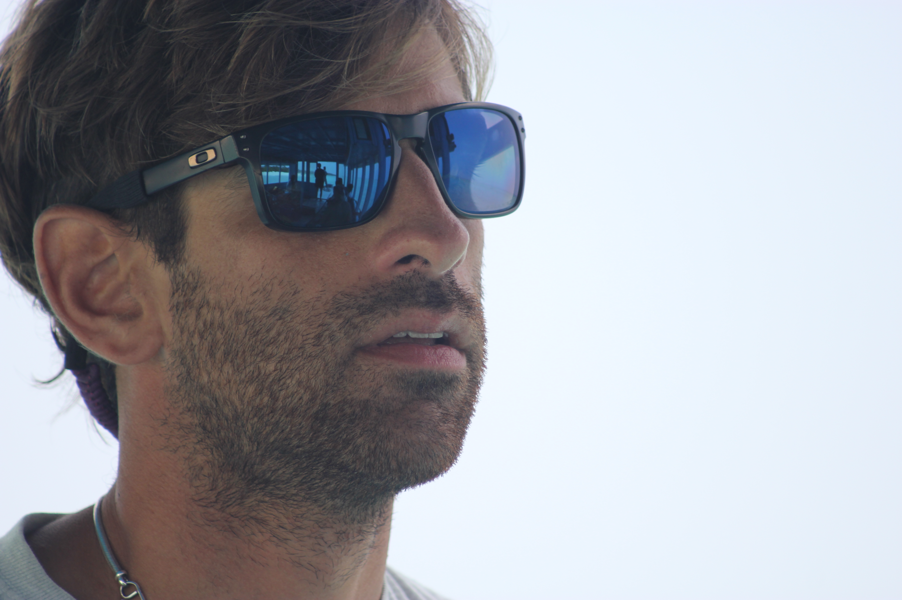
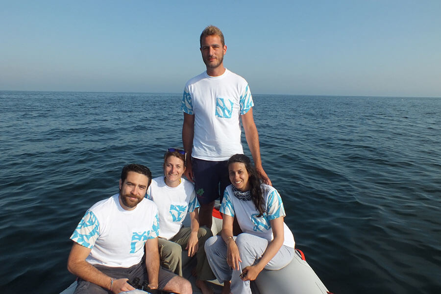

Ci tengo a puntualizzare una cosa, cari amici lettori: MyHumus non abbandona mai i propri intervistati!

Voglio dire, non è che dopo la pubblicazione dell'articolo ci si saluta e stop, *è stato bello, arrivederci e grazie*...eh no, io li tampino anche dopo!

Scherzi a parte, l'articolo di questa settimana torna a parlare di tre progetti green italiani che sono stati particolarmente amati dai lettori di MyHumus: [The Barefoot Conservation Center](https://myhumus.com/natura/), [Delfini Bizantini](https://myhumus.com/delfini-tutela/) ed [UNO Cookbook](https://myhumus.com/uno-cookbook-cucina-vegana/).

Che ne è stato di loro, dopo le interviste? Quali sviluppi ci sono stati? Che cosa stanno facendo adesso?

Scopriamolo subito!

## Flavio Sacco (The Barefoot Conservation Centre)

Qualche settimana fa ho avuto uno scambio di mail con Flavio Sacco, il biologo marino italiano che sta conducendo attività di ricerca sull'isola di Hanimaadhoo, alle Maldive.

[The Barefoot Conservation Center](http://www.thebarefoot.com/portfolio-normal-layout/maldives-conservation-center/) è un Centro di monitoraggio, di conservazione e di educazione ambientale situato all'interno della struttura turistica *The Barefoot Eco Hotel,* ed è proprio in questo Centro che Flavio, ogni giorno, porta avanti le sue attività di ricerca e di tutela ambientale insieme ai ricercatori con cui collabora.

Le sue news sono tante e, soprattutto, estremamente positive:

- insieme al suo team di lavoro, Flavio sta intensificando i rapporti con le scuole maldiviane per condurre brevi corsi di educazione ambientale;
- a fine anno, in collaborazione con il consiglio comunale, il gruppo di ricerca inizierà a sviluppare un'area sull'isola per la gestione dei rifiuti. Ciò rappresenta un enorme passo per la gestione dei rifiuti alle Maldive (i documentari sulla questione si sprecano!);
- il gruppo intensificherà la collaborazione con alcune associazioni per la conservazione dell'ambiente, fra cui la [Manta Trust](http://www.mantatrust.org), ospitandone i rappresentanti in hotel. I ragazzi intendono compiere il primo passo per diventare seriamente un avamposto di ricerca nel nord delle Maldive;
- Flavio e gli altri biologi stanno imbastendo una rete per la raccolta di tutte le realtà ecoturistiche delle Maldive: l'obiettivo è quello di realizzare un portale in cui i turisti possano scegliere fra le varie opzioni "eco" alle Maldive (uno strumento che, oggi come oggi, non è ancora disponibile). Nell'arco di poco tempo, il portale sarà attivo. Il sito di riferimento è [www.ecotrvl.com](http://www.ecotrvl.com);
- lo scorso maggio, il team di Flavio ha accolto un nuovo componente: la biologa marina italo-inglese Maxine Cutracci. Maxine ha già lavorato in Centro America nell'ambito del monitoraggio delle risorse marine ed è un'esperta di coralli. Oltre a Maxine, il team si prepara a dare il benvenuto ad una biologa marina che, quest'anno, ha concluso un importante progetto internazionale che ha avuto molta risonanza. Insieme a lei arriveranno molte altre iniziative e progetti...ma per il momento resta ancora tutto top secret;
- nel terreno dell'hotel hanno iniziato a produrre frutta e verdura a km zero per limitare sempre di più l'importazione dei beni alimentari e la conseguente *carbon footprint* che ne deriva. Il pesce, ad esempio, proviene dai pescatori locali dell'isola;
- da pochissimi mesi, il gruppo di ricerca è entrato in contatto con l'azienda australiana [Protean Wave Energy](http://www.proteanwaveenergy.com) che, nei mesi futuri, installerà uno dei suoi sistemi per la produzione di energia elettrica a partire dal movimento delle onde nelle zone remote dell'isola di Hanimaadhoo. In prospettiva, l'hotel avrà energia pulita al 100%; tutto questo, in aggiunta alle iniziative già attive e alla volontà di imbottigliare l'acqua potabile all'interno di bottiglie di vetro - eliminando del tutto quelle di plastica - renderà The Barefoot Eco Hotel una delle strutture turistiche più sostenibili della zona. Tutto questo a nemmeno un anno dall'apertura, avvenuta il 22 novembre 2014!
  Flavio, ovviamente, è molto fiero ed orgoglioso dei risultati raggiunti, anche perché sono andati di pari passo con l'apprezzamento molto alto da parte degli ospiti (occorre solo dare un'occhiata a Tripadvisor!);
- dall'1 novembre farà ufficialmente parte del Conservation Center la dott.ssa Frauke Bagusche, responsabile scientifica della spedizione sponsorizzata dalla Biotherm, [Aquapower Expedition](http://aquapower-expedition.com);
- a partire da questo inverno, il Centro ospiterà neolaureati in biologia marina per brevi periodi (1-3 mesi) per insegnare loro a lavorare in contesti turistici sviluppando progetti di conservazione ambientale. Dovranno solo pagare il biglietto aereo, dopodiché saranno ospiti spesati per tutto il periodo di permanenza e potranno lavorare al nostro fianco. Ovviamente, ciò offrirà loro l'occasione di imparare a lavorare con i turisti ed entrare in contatto la rete dei resort alle Maldive per trovare una posizione retribuita.
  

## Delfini Bizantini

Rebecca Andreini, Nicola Aurier, Michela Spreafico e Carlo Pezzi: sono loro i quattro componenti della squadra di [Delfini Bizantini](https://myhumus.com/delfini-tutela/), ve li ricordate? Questa associazione, nata da pochissimi mesi, monitora e tutela i delfini dell'Alto Adriatico.

Sono felice di dirvi che anche questo progetto sta procedendo bene, negli ultimi mesi i ragazzi hanno avuto molta visibilità su diversi giornali e reti televisive, sono riusciti ad organizzare piuttosto bene la fase di ricerca sul campo e hanno proseguito le loro attività di monitoraggio attraverso la foto-identificazione e la raccolta dei dati comportamentali e clinici dei soggetti.

Durante l'estate, inoltre, i ragazzi hanno proposto alcuni laboratori tematici dedicati ai più piccoli ed una serie di lezioni presso il circolo velico ravennate. Il gruppo ha intenzione di intraprendere attività aperte ai soci.

## Manuel Marcuccio (UNO Cookbook)

Dal momento che questa intervista risale al mese di marzo, credo sia opportuno rinfrescarvi un poco la memoria: Manuel Marcuccio, food blogger che vive a Milano nonché autore del blog di cucina vegana [UNO Cookbook](http://www.unocookbook.com), dice di essere una persona che fa da mangiare per chi ama avendo cura delle materie prime.

I suoi followers saranno contenti di sapere che ha appena iniziato a collaborare con un nuovo juice bar di Milano che propone trattamenti detox personalizzati di varie durate; per questo locale ha realizzato dieci hummus che saranno serviti all'interno di un barattolo di vetro con il brand "UNO Cookbook".

Insieme ad una delle titolari del juice bar milanese, inoltre, Manuel lavorerà ad un nuovo libro completamente dedicato a succhi, estratti e smoothies rientranti nei programmi detox.

Di recente, il nostro food blogger di fiducia è stato il curatore del libro di [Carla Leni](https://myhumus.com/cucina-vegetale-vegan/), recentemente intervistata da MyHumus.

> *Foto di copertina: [Alfie Ianni](http://www.flickr.com/photos/90325628@N00/2599394171) via [Photopin](http://photopin.com).*

