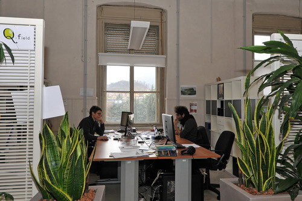
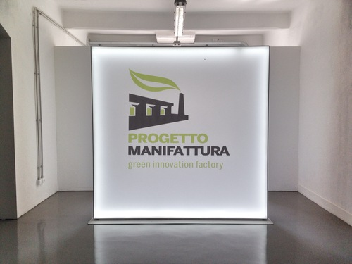
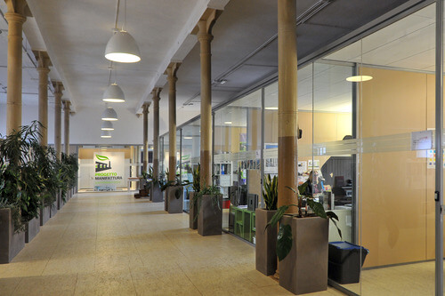
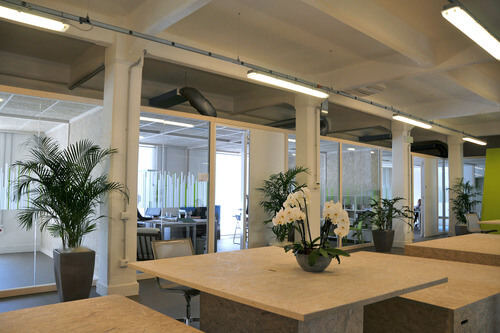

La scorsa settimana io e mio fratello ci siamo svegliati prestissimo per visitare una struttura trentina dedicata all'innovazione ecosostenibile: [Progetto Manifattura](http://www.progettomanifattura.it/it).
Si tratta di uno spazio ispirato a un modello di sviluppo orientato alla realizzazione di beni e servizi basati sul concetto di sostenibilità ambientale e di green innovation.
Il nome deriva dal precedente utilizzo dello stabilimento, un tempo Manifattura Tabacchi, entrato in funzione a metà Ottocento per produrre prodotti a base di tabacco.

Progetto Manifattura offre servizi, competenze e conoscenze per l'ideazione di imprese che vedono nell'economia sostenibile un principio indissolubile. Lo spazio rientra nella strategia adottata dalla provincia autonoma di Trento, basata su tre tipi di sostenibilità: ambientale, economica e sociale.

Con mio grande piacere, ho intervistato il presidente di Progetto Manifattura, il Dott. Gianluca Salvatori, che mi ha parlato di questa struttura con grande slancio e passione.

### Dott. Salvatori, grazie di aver accettato l'intervista per MyHumus. Mi parlerebbe delle origini di questo progetto di innovazione ecosostenibile?

> Salve, Anna. Il Trentino comunica l'idea che l'interazione fra Uomo e ambiente non sia un fattore secondario. Un **equilibrio ecologico consapevole** è al centro dello sviluppo di questo territorio che, in sé, ospita ecosistemi delicati con caratteristiche uniche.
>
> **Lo sviluppo della società trentina è sempre dipeso dalle condizioni ambientali**. È anche per questo che, nella cultura locale, si è radicato un rispetto ambientale sempre più profondo. Il 60% del territorio è coperto da foreste e si avverte quanto il cambiamento climatico possa influire negativamente o positivamente sulla vita delle persone.
>
> Questo è un elemento che appartiene alla storia della popolazione locale ed è certamente qualcosa su cui fare leva per pensare al suo futuro. E per capire quale possa essere la sua proiezione negli anni a venire.
>
> Uno sviluppo locale efficace dipende da un'analisi puntuale del contesto. Occorre capire cosa si abbia attorno e su cosa si possa far leva. Serve quindi rispolverare un principio vecchio come il mondo: **i percorsi dello sviluppo economico sono influenzati dal contesto locale**.
>
> Per fortuna, in Trentino la natura è stata preservata nel tempo e la coscienza sociale ha prestato attenzione al tema degli equilibri ecologici. In più, una buona amministrazione si impegna ogni giorno a gestire consapevolmente il patrimonio naturale, anche attraverso l'innovazione ecosostenibile.

### Quali temi affrontate a Progetto Manifattura?

> Il filo che collega tutti coloro che ospitiamo è legato al concetto di **sostenibilità applicata alle costruzioni, alle energie rinnovabili e alle tecnologie** per la gestione delle risorse ambientali. Oltre a questi temi se ne affrontano altri come, ad esempio, lo **studio di tessuti ecocompatibili** oppure gli oggetti di **green design**.
>
> Ad ogni modo, il tema cruciale di Progetto Manifattura è sicuramente quello dell'abitare in modo più sostenibile. Effettivamente, sono molte le imprese che affrontano questo argomento.

### _Innovazione ecosostenibile_ è la parola chiave che riassume la mission di Progetto Manifattura?

> Esatto: **la sostenibilità è il modo di fare innovazione in Trentino**.
>
> Lo sviluppo locale, in Trentino, si chiama _innovazione ecosostenibile_. Negli anni, di fatto, abbiamo definito come ambito prioritario quello dell'abitare: la costruzione quale trasformazione del territorio per ospitare l'Uomo e le sue attività.
>
> **Costruire sostenibile**: perché la costruzione di un edificio o di una casa è la sintesi reale di moltissimi usi. Così come di tecnologie, competenze e conoscenze.
>
> Per costruire e per utilizzare un edificio servono tanti saperi. Quali materiali scegliere? Come riqualificarne uno già esistente? Come riscaldarlo, illuminarlo e/o isolarlo? Come collegarlo alla rete e renderlo autonomo rispetto ad essa? Come influenzare i comportamenti di chi lo utilizza così che siano più virtuosi?
>
> Il green building non è solo una questione di ingegneria: è un insieme di temi attorno al quale si possono costruire una moltitudine di competenze.
>
> La scelta dell'abitare sostenibile ha certamente messo in movimento un pezzo di economia locale.

### Può descrivermi il vostro _modus operandi_?

> Abbiamo suddiviso lo spazio in tre settori: la fase di **avviamento**, dove ospitiamo persone con idee innovative che abbiano intenzione di creare un'impresa coerente con i temi che trattiamo. In questi primi 12 mesi verifichiamo che l'idea possa dar vita a una futura impresa con la messa a punto di tutte le condizioni necessarie. Dopo questo primo anno si sostiene un 'esame di maturità'' per valutare che ci siano le condizioni ottimali per proseguire. Dopodiché si costituisce l'impresa, il progetto in sé deve essere venduto ad almeno un cliente.
>
> La seconda fase è quella di **consolidamento** e dura cinque anni: ora si lavora per far crescere la giovane impresa anche attraverso l'assunzione di persone.
>
> Dopo questa sorta di 5+1, si passa alla fase finale destinata a un nuovo edificio ora in fase di costruzione. La struttura verrà realizzata dall'architetto giapponese **Kengo Kuma** e sarà interamente in legno. Privilegerà l'illuminazione naturale e consentirà una modularità degli spazi tale da permettere una loro rapida riconfigurazione.
>
> Il nuovo edificio consentirà un **risparmio idrico del 50%**, un **risparmio di energia elettrica del 60%** e una **riduzione fino all'85% delle emissioni di anidride carbonica**. Da queste percentuali di risparmio s'intuisce subito quanto l'architettura sostenibile sia efficace.
>
> Verrà anche istituito un parco pubblico accessibile a tutta la cittadinanza.

### Nella vostra struttura per l'innovazione ecosostenibile lavorate di più con aspiranti imprenditori italiani o stranieri?

> Fino ad ora ci siamo concentrati sul nostro Paese e le aziende che ospitiamo sono tutte italiane. Tuttavia, a partire da quest'anno, attueremo un'attività di promozione anche in territorio estero.

### Quali requisiti bisogna avere per presentare un progetto a Progetto Manifattura?

> Non c'è alcun massimo di età, l'importante è che si rispetti il requisito di coerenza con le nostre aree tematiche e che esista un potenziale di sviluppo. Avere a cuore l'innovazione ecosostenibile, ovviamente, rientra fra i _must have_.

