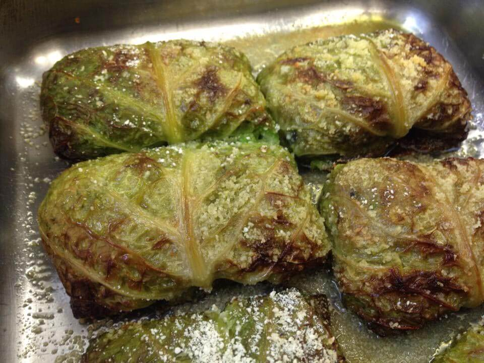

C'è una gastronomia vegana a Ravenna che è il paradiso del gusto e della fantasia. I suoi piatti racchiudono la tradizione romagnola in chiave vegan, ma anche l'amore di una famiglia per i sapori genuini e l'esperienza maturata in tanti anni di cucina.
Paolo, Paola il loro figlio Andrea sono una famiglia vegana ravennate.
Tutti e tre gestiscono [Ravegan Gastronomia](https://www.facebook.com/pages/Ravegan-Gastronomia/532234820243716), la gastronomia vegana di Ravenna in via Galilei 75.
Paolo e Paola sono due miei buonissimi amici. Li ho intervistati con mooooooooooooolto piacere!

### Ciao, Paolo. Che bello pubblicarti su MyHumus! Dimmi, perché Ravegan?

> Ciao, Anna. Grazie a te dell'intervista! **Volevamo un lavoro soddisfacente, creativo, autonomo, che rispondesse ai valori etici in cui crediamo** profondamente. Ecco perché abbiamo deciso di aprire la nostra gastronomia vegana a Ravenna.

### Come e perché siete diventati vegani?

> Tanti anni fa, io e Paola abbiamo deciso di non mangiare più carne, un po' per motivi di salute e un po' per motivi etici.
>
> Andrea, un giorno,  è tornato a casa dicendo che non avrebbe più consumato nulla di origine animale. Non avrebbe più comprato oggetti o abbigliamento in pelle o lana per non supportare l'industria basata sullo sfruttamento animale.
>
> Lì per lì ci è sembrato che il suo fosse un atteggiamento un po' estremo. Dopo alcune ricerche sul web, però, e dopo aver parlando con amici e aver letto libri come *Ecocidio* di Rifkin, ci siamo resi conto che Andrea era sulla strada giusta. E che **essere vegetariani non sarebbe bastato**.
>
> Così abbiamo deciso di aprire una gastronomia vegana a Ravenna.

### Dove avete imparato a cucinare per la vostra gastronomia vegana a Ravenna?

> Diciamo che è stata una necessità e, tutto sommato, non è stato nemmeno troppo difficile.
>
> Abbiamo iniziato a **rielaborare i cibi di sempre**, eliminando tutto ciò con provenienza animale. Paola e Andrea hanno sempre avuto molta creatività e curiosità, in cucina. Chi veniva a mangiare da noi non rimpiangeva la cucina tradizionale.
>
> Abbiamo sperimentato alimenti nuovi come il tofu, il seitan, il temphe e la panna di soia. Inizialmente, tofu e seitan lo compravamo tramite il gruppo di acquisto ravennate. Con il tempo, abbiamo deciso di produrlo noi stessi.
>
> Pian piano abbiamo delineato l'offerta della nostra gastronomia vegana a Ravenna.

### Com'è stata la vostra vita prima di Ravegan?

> Prima ci siamo occupati di tutt'altro: Paola lavorava presso [Radisa](http://www.radisa.it/it/home.html), mentre Andrea non trovava un lavoro.
>
> Io avevo alle spalle un trascorso da operaio metalmeccanico e, negli ultimi tempi, avevo lavorato per una cooperativa del Consorzio Agrario di Ravenna.
>
> Alla fine abbiamo capito che, se avessimo voluto dare una svolta alla nostra vita, avremmo dovuto contare solo su noi stessi. **Stare in cucina era la cosa che ci piaceva di più in assoluto**. Indi per cui...

### Cosa realizzate nella vostra gastronomia vegana a Ravenna?

> Produciamo tofu, seitan e gastronomia pronta e preparata con questi alimenti come, ad esempio, cotolette, vegburger, polpette, spezzatino e creme spalmabili salate. Prepariamo anche pasta ripiena, pizza e focacce, insalate e dolci. Insomma, nella nostra gastronomia vegana a Ravenna trovi dall'antipasto al dolce, e **i nostri piatti rispettano l'ambiente e i lavoratori**.

### A quali materie prime ricorrete? E dove le trovate?

> La maggior parte delle nostre materie prime provengono da produttori che riforniscono i G.A.S.
>
> Le nostre verdure, ad esempio, ci vengono fornite da [Mater Naturae di Christian Grassi](https://www.facebook.com/christian.grassi.98), un carissimo amico ravennate che ci consegna verdure e ortaggi appena raccolti.
>
> I legumi, i fagioli, i ceci, le lenticchie e la soia provengono da Meldola e sono frutto delle cure di Filippo Petrelli, produttore del G.A.S di Forlì.
>
> La farina di farro, quella di grano Senatore Cappelli e quella di ceci vengono macinate a pietra in un piccolo mulino. È lo stesso adoperato dal nostro fornaio Christian che rifornisce di pane, pizza e biscotti anche i G.A.S di Ravenna, Lugo e Cesena.
>
> Le spezie, il sale, il cioccolato, la pasta e altri prodotti li acquistiamo presso [KI](http://www.kigroup.com) e [Padovana Macinazione](http://www.padovanamacinazione.com).

### Avete una clientela più giovane o più adulta? Perche mangiano vegan, secondo voi?

> I nostri clienti appartengono a entrambe le categorie. I più giovani, probabilmente, acquistano vegan per motivi etici, conoscono il movimento vegano e ne apprezzano la filosofia. I più adulti, a mio avviso, pensano che mangiare vegano sia più salubre.
>
> Tanti altri, a prescindere dall'età, vengono da noi, almeno inizialmente, per comodità.
>
> La nostra gastronomia vegana a Ravenna offre un **ambiente tranquillo** in cui **mangiar bene spendendo il giusto**.

### Cosa vi augurate per il futuro?

> Per il futuro ci auguriamo di continuare a lavorare con serenità e di vedere sempre il sorriso sui volti dei nostri clienti.
