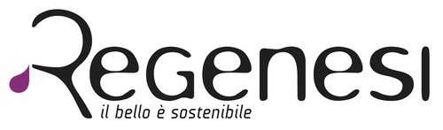
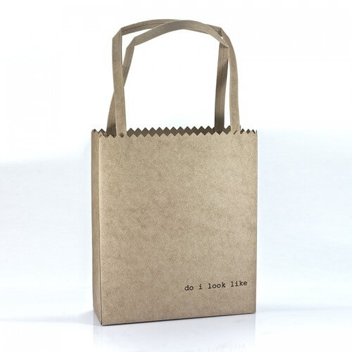
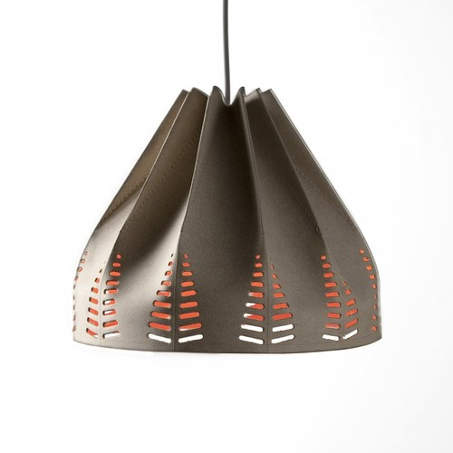

A Ravenna c'è un fashion brand di moda ecosostenibile che, non ho dubbi, farà molta strada: [Regenesi](http://regenesi.com).
Il team di questo marchio è composto da persone lungimiranti che perseverano, sperimentano senza paura e osano.
E se _osare_ va di pari passo con parole come _coscienza ecologica_, _non convenzionalità_ e _aggregazione_, il top è veramente garantito.
Regenesi è un marchio di accessori per la casa, per l'ufficio e per la persona con un'anima eco. Perché riutilizzare non significa per forza escludere gusto e bellezza!

Il sito di Regenesi riporta una citazione bellissima del proprio CEO:

_"Ho avuto un sogno e ho aggregato un gruppo di persone in grado di aiutarmi a realizzarlo. Ho unito varie competenze e creato un luogo e il contesto in cui farle incontrare. È nata un'azienda non convenzionale capace di dare nuova vita ai materiali, creando prodotti unici grazie al network di eccellenze creative e produttive."_

Metti un bel caschetto di capelli neri, aggiungi tanta determinazione e altrettanto talento: ecco un primo identikit di Maria Silvia Pazzi, CEO di Regenesi.

### Ciao, Maria Silvia! Com'è nata l'idea di Regenesi e di una moda ecosostenibile?

> Ciao, Anna! Regenesi è nata da un percorso tutto mio. Sebbene volessi diventare architetto, mi sono iscritta a Economia e a un master in Gestione d'Impresa. Ho lavorato come consulente per alcune imprese sognando di essere un'imprenditrice in prima linea.
>
> Regenesi è nata da un'**evoluzione personale** e da una **passione per la moda**, per il **design** e per il **Made in Italy**.
>
> I sei soci che hanno investito in questo marchio sono professionisti con competenze differenti. Le altre figure offrono un insieme di consulenze e di professionalità indispensabili a rendere unico il nostro brand di moda ecosostenibile.

### Se dico _Regenesi_, di cosa sto parlando?

> Regenesi propone il **Made in Italy secondo nuove codifiche**, seguendo un approccio diverso rispetto a quello classico italiano. È un progetto ambizioso che **punta ai mercati di tutto il mondo**.
>
> Abbiamo un sito che è anche un **e-commerce**. Intratteniamo collaborazioni con diversi **concept stores** e con **showroom temporanei** gestiti direttamente da noi, a Bologna e a Milano.
>
> Per quanto riguarda la nostra moda ecosostenibile, esponiamo al [White Show](http://www.whiteshow.it) di Milano e alla [Maison&Objet](http://www.maison-objet.com) di Parigi.

### Su quali settori verte la creatività di Regenesi?

> Ci interessiamo agli accessori per la casa, per l'ufficio e per la persona. Molti dei nostri prodotti sono flessibili, nel senso che sono 'intelligenti' perché possono avere diverse funzionalità e adattabilità. Trovo che questo sia un forte valore aggiunto.

### Da dove provengono le materie prime? E quali materiali privilegi per la tua moda ecosostenibile?

> Utilizziamo moltissimi materiali: plastica, alluminio, arta, cartone, vetro e molti altri materiali in fase di sperimentazione che stimolano l'interesse e la creatività dei nostri designer. La sperimentazione è al vertice delle attività di Regenesi.
>
> Lavoriamo anche la pelle: acquistata in Germania per via delle maggiori certezze sulla provenienza e sulle modalità di riciclo e di rigenerazione, proviene da una concia vegetale. In Italia, invece, è a base di cromo, e i processi di colorazione usano pigmenti chimici anziché naturali. La pelle viene reimpastata con caucciù proveniente da piantagioni controllate, poi viene colorata con farina di castagne. Il colore viene fissato grazie a sali minerali naturali.

### Quali nomi importanti collaborano con Regenesi?

> Abbiamo diversi designer che lavorano alla nostra moda ecosostenibile. Alcuni, come Denis Santachiara, Giulio Iacchetti e Marco Ferreri, sono italiani. Altri, invece, sono creativi stranieri che vivono o che si sono formati nel nostro Paese. Mi riferisco, ad esempio, a Matali Crasset, Setsu&Shinobu Ito e Kaisli Kiuru.

### Prima di passare ai saluti, ti chiedo: cosa bolle in pentola per il futuro dell'azienda?

> Bolle sempre qualcosa in pentola, in Regenesi!
>
> In occasione del Fuorisalone dello scorso aprile, abbiamo presentato la partnership con [Dainese](http://www.dainese.com/it_it/). Sui rispettivi cataloghi avremo nuovi prodotti, recuperati e totalmente reinventati, realizzati dalle tute dei piloti di MotoGP. Questi articoli saranno in vendita nei prossimi mesi sui nostri e i loro canali.
>
> Il bello di questa partnership è che le persone capiscono la storia e l'anima di questi prodotti. Tutti comunicano la loro storia precedente. Sono oggetti di uso comune come, ad esempio, cover per i cellulari e portachiavi, ma impreziositi dalla passione e dall'unicità di una moda ecosostenibile.
>
> Stiamo anche valutando il Nord Europa attraverso una possibile partnership con base a Copenaghen.
