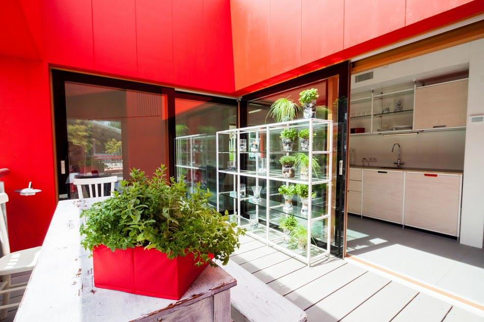

*Considerazione numero 1*: mi fa sempre piacere quando università, studenti e aziende lavorano insieme ad un progetto comune, è una forma di collaborazione che apporta benefici a tutte e tre le parti in questione, almeno secondo il mio punto di vista.

*Considerazione numero 2*: qualche tempo fa sono arrivate le bollette di casa e ho seriamente deciso di attuare tutta una serie di modifiche al mio piccolo nido affinché raggiunga la massima efficienza energetica attraverso interventi tecnologici dal costo ragionevole e in grado di ridurre al massimo gli sprechi.

*Considerazione numero 3 (altresì definita: "Considerazione finale" o "Considerazione di tutte le considerazioni")*: voglio una "rivoluzione sostenibile". E la voglio adesso!

Questa settimana parliamo di un ambizioso progetto, si chiama RhOME for denCity ([www.rhomefordencity.it](http://www.rhomefordencity.it/intro/index.html)) ed è stato condotto dal Dipartimento di Architettura dell'[Università Roma Tre](http://www.uniroma3.it) (con a capo gli architetti [Chiara Tonelli](http://www.rhomefordencity.it/SDE/ita/chiara-tonelli/), [Gabriele Bellingeri](http://www.rhomefordencity.it/SDE/ita/team-gabriele-bellingeri/) e [Stefano Converso](http://www.rhomefordencity.it/SDE/ita/team-stefano-converso-2/)) insieme ai Dipartimenti di Ingegneria e di Economia: professori, studenti, dottorandi e professionisti hanno collaborato alla realizzazione di un interessantissimo progetto di casa sostenibile, la cosiddetta *"casa RhOME"*, la quale, fra le altre cose, ha vinto il [Solar Decathlon Europe 2014](http://www.solardecathlon2014.fr/en/) a Versailles.

Giusto per farvi capire che fanno sul serio.

Il prossimo intervistato si chiama Nicola Moscheni, ha 26 anni ed è uno studente del corso di laurea magistrale in Progettazione Architettura presso l'Università Roma Tre e Communication Coordinator per il progetto RhOME.

Lui, come tanti suoi colleghi, in RhOME ci ha messo il cuore, ed uno dei suoi sogni è quello di portare avanti questo progetto.

Sentiamo cosa ci racconta...

### Ciao Nicola, sono felice di parlare di RhOME for denCity in MyHumus! Qual è la mission di questo progetto?

> Il team RhOME progetta sul tessuto di Roma e lavora su zone che si sono costruite nel tempo in modo talmente spontaneo da aver creato dei pezzi di città slegati e dissociati dalla dimensione cittadina. Sono aree sprovviste di servizi, di spazi di condivisione, di una dimensione commerciale attiva, senza contare i problemi di mobilità che le rendono completamente scollegate da quelle più centrali della città.
> 
> L'obiettivo di RhOME for denCity è quello di risanare tali aree migliorando non solo la qualità della vita degli abitanti, ma diminuendo anche l'impatto ambientale durante le fasi di costruzione e di futuro utilizzo delle strutture: si tratta di un "eco-quartiere" composto da edifici in legno realizzati tramite un modello di prefabbricazione, ma con soluzioni altamente flessibili in grado di rispondere alla nuova domanda abitativa (non ci sono più le famiglie allargate di una volta, ai giorni nostri i nuovi abitanti sono coppie, single, utenti temporanei, ecc), veloci da costruire, ad altissima efficienza energetica e, allo stesso tempo, con un costo di costruzione molto basso e paragonabile a quello dell'edilizia popolare.
> 
> È un nuovo modo di intendere la sostenibilità: non riservata solo a chi se la può permettere, ma aperta ad un pubblico più vasto... una sorta di *democrazia energetica*!
> 
> Sostenibilità ambientale, economica e sociale trovano in RhOME un punto d'incontro.

### Spiegami: su quali principi si basa RhOME for denCity?

> L'obiettivo del progetto è l'utente finale, non si può parlare di alta efficienza energetica senza considerare l'abitante della casa.
> 
> Dobbiamo rendere tutti capaci di avvicinarsi alle nuove tecnologie e al mondo della sostenibilità. Ecco perché casa RhOME è pensata innanzitutto come un luogo da abitare e non solo come una macchina ad altissime capacità.
> 
> Siamo riusciti ad integrare le grandi tecnologie e i nuovi brevetti messi in campo con gli aspetti architettonici, costruttivi e di vita all'interno della casa. Si tratta di un organismo unico all'interno del quale ogni elemento, sistema e tecnologia lavorano in sinergia con chi abita la casa.
> 
> Si tratta di una costruzione a secco, veloce da assemblare e che consente interventi tempestivi.
> 
> Allo stesso tempo è una struttura pesante, dotata di massa, che garantisce alte prestazioni strutturali, termiche e di comfort. Un edificio che, prima di pensare all'utilizzo di sistemi per la produzione di energia pulita, riduce le dispersioni e gli sprechi.
> 
> *"Ridurre prima di consumare"* è stata la filosofia che ha supportato il progetto fin dal suo principio. Siamo noi gli attori principali della *rivoluzione sostenibile*, dobbiamo conoscere quali siano gli aspetti del risparmio energetico come *abitanti delle case* ancor prima che come progettisti.
> 
> Ci siamo sempre impegnati in questo, in due anni di lavoro abbiamo organizzato varie campagne di sensibilizzazione su come essere più green.
> 
> Perché sono quelle buone abitudini che possiamo applicare nella vita dei tutti giorni, nelle nostre case, anche se non abbiamo un pannello fotovoltaico.

### Ora che ne abbiamo dato un'anticipazione, passiamo al progetto vero e proprio: quali caratteristiche possiede la casa pensata per RhOME? Ti va di snocciolare un po' di termini tecnici?

> Certo! In occasione della competizione a Versailles abbiamo presentato un prototipo che rappresentasse un sistema urbano più complesso di edifici multipiano: è una casa di circa 65 mq completamente in legno, realizzata in collaborazione con [Rubner Haus](http://www.haus.rubner.com/it/casa-in-legno/1-0.html), che rappresenta l'ultimo piano di uno degli edifici che vorremmo inserire nel tessuto romano.
> 
> Nella casa ci sono spazi flessibili che ruotano attorno al cosiddetto "corpo centrale", ovvero il cuore degli impianti, e tali spazi sono stati studiati per accogliere diverse soluzioni capaci di ospitare differenti utenze, dalla persona singola alle famiglie più numerose.
> 
> La progettazione degli spazi è anche volta al corretto utilizzo della luce naturale e alla gestione delle temperature all'interno degli ambienti: le grandi aperture delle due logge garantiscono una corretta illuminazione delle stanze. Allo stesso tempo, gli spazi esterni sono ben ombreggiati dall'arretramento delle finestre e dai sistemi ombreggianti. Lo spazio della cucina, tramite un sistema di chiusure, può diventare un buffer termico che permette di controllare la temperatura tra interno ed esterno.
> 
> Il 3D CORE è l'elemento che mantiene in vita la casa: contiene l'impianti idrico, sanitario, elettrico e di trattamento dell'aria.
> 
> Essendo un elemento prefabbricato, riduce radicalmente tempi e costi di assemblaggio, integra il corpo bagno con l'angolo cottura consentendo di ridurre la lunghezza delle tubazioni e le conseguenti dispersioni termiche, ed il suo cuore è un server che riceve e registra i dati provenienti da tutta la casa.
> 
> Il 3D core è connesso ai pannelli fotovoltaici e termodinamici e attribuisce solidità a tutta la struttura: funziona come una scatola compatta che, situata in posizione centrale, permette anche di resistere alle forze sismiche. All'interno del Core abbiamo tutti i sistemi tecnologici della casa.
> 
> I diversi partner di progetto hanno portato i migliori prodotti di ogni azienda per un sistema ad altissima efficienza, assemblati in modo sapiente e in grado di offrire un alto livello di funzionalità (il tutto a prezzi economicamente accessibili! I prodotti utilizzati, infatti, sono di gamma residenziale).
> 
> La produzione energetica della casa è garantita da pannelli solari fotovoltaici flessibili integrati negli schermi ombreggianti delle logge. Sono gli stessi che vengono utilizzati nelle barche a vela (una tecnologia messa a punto da [Solbian](http://www.solbian.eu/index.php?lang=it)).
> 
> A coprire la loggia a sud c'è una "vela", una tenda fotovoltaica che ha come primo obiettivo quello di impedire l'irraggiamento diretto del sole che potrebbe scaldare fortemente la casa. Questa "vela" fotovoltaica copre parte del tetto e una delle pareti verticali e, grazie all'estrema leggerezza (0,8 kg per modulo, sei volte meno rispetto a un pannello tradizionale di pari potenza) può essere mossa manualmente per fungere da sistema ombreggiante della loggia, facendola scorrere sulla facciata.
> 
> La produzione dell'acqua calda sanitaria per la casa è garantita da un innovativo sistema termodinamico, integrato nei parapetti delle due logge realizzate in alluminio che, allo stesso tempo, raffrescano gli spazi esterni senza consumo aggiuntivo.
> 
> Il sistema sfrutta la radiazione solare e il calore esterno dell'aria, perciò è in grado di funzionare a bassissimo consumo elettrico, con qualsiasi condizione metereologica ed a qualsiasi orario, compresa la notte. È un sistema mutuato dall'industria della refrigerazione, funziona infatti come un frigorifero (ma al contrario!). Il gas contenuto nei circuiti dell'elemento si attiva per differenza di temperatura tra il gas stesso (-30°C) e l'esterno. Il calore del gas termovettore viene ceduto all'acqua del serbatoio principale dell'acqua sanitaria. Allo stesso tempo, proprio perché il gas cattura il calore esterno, riesce a raffrescare l'ambiente esterno con un sistema di raffrescamento che nasce dalla normale reazione di questo gas.
> 
> Il rendimento di questo sistema è molto alto, utilizzando pochissima energia rende sei volte tanto rispetto al consumo elettrico.
> 
> Il parapetto, disegnato e personalizzato *ad hoc* dal team, è stato ingegnerizzato e prodotto da [CGA Technologies e Energie](http://www.cgaspa.it/ViewNews.aspx?IDCategoria=10) come primo elemento così costituito, tanto da essere brevettato.
> 
> La casa ha prestazioni energetiche elevate ed è completamente autosufficiente.
> 
> È una produzione sobria e commisurata ai bisogni del prototipo. Nel progetto urbano, invece, la produzione risulta essere il doppio dei consumi richiesti dall'edificio, tali da donare energia alla rete della città.
> 
> La pompa di calore per produrre il riscaldamento e il raffrescamento è affidata a [Daikin Italy](http://www.daikin.it), che ha affiancato un proprio gruppo di lavoro al nostro team, con l'obiettivo di ottenere la perfetta integrazione tra involucro e sistemi di gestione. La pompa di calore impiegata utilizza un gas refrigerante con un potenziale di riscaldamento globale inferiore del 67% rispetto a quelli tradizionali.
> 
> L'isolamento dell'edificio è pressoché totale ed è garantito da una sorta di "manto" che circonda l'abitazione, perché il team, anche se l'energia viene prodotta con sistemi rinnovabili, punta alla massima efficienza energetica e ad annullare i consumi inutili.
> 
> I ponti termici sono quelle zone critiche dell'involucro della casa che interrompono l'isolamento della parete e permettono la penetrazione del freddo. Nel caso di RhOME, sono totalmente eliminati. La ventilazione naturale è ottimizzata utilizzando il *free-cooling* notturno: le logge posizionate a nord e a sud consentono, una volta aperte le porte, la creazione di una corrente naturale che va dalla zona più fresca (nord) a quella più calda (sud)".

### Ora che abbiamo definito i tecnicismi relativi a RhOME, spiegaci: quale quartiere è stato pensato per la realizzazione del progetto e perché?

> Per la sperimentazione progettuale è stata scelta la zona di Tor Fiscale, che è uno dei poli del grande parco dell'Appia e che accoglie al suo interno importanti pre-esistenze storiche come, ad esempio, i resti di due acquedotti di epoca romana e rinascimentale.
> 
> Su queste presenze monumentali insistono edificazioni abusive che vorremmo eliminare per restituire al luogo la sua grande bellezza e offrire agli abitanti condizioni abitative più sicure e confortevoli.

### È un modello replicabile anche altrove?

> Certamente, con opportune modifiche a seconda del luogo, del clima e dello stato dei fatti.
> 
> Immaginiamo RhOME come soluzione per intervenire in molte realtà, non necessariamente con edifici *ex novo*, ma applicando i principi del progetto anche al costruito.
> 
> L'applicazione come modello insediativo è una cosa molto delicata e non automatica nella sua realizzazione. Tuttavia, potrebbe diventare un'occasione di scambio per la ricerca e l'applicazione di modelli innovativi.
> 
> Si possono vedere anche i Paesi in Via di Sviluppo come terreno di applicazione molto ampio, ma ciò si scontra con i problemi economici e, soprattutto, sociali.
> 
> Bisogna riuscire ad esportare competenze e modelli che possano essere applicati secondo la situazione economica e la realtà sociale, non esistono limiti su dove applicare innovazioni tecnologiche e nuovi modelli di intervento. Tuttavia, occorre tenere conto dello stato delle cose nei luoghi in cui vengono applicati.
> 
> Perché non pensare ad una riqualificazione delle grandi favelas brasiliane o delle bidonville argentine, non solo ricostruendo un tessuto cittadino danneggiato ma anche una cultura tecnologica rinnovata ed una coscienza maggiore sul risparmio energetico?.

### Quali realtà sono state coinvolte nella realizzazione di RhOME?

> Università, giovani e aziende: questi sono i tre ingredienti del nostro team.
> 
> Io sono uno studente di Architettura alla conclusione del suo percorso accademico, ho fatto parte del team fin dall'inizio, da quel gennaio 2013 in cui tutto è iniziato.
> 
> All'inizio eravamo una ventina di studenti del Dipartimento di Architettura, capeggiati da Chiara Tonelli (responsabile di tutto il progetto), Gabriele Bellingeri e Stefano Converso. Con il passare del tempo abbiamo coinvolto sempre più figure.
> 
> Siamo arrivati in competizione con una squadra di cinquanta persone provenienti dai Dipartimenti di Architettura, di Ingegneria e di Economia dell'Università di Roma Tre, tutti giovani studenti come me, dottorandi, professori e collaboratori.
> 
> A questo team si sono unite molte aziende, per lo più italiane, che hanno creduto in noi, sostenendoci non solo come sponsor del progetto ma mettendosi in gioco con i loro ricercatori e tecnici. Si lavorava sempre a stretto contatto: studenti, professori e professionisti allo stesso tavolo per cercare le soluzioni che, col senno di poi, definirei vincenti.
> 
> E non è tutto: siamo riusciti a mettere in campo nuovi brevetti e soluzioni innovative che ora sono prodotti commercializzati.

`youtube: goMPUC59ppo`

### Il team RhOME è vincitore del Solar Decathlon Europe 2014: una bella soddisfazione, vero?

> Solo soddisfazione? Non so come descrivere l'esperienza del Solar Decathlon, potrei scrivere un libro!
> 
> Vorrei mettere il punto su una questione: quando si parla di sostenibilità e di efficienza energetica si pensa sempre ai paesi del nord Europa o agli Stati Uniti, noi italiani sembriamo sempre il fanalino di coda.
> 
> Abbiamo dimostrato in una vetrina internazionale come quella del Solar Decathlon che il nostro Paese può raggiungere risultati di eccellenza, superando anche Francia, Olanda e Germania.
> 
> Le realtà che funzionano, in Italia, esistono, ma per farsi notare bisogna alzare la voce e noi, alla premiazione, la nostra soddisfazione l'abbiamo letteralmente urlata al mondo:
> 
> Sono un semplice studente, tuttavia, per due anni, ho avuto la possibilità di affrontare un progetto reale quasi come se fosse un'esperienza lavorativa. Sono stato supportato da professori che stimo e ho avuto come compagni di avventura dei ragazzi che, come me, hanno creduto fortemente in quello che abbiamo fatto.
> 
> Vedere la "nostra" casa costruita era già una conquista, la vittoria a Versailles è stata la ciliegina sulla torta!".

`youtube: 5xx8EpwW1Ow`

### Cosa bolle in pentola per i mesi futuri?

> Non ci siamo di certo fermati, abbiamo sempre lavorato senza sosta fin dal giorno successivo alla premiazione.
> 
> Cosa ci aspetta nel futuro? Tanto e poco. Riceviamo diverse proposte, molti sono anche i campi nei quali ognuno di noi si sta muovendo per portare avanti il lavoro che è iniziato con RhOME (anzi, ancor prima con [MED in Italy](http://www.medinitaly.eu/it), la casa che ha vinto il terzo posto a Madrid nel 2012).
> 
> Stiamo cercando di far sì che il nostro lavoro non resti solo un esperimento da competizione.
> 
> Non è facile muovere una macchina come questa... noi, però, non molliamo!.

Foto di copertina: Lorenzo Procaccini.

