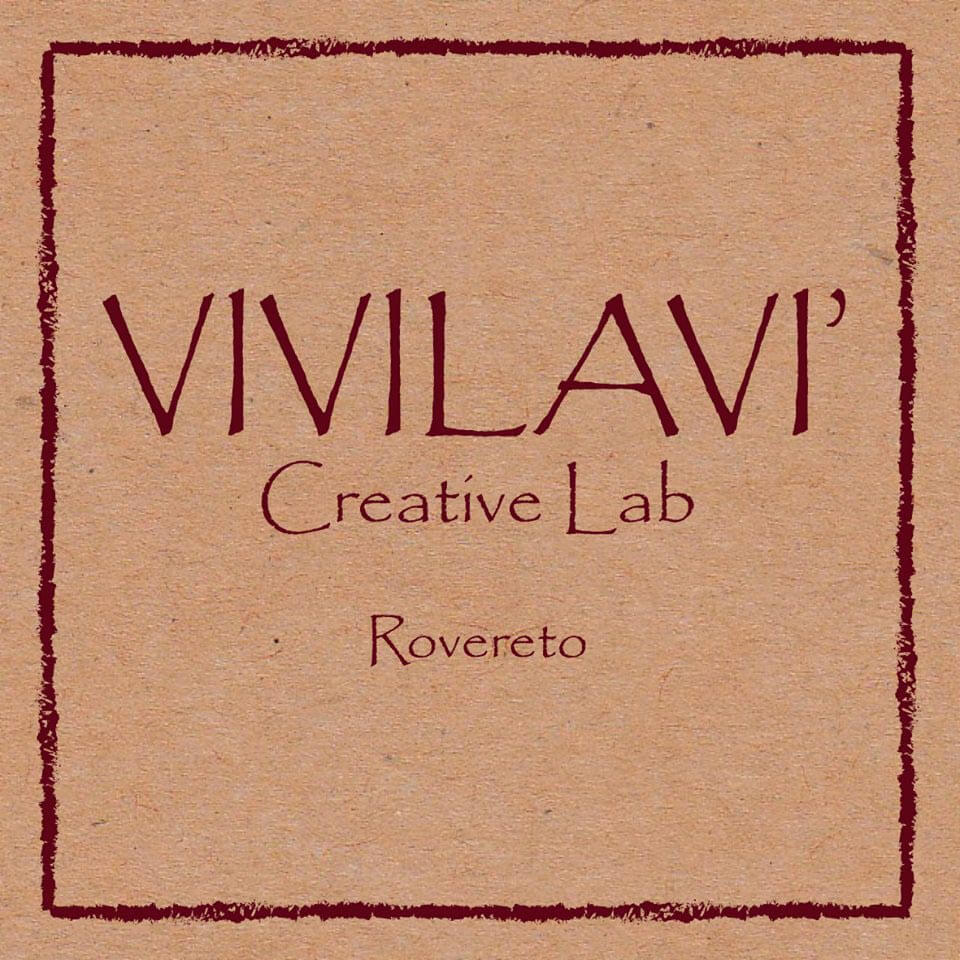

C'è poco da fare: il fashion sostenibile è una necessità.
Sono molte le campagne condotte in tutto il mondo da [Greenpeace](http://www.greenpeace.org/international/en/), e da molte altre realtà, per sensibilizzare le case di moda sull'ambiente. L'obiettivo è incentivarle ad adottare approcci più etici e meno impattanti sugli ecosistemi naturali.
Una delle recenti azioni intraprese in questo senso va sotto il nome di [The Fashion Duel](http://www.greenpeace.org/international/en/System-templates/Search-results/?all=the%20fashion%20duel) ed è una sfida internazionale al mondo dell'Alta Moda. Si punta difendere le ultime foreste e ad eliminare il rischio di intossicazione del Pianeta con sostanze chimiche pericolose.

`youtube: 6IDOUrH9mC8`

Questa settimana parlo del progetto di fashion sostenibile di Alessandro Dimauro. Alessandro è un creativo impegnato nella realizzazione di articoli di design che sta approdando al mondo dell'abbigliamento con un nuovo approccio.

[AleDima Studio](https://www.aledima.com).

Iniziamo dal principio.
Il marchio è nato nel 2011 nello studio olandese di design [Maarten Baas](http://www.maartenbaas.com). In quel periodo, Alessandro si è avvicinato al riciclo e al riutilizzo degli oggetti.

Una volta tornato in Italia, Alessandro ha stretto le prime collaborazioni con alcune cooperative sociali e con aziende, facendo dei materiali riciclati, della personalizzazione e della sostenibilità sociale i tre cardini del suo lavoro.
Una delle realtà coinvolte fin da subito è stata la [cooperativa A.L.P.I](http://www.coop-alpi.it) attraverso una linea di articoli riciclati a brand [REDO Upcycling](https://www.facebook.com/redoupcycling).

Si tratta di borse ottenute da tessuti e da striscioni pubblicitari riciclati, ma anche di poltroncine in diverse versioni e di divanetti.

Al momento, Alessandro si procura le materie prime in Trentino-Alto Adige, dove ci sono diverse realtà in grado di mettere a disposizione preziose giacenze di magazzino. Il suo marchio è insediato all'interno di [Progetto Manifattura](http://www.progettomanifattura.it).

Ciò che attualmente Alessandro sta cercando di avviare è un _network del riciclo_ in cui rientrino competenze e realtà differenti. Il tutto in un'ottica di _business sostenibile_.
**Riciclo** e **valore sociale** sono le due parole d'ordine dei suoi prodotti.

Da qualche tempo, Alessandro collabora anche con la [cooperativa CS4](http://www.cs4.it) tramite il brand [Border](https://www.facebook.com/pages/Border/1508620196064367?ref=hl). L'obiettivo è di creare oggetti di design interessanti anche dal punto di vista sociale, favorendo gli inserimenti lavorativi di fasce deboli e recuperando materiali di scarto.

Detto ciò, Alessandro si sta avvicinando al fashion sostenibile grazie al brand [Vivilavì](https://www.facebook.com/officialvivilavi?fref=ts).
**Recupera materiali come TNT e PVC**, provenienti dalle manifestazioni sportive e dai musei, per consegnarli a Viviana Setti invitandola alla sperimentazione.
Alessandro ha avviato una collaborazione con il [Centro Moda Canossa](http://www.centromoda.tn.it/CMC1/Home.html) di Trento. Questo per attivare un progetto che parli del riciclo come fonte di **nuove opportunità attraverso un fashion sostenibile**.

Viviana Setti, dal canto suo, sta studiando questi materiali per capire se siano difficili da lavorare o meno. Hanno una buona vestibilità? Sono adatti al gioco di volumi? Come resistono ai lavaggi?

E ora, ecco una carrellata di immagini. Quella in foto sono io nelle vesti di modella di Vivilavì!
Gli articoli che ho indossato sono molto soffici al tatto, hanno tagli accattivanti e colori sgargianti. Li consiglio a chiunque non voglia passare inosservato e desideri farsi promotore del riciclo!
I capi Vivilavì finora prodotti sono in vendita presso _Maximilian_, in via Rialto n.44 a Rovereto.

Per maggiori informazioni, contatta Alessandro via e-mail all'indirizzo [alessandro_dimauro@hotmail.com](mailto:alessandro_dimauro@hotmail.com) o tramite la [pagina Facebook](https://www.facebook.com/pages/AleDima-Studio/695349387157542?fref=ts).

