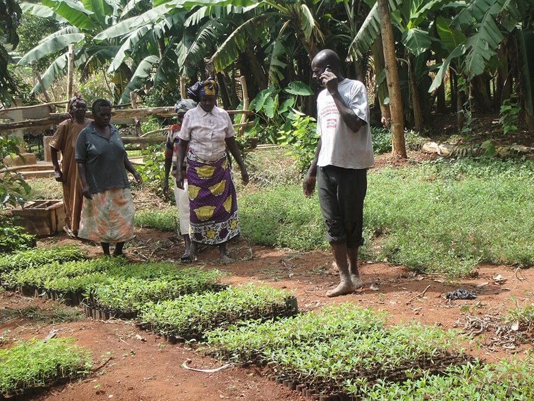
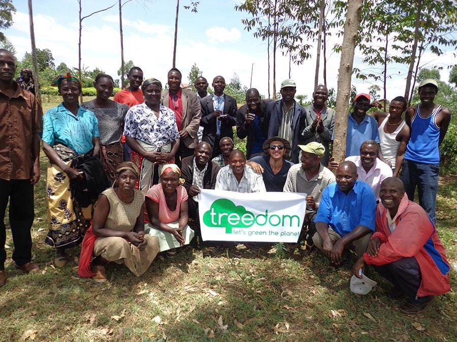
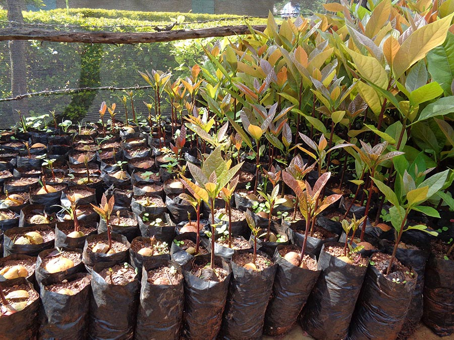
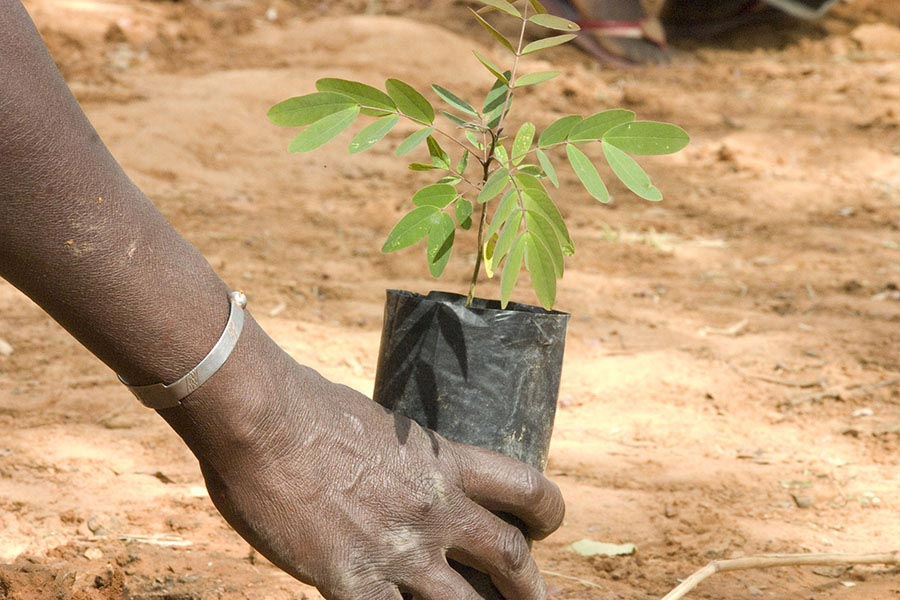

Regalare un albero: ci avete mai pensato?
Quando volete (o dovete) fare un regalo a qualcuno, su cosa basate la vostra scelta? Estetica? Utilità? Trend del momento?
Avete mai regalato qualcosa pensando anche al pianeta?

Faccio outing: mi sono innamorata di [Treedom](http://www.treedom.net/it/tropicalpizza), un progetto stupendo che si occupa di riforestazione del pianeta grazie a una piattaforma web.
Questa settimana vi presento **Giacomo Sebregondi**, communication manager di Treedom.

### Ciao, Giacomo. Che progetto bellissimo, me ne sono innamorata all'istante! Iniziamo dal principio, come sempre: parlami della nascita di Treedom...

> Ciao, Anna! Treedom è nato a Firenze nel 2010 da un'idea di Tommaso Speroni e di Federico Garcea con l'obiettivo di sfruttare la Rete per creare qualcosa che piaccia alle persone e che abbia un **impatto positivo sul pianeta**.
>
> **Ispirati da Farmville**, Tommaso e Federico hanno realizzato una piattaforma che facesse sì che piantare alberi veri fosse meglio che piantarne di virtuali.

### Che cos'è Treedom? Mira fondamentalmente a consentire a chiunque di regalare un albero?

> Treedom è una piattaforma web che fa da copertina a un [gruppo di giovani](http://www.treedom.net/it/page/about_us) con caratteristiche e skills diverse. Insieme promuovono **progetti di riforestazione** nel mondo, incaricandosi di portarli a termine attraverso il **finanziamento di privati e aziende**.
>
> L'obiettivo di Treedom è di **rendere la piantumazione di un albero un percorso bello e per tutti**. Regalare un albero fa bene a noi e al pianeta su cui viviamo!

### È un progetto importato dall'estero?

> No, anzi, lo abbiamo esportato: abbiamo sede anche a Santa Monica, in California.

### Cosa si deve fare per regalare un albero?

> Basta andare su [treedom.net](http://www.treedom.net/it/tropicalpizza) e scegliere tra una delle specie disponibili. Eventualmente si può decidere se regalarlo a qualcuno via e-mail, Facebook o trascrivendo il codice su un biglietto regalo.

### Posso adottare e/o regalare un albero in tutto il mondo?

> I progetti attualmente in corso sono otto, **dall'Italia all'Africa fino ad Haiti**, ma stiamo cercando altre realtà in cui importare il nostro sistema. Vogliamo che regalare un albero sia fattibile ovunque!

### Come monitoro la crescita e lo stato di salute dell'albero?

> **Ogni albero ha una pagina dedicata**. Questo è possibile perché, ad ogni piantumazione, raccogliamo materiale fotografico, coordinate e forniamo un codice unico all'operazione.
>
> Chiunque pianti un albero, o chiunque lo riceva in regalo, può 'seguire' l'albero registrandosi sul nostro sito.

### Ho letto che le aziende possono affidarsi a Treedom: quali soluzioni proponete per rendere il mondo del business più ecofriendly?

> **Treedom offre molte soluzioni per le aziende**. Ad esempio, il calcolo dell'impronta di carbonio e la compensazione dei propri prodotti tramite, appunto, la piantumazione di alberi.
>
> Tra le attività di maggiore risalto c'è sicuramente la comunicazione. Molte aziende scelgono di usare Treedom per parlare ai loro clienti e **fare qualcosa con un impatto positivo sull'ambiente**.
>
> L'azienda che sceglie di regalare un albero veicolerà per sempre il messaggio dell'impegno preso.

### Sogni nel cassetto? Progetti futuri?

> A dire il vero, abbiamo appena realizzato un sogno nel cassetto. Volevamo fare qualcosa che avesse un maggiore riscontro sull'Italia e abbiamo dato vita a [PlanBee.bz](http://www.planbee.bz/it/). Invito tutti a scoprire di cosa si tratta!
