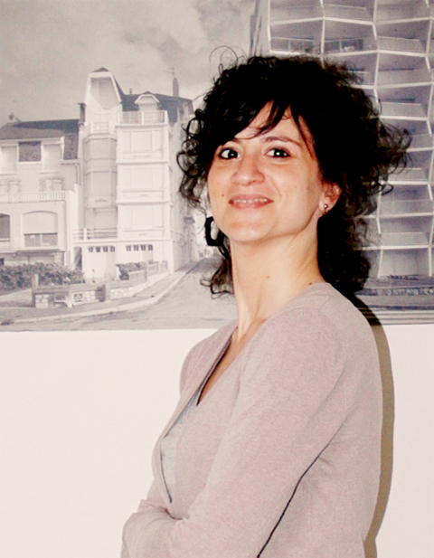
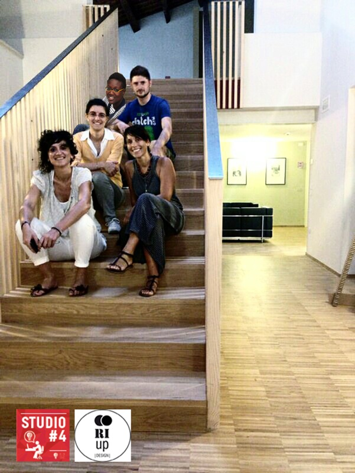

A Faenza c'è RIUp [www.riup.eu](http://www.riup.eu), una start-up il cui obiettivo è riutilizzare gli scarti industriali per proporre un design ecosostenibile.
Il riutilizzo, per RIUp, è una filosofia di vita e di lavoro!

Silvia Dal Prato è un architetto libero professionista impegnato sul fronte del design, ma anche in ambito urbano e territorialee. All'interno di RIUp è coordinatrice generale.
Sono proprio curiosa di saperne di più! In che modo è possibile riutilizzare gli scarti industriali?

### Ciao, Silvia. Grazie innanzitutto di aver accettato l'intervista. Quando è nata l'idea di RIUp e di riutilizzare gli scarti industriali?

> Ciao, Anna! RIUp nasce da un'esperienza precedente, chiamata _RI.KEA nella mia città_. Si è trattato di un evento rivolto alla cittadinanza come provocazione e riflessione sul riciclo e il riuso. Il successo di _RI.KEA nella mia città_ si è evoluto in RIUp, una start-up che produce **oggetti di arredo green e sostenibili per la casa**.
>
> 

### Vorrei capire più nel dettaglio: qual è l'aspetto green della vostra start-up?

> RIUp si caratterizza per l'innovazione di far rientrare il concetto di design seriale e di prodotto all'interno dell'ambito del riciclo.
>
> Vuole essere un **nuovo sistema produttivo per ammortizzare l'impatto ambientale**. Come? Trasformando gli scarti aziendali in oggetti di design per la casa che siano funzionali, componibili e accessibili a tutti. RIUp mira a riutilizzare gli scarti industriali.

### Quali sono le caratteristiche dei vostri prodotti?

> RIUp riesce a dare una **seconda vita agli elementi** sotto forma di oggetti di design prodotti in modo seriale. Si basa, sostanzialmente, sul principio di **autocostruzione**.
>
> Questi prodotti sono studiati e progettati in modo che sia l'utente finale a provvedere al montaggio dell'oggetto. Questo con l'aiuto del libretto di istruzioni a corredo di ogni prodotto.

### Dove reperite le materie prime? Quale uso ne fate?

> **Lavoriamo con le aziende delle nostro territorio**, Faenza e circondario. Inizialmente mappiamo gli scarti emergenti disponibili, Poi scegliamo quelli più interessanti basandoci su alcuni criteri: **serialità**, **convenienza economica e di lavorazione**, **fattibilità normativa** nel recupero dello scarto. Riutilizzare gli scarti industriali richiede comunque uno studio pregresso.

### In che modo le altre realtà aziendali e le singole persone collaborano con voi? Qual è il vostro modo di _fare rete_ e di coinvolgere le persone?

> Per quanto riguarda gli aspetti operativi, **lavoriamo con due cooperative faentine**: la [CEFF](http://www.ceff.it) e il [Comitato di Amicizia](http://www.comitatodiamicizia.org), una Onlus che ci aiuta con la logistica e il ritiro della merce nelle aziende.
>
> Per la progettazione, **abbiamo i nostri designer** all'interno del team. Collaboriamo anche con designer e studi esterni.
>
> Siamo sempre alla ricerca di professionisti pronti a studiare con noi il modo migliore di riutilizzare gli scarti industriali. Abbiamo anche un bando aperto e offriamo le _royalties_ sulle vendite.

### Avete ricevuto fondi per attivare RIUp?

> Nel 2014 **abbiamo vinto diversi premi** grazie alla nostra partecipazione a concorsi come [Emilia-Romagna Start-Up](http://www.emiliaromagnastartup.it). Ci siamo classificati fra i 10 finalisti.
>
> E poi c'è stata [Impresa Creativa](http://www.impresacreativa.net). In questo caso, siamo stati fra i 3 vincitori.
>
> Nel passato abbiamo anche vinto _Spinner ICC_, che ha finanziato lo sviluppo del nostro business plan attraverso consulenze e viaggi all'estero.

### Che cosa vi aspettate da questo 2015 appena iniziato?

> Il 2015 sarà l'anno del lancio. Stiamo lavorando sull'ultimazione dei nostri primi prototipi per uscire sul mercato con i nostri prodotti nella seconda metà dell'anno.

Foto di copertina: [Nick Page](https://www.flickr.com/photos/nicksie2008/14486065741/).
