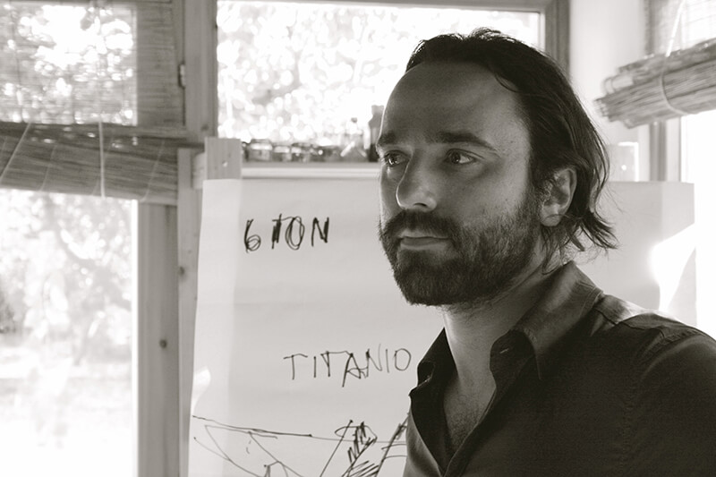
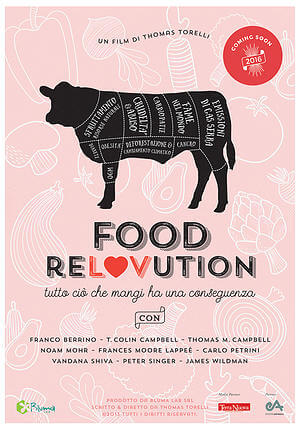

Amici, sono super felice di aver conosciuto [Thomas Torelli](http://www.thomastorelli.com), il regista italiano che sta ultimando un documentario sulla cultura della carne: [Food ReLOVution](http://www.foodrelovution.com/#!home/c1ite).

Thomas è convinto che le rivoluzioni più importanti siano quelle interiori, quelle silenti e potenti che nascono dall'_io_ più profondo.
Grazie al suo lavoro, questo regista vuole lanciare un messaggio molto importante: la scelta è la nostra arma più importante. Non affidiamoci ai soli dogmi alimentari imposti dalla società, conoscere meglio ciò che mangiamo.
Sarà solo in questo modo che potremo dare il via a una rivoluzione, sì, ma fatta con amore.
Chi ne siate convinti o meno, la rivoluzione alimentare è adesso!

### Ciao, Thomas! Sono molto felice che tu abbia accettato l'intervista e ne approfitto per ringraziarti. Perché ti sei buttato a capofitto in questo documentario sulla cultura della carne?

> Ciao, Anna! Food ReLOVution è conseguenza logica del mio film precedente, [Un altro mondo](http://www.unaltromondo.net), che ha vinto il [Clorofilla Film Festival](http://www.festambiente.it/index.php/clorofillahome.html).
>
> _Un altro mondo_ parla di quel senso di unione con la Terra e gli uomini di cui c'è così tanto bisogno, oggi più che mai.
>
> È una profonda riflessione sull'interconnessione esistente fra Uomo e universo, sulla fisica quantistica e sulle credenze che popolano questo pianeta.
>
> `youtube: UAsa8wbzJ78`
>
> Food ReLOVution indaga l'**impatto ambientale della cultura della carne**. Ciò che mangiamo può davvero rappresentare il primo grande passo etico nei suoi confronti e il mio documentario sulla cultura della carne vuole gridarlo.
>
> 
>
> **Scegliere consapevolmente ciò che mangiamo** può davvero cambiare il mondo. La cultura della carne causa problemi globali che interessano direttamente ognuno di noi. Non possiamo, e non dobbiamo, far finta di nulla. Quello che occorre è una **rivoluzione fatta con amore**, da qui il nome del progetto.
>
> Riflettiamo su un concetto molto semplice: per produrre un chilo di carne da allevamenti intensivi consumiamo dai 15 ai 17.000 litri d'acqua. Non è assurdo?
>
> Simili squilibri derivano da cosa scegliamo di mangiare quotidianamente.
>
> Food ReLOVution è un documentario sulla cultura della carne che vuole stimolare le persone a divenire consumatori più attenti e consapevoli. Consumatori capaci di compiere scelte basate sul buonsenso. Così non possiamo andare avanti.

### Hai ricevuto fondi per la realizzazione di Food ReLOVution?

> Riccardo Gatto, esperto di post-produzione, ha investito i primi 30-40.000 euro, dopodiché il lavoro si è bloccato per un po' di tempo.
>
> Ora, grazie a un [crowfunding](https://www.indiegogo.com/projects/food-relovution-what-we-eat-can-make-a-difference#/), abbiamo raccolto soldi a sufficienza per concludere il lavoro. Quello che al momento sta circolando è il trailer ufficiale di presentazione.

### Come sarà strutturato il tuo documentario sulla cultura della carne?

> Food ReLOVution è un progetto scritto e diretto da me, e prodotto da [Bluma Lab](http://www.blumalab.it/home.html).
>
> Il documentario durerà 80 minuti e sarà basato su tre capitoli: i **danni all'ambiente**, quelli **all'umanità** e quelli arrecati **al mondo animale**.
>
> Avremo una **storia ambientata in una fattoria di animali in Florida** intervallata da alcuni minuti di cartone animato. Ogni esperto coinvolto parlerà di un tema specifico.
>
> Senza demonizzare i 'carnivori', il film analizzerà anche le trasformazioni che sono avvenute nel processo alimentare nell'ultimo secolo, specie negli ultimi 40 anni.
>
> Con il mio documentario sulla cultura della carne voglio **dare un'idea visiva di tutto quello che, finora, è solo immaginabile**.

### Hai coinvolto diversi nomi importanti: Franco Berrino, Vandana Shiva, Peter Singer, T. Colin Campbell e molti altri...

> Sì, è stato bellissimo! Siamo volati negli States e abbiamo girato tutto il documentario in due settimane.
>
> Alcuni dei celebri intervistati sono stati coinvolti in modo fortuito. Abbiamo incontrato Peter Singer, ad esempio, negli unici cinque giorni di sua permanenza a New York.
>
> Siamo riusciti a intervistare Frances Moore Lappé, autrice di _Diet for a Small Planet_, nell'unico lunedì mattina libero che abbiamo avuto a New York. Fantastico!

### E dimmi, il tuo documentario sulla cultura della carne sta sucitando interesse?

> Sì, al momento il film sta riscontrando moltissimo interesse. Spero di riuscire a ultimarlo entro la prossima estate e di distribuirlo il più possibile, in Italia e all'estero.

Foto di copertina: [Serge Esteve](https://www.flickr.com/photos/24314363@N02/?utm_source=Unsplash&utm_medium=website&utm_campaign=unsplash) via [Unsplash](https://unsplash.com).
