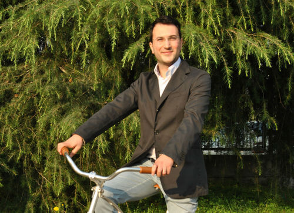

In tutti i viaggi che ho fatto, in Italia e all'estero, avrei tanto voluto avere con me una bici pieghevole leggera. Qualcosa di comodo, di estremamente pratico e di qualità.
Sarebbe bastato conoscere prima l'ingegnere **Gianluca Sada**, mannaggia a me!

Nato a Battipaglia, in quel di Salerno, Gianluca si è laureato in Ingegneria dell'Autoveicolo al [Politecnico di Torino](http://www.polito.it) con una tesi di laurea piuttosto originale: il brevetto di una bicicletta molto particolare.
In questi anni, Gianluca ha impiegato le proprie forze per mettere a punto il prototipo di una bici pieghevole leggera e senza raggi.

Il suo progetto si chiama [Sada Bike](http://www.sadabike.it/en) ed è un inno alla **riduzione dei pesi e degli ingombri**.

Questa **bici pieghevole dal design innovativo** ha il comfort e l'ergonomia di seduta di una normale citybike con ruote da 26". E in più, si piega!
Il sistema di piegatura ha un fulcro centrale attorno al quale ruotano le parti anteriori e posteriori della struttura. L'intero telaio si chiude fino a raggiungere un **ingombro pari a quello di un ombrello**. Di un ombrello, sì!
**La bici si piega in pochi secondi** dopo aver divincolato il cerchio anteriore con un solo movimento.

**Sada Bike entra in uno zaino monospalla**. I cerchi delle ruote diventano parti integranti della struttura e lo spazio vuoto, dovuto alla mancanza dei raggi, può ospitare libri e/o altri oggetti.
La cerniera centrale dello zaino ne permette l'espansione e la presenza di una struttura interna fa sì che le ruote tocchino a terra, trasformandolo in un **trolley da viaggio**.

Il prototipo di questa bici pieghevole leggera è in **ergal**, una lega di alluminio, ed è stato realizzato grazie alla collaborazione con lo [Studio Battipaglia TechnoDesign](http://www.technodesign.it).
A marzo usciranno i prototipi pre-serie. In futuro, invece, inizierà la vendita vera e propria, sia sul mercato italiano che su quello internazionale.

Gianluca, in tutto ciò, ha un socio: l'ingegnere **Giovanni Tonno**, titolare della [Fomt Spa](http://www.fomt.it).
Questa azienda meccanica torinese opera nel settore dell'automotive, è alla terza generazione e, fra i propri clienti, vanta diversi noti marchi automobilistici.

La società che Gianluca sta aprendo per la sua bici pieghevole leggera sarà una start-up innovativa che verrà incubata in [I3P](http://www.i3p.it).

Che Gianluca, in tutto ciò, ci abbia visto giusto lo dimostrano i fatti: il progetto di questa bici pieghevole leggera è stato insignito del *Premio Idea-To 2010*. È stato anche selezionato fra le 10 migliori start-up del 2014.
Gianluca, oltretutto, è stato scelto fra i 200 giovani talenti d'Italia al *Festival Giovani Talenti*.

Siete d'accordo con me sul fatto che in Italia ci siano menti straordinarie?
