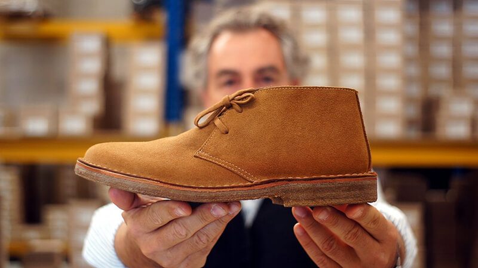

**Gigi Perinello** è un produttore di scarpe artigianali in vera pelle. Oltre a ciò, è una persona molto alla mano e dai modi estremamente gentili che ama definirsi _ribelle per natura_.
Dopo anni trascorsi a vendere materie prime ai grandi marchi di calzature italiani e stranieri, ha scelto di avviare un progetto dal nome accattivante: [Ragioniamo con i piedi](http://www.ragioniamoconipiedi.it/it).
Bisogno di ritrovare l'entusiasmo di un tempo e voglia di dimostrare che oggi è ancora possibile parlare di **qualità**, di **filiera corta**, di **sostenibilità autentica**, di **fiducia** e di **valorizzazione del lavoro**.

Insieme a Maria Grazia, Francesca, Dimitri e Antonella, Gigi ha dato vita a una sorta di _boutique errante_ che promuove scarpe artigianali in vera pelle, sostenibili e resistenti.
L'altro giorno ho fatto due chiacchiere insieme a Gigi.

### Ciao, Gigi. Di cosa ti occupavi prima di fondare _Ragioniamo con i piedi_?

> Ciao, Anna! Per 35 anni ho lavorato nel mondo della scarpa convenzionale vendendo materie prime. In quel lungo periodo ho notato che ai grandi marchi non importava della nostra salute e dei nostri portafogli. Aaffidavano le produzioni a Paesi con manodopera a basso costo e sceglievano materiali scadenti. Stanco di lavorare così, ho dato il via a questo progetto.
>
> Tutti i giorni cerco di motivare ogni mia scelta, creando un dibattito e una discussione con i miei clienti affinché siano anche miei alleati. Penso sia molto importante **instaurare delle relazioni di fiducia** che ci permettano di non lobotomizzarci.

### Che cosa ti infastidiva di più all'epoca del tuo precedente lavoro?

> La mancanza di coerenza e di trasparenza. Diciamo che c'erano molti equivoci.

### Cioè?

> La scarpa in sé deriva dall'unione di una suola con una tomaia, e questo rappresenta circa il 20% del lavoro totale. Tutti gli altri processi vengono ormai condotti all'estero e rappresentano l'80% del lavoro complessivo! È poco sensato parlare di Made in Italy.

### Quali processi vengono condotti all'estero?

> Tagliare, scarnire, cucire e foderare: praticamente l'intera costruzione della tomaia. È proprio a questo punto che **il senso di responsabilità dell'imprenditore gioca un ruolo decisivo**.

### Spiegati meglio...

> Il vero imprenditore, quello responsabile, deve volere il bene della società in cui vive. La sua azienda deve migliorare il territorio in cui si insedia e rappresentare un luogo piacevole per i dipendenti.

### E l'Italia, in questo senso, aiuta l'imprenditore?

> No, credo che i nostri politici non abbiano capito come dovrebbe andare il sistema economico. Produrre tanto e abbassare i costi di produzione è un giochino che ormai non funziona più.

### Mai come oggi abbiamo la grande opportunità di poter essere consumatori consapevoli. Dimmi, come nascono le tue scarpe artigianali in vera pelle?

> Ragioniamo con i piedi è nato per gioco nel 2008 insieme a un cliente, Astorflex, che aveva difficoltà a vendere le proprie calzature. Sono stato io a proporre la produzione di una scarpa per i gruppi di acquisto che fosse costituita da **materiali non comuni**.
>
> Dopo poco tempo abbiamo avuto un grandissimo riscontro, vendendo 600 paia di scarpe artigianali in vera pelle in pochissimo tempo. Nel 2009 la Gabanelli ci ha chiesto di poter realizzare un servizio su _Ragioniamo_ e noi, ovviamente, abbiamo accettato.
>
> Col tempo si sono aggiunti alcuni calzaturieri, ognuno specializzato in un tipo di scarpa.

### Come funziona "Ragioniamo con i piedi"?

> Io dirigo le linee produttive di alcune manifatture artigianali, poi le propongo su [www.ragioniamoconipiedi.it](http://www.ragioniamoconipiedi.it) e ad alcuni mercatini. Specifico che tutte le scarpe che trovate sul sito vengono realizzate sotto la mia direzione e il mio collaudo.

### Quali sono le manifatture che hai selezionato?

> Sono [Astorflex](http://www.astorflex.it), [Gronell](http://www.gronell.it), [Still Tre](http://www.esseutesse.it), Vassanelli e [Gaibana](http://www.gaibana.it). Piccole, qualificate e con un'ottima conoscenza del prodotto, nutrono tutte una forte passione per il **vero Made in Italy** e per determinati **pellami con caratteristiche specifiche**.

### Qual è il valore aggiunto delle tue scarpe artigianali in vera pelle?

> Io non faccio moda. La moda è qualcosa che deve rispondere alla sovrapproduzione. Non amo il consumatore schiavo del sistema economico, voglio che il consumatore sia consapevole.
>
> Ciò che offro è una garanzia di qualità. **Le nostre scarpe artigianali in vera pelle sono più sane, non fanno cattivo odore, durano nel tempo e possono essere riparate senza problemi**.
>
> Le pelli sono conciate con **tannini vegetali** e **senza cromo**, e assorbono perfettamente il sudore. Tutta la produzione viene svolta in Italia secondo i principi della **filiera corta**. Così facendo, per le nostre scarpe artigianali in vera pelle, abbiamo qualità, lavoro, comprensione e difesa della cultura.

### Gigi, come vengono conciate, normalmente, le scarpe?

> Devi sapere che nel 95% dei casi le pelli vengono conciate utilizzando il cromo, un elemento che inquina l'ambiente e provoca allergie da contatto.
>
> Noi usiamo **tannini di mimosa, castagno e quercia**. Hanno bisogno di una lavorazione più lunga, ma sono molto più sostenibili e amici del tessuto cutaneo. È per questa ragione che le nostre scarpe artigianali in vera pelle sono più sane.

### Ho letto sul vostro sito che escludete la pelle di maiale. Perché?

> La pelle di maiale, che viene spesso utilizzata nella produzione delle scarpe, costa poco. Essendo piuttosto grassa, però, non assorbe bene il sudore. La pelle di vitello lo assorbe molto meglio, non provoca cattivo odore e dura di più grazie alla sua maggiore consistenza.

### Proponete anche scarpe artigianali in vera pelle per bambini?

> Sì, ma forse smetterò di venderle perché i bambini sono troppo soggetti alle mode.

### Prima di concludere la nostra chiacchierata, dimmi tre aggettivi capaci di descrivere il tuo team!

> Entusiasta, cocciuto e preparato. In tre parole: **siamo una famiglia**.
