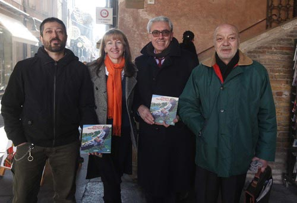
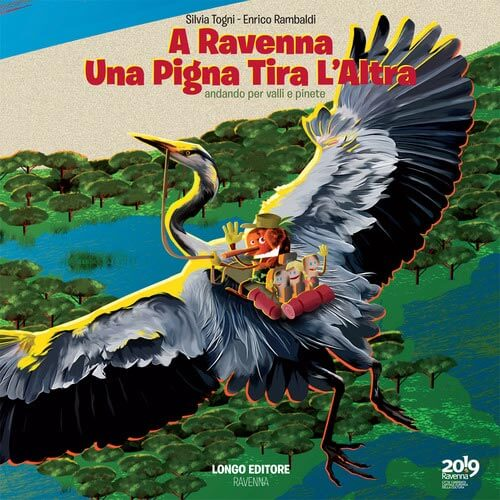

Ci sono due guide illustrate di Ravenna che raccontano a bambini e ragazzi la storia della città col linguaggio delle parole e delle illustrazioni. Protagonista dei due libricino è... una pigna!

Cosa rappresenta, la pigna, per una guida turistica o un appassionato di storia dell'arte? Lo sapete?
Fin dai tempi dell'Antica Roma, la pigna è associata alla rinascita, all'immortalità e alla fertilità, complice anche la sua forma molto simile a quella di un uovo.
Effettivamente, la pigna, per quanto esternamente risulti secca, in realtà racchiude la vita: i pinoli. Ci sta che venga considerata come simbolo di continuità.

A Ravenna se ne contano tante, ce ne sono anche nella stessa Piazza del Popolo e vicino alla Tomba di Dante.
**Silvia Togni** l'ha resa protagonista di una serie di libri illustrati.
Presidente del Sindacato Guide Turistiche Confcommercio Ravenna, insieme al graphic designer e naturalista Enrico Rambaldi, Silvia ha pubblicato questi due libricini per conto di [Longo Editore](http://www.longo-editore.it).

Da sinistra: Enrico Rambaldi, Silvia Togni, Sauro Mattarelli (Fondazione del Monte di Bologna e Ravenna) ed Alfio Longo, l'editore (Ph. Giampiero Corelli).

*Una Pigna per Ravenna* è la prima delle due guide illustrate di Ravenna: Silvia diventa una pigna travestita da Sherlock Holmes che racconta la storia della città attraverso i simbolismi nascosti.
In *A Ravenna una Pigna tira l'altra*, invece, la nostra pigna-cicerone ci conduce all'interno del patrimonio naturale ravennate.

Da *A Ravenna una Pigna tira l'altra* trapelano mille mila curiosità.
Leggendo il capitolo sulle valli, ad esempio, ho scoperto che 'piallassa' deriva da *pija* e *lassa*, due verbi veneti che rimandano al movimento delle maree.
Nel capitolo in cui si parla delle saline, invece, ho scoperto che il termine 'salario' deriva dal sale, l'antica moneta con cui si pagavano i soldati romani.

Quante cose si possono imparare leggendo due guide illustrate di Ravenna, eh? Chi l'avrebbe mai detto!

### Ciao, Silvia! Perché diventare una guida turistica?

> Ciao, Anna! L'idea di essere una guida turistica è nata alle elementari, quando una maestra mi ha fatto conoscere la storia della mia città e del suo territorio. È così che ho 'preso in ostaggio' amici e parenti e li ho trascinati per chiese e mosaici.
>
> La conoscenza delle bellezze artistiche di Ravenna è nata molto prima, da bambina. All'epoca non esistevano ancora ZTL, piste ciclabili e parchi giochi. I polli sultani di Sant'Apollinare Nuovo e le colombine del Mausoleo di Galla Placidia sono diventati i miei primi compagni di giochi.

### Cosa ami della storia di Ravenna?

> **Ravenna è una città antichissima**, le sue origini si perdono nella notte dei tempi. Per questo è ricca di misteri che, forse, non saranno mai svelati, e che la rendono ancora più affascinante.
>
> Il suo *isolamento cosmico* le è valso, nei secoli, miseria e fortuna, ma anche peculiarità che la rendono unica al mondo. Basti pensare al patrimonio musivo dei secc. V e VI, il più vasto e meglio conservato a livello mondiale!
>
> Ravenna **va sempre controcorrente**: diventa capitale di un impero quando tutta Europa è allo sfacelo, è sofferente quando le meraviglie del Rinascimento impazzano ovunque. È una 'città-pigna', come mi piace definirla: chiusa, dura, severa. Eppure coltiva sempre la vita e la voglia di rinascere, proprio come la pigna con i suoi pinoli.

### Le strade ravennati: quali 'celebrità' del remoto passato le hanno percorse, e quali avvenimenti degni di nota hanno ospitato?

> Rimando alle mie due guide illustrate di Ravenna, nelle quali ho citato **tanti personaggi storici legati a Ravenna**, quasi ignoti e spesso ignorati dai classici libri di storia.
>
> Amo la storia non convenzionale. Mi riferisco a quella dei barbari illuminati come Teodorico e Drogdone, quella delle donne pittrici come Barbara Longhi e quella degli arcivescovi dalle larghe vedute come Rinaldo da Concorezzo, amico di Dante.
>
> Ci vuole coraggio, come ne ha avuto Ravenna, a resistere, per secoli, incastrata tra la terra e il mare, in balia delle acque e della subsidenza!

### Com'è nata l'idea di scrivere queste due guide illustrate di Ravenna, e perché ti sei identificata in una pigna?

> La pigna è un simbolo antichissimo: si trova a quasi tutte le latitudini del globo e, ovunque, simboleggia la rinascita dopo la morte. Una specie di fenice. Ravenna non fa eccezione e, solo in Piazza del Popolo, se ne possono trovare una quarantina.
>
> L'idea che la pigna, presente anche sul nostro stemma cittadino, fosse la protagonista dei miei tour e delle mie due guide illustrate di Ravenna, è arrivata lavorando come guida turistica. **Volevo che la mia città venisse vista come un luogo pieno di vita**.
>
> Enrico Rambaldi ha fatto il resto, dando vita a una serie di pinoli curiosi che, come turisti, vanno a caccia di novità, in città e non solo.

### Chi desideri ringraziare per la realizzazione delle due guide illustrate di Ravenna?

> A parte te, che mi onori di questa intervista, ringrazio in modo particolare Ravenna e la Romagna, una terra bellissima che resta la mia massima fonte di ispirazione.

### Un'ultima domanda: cosa riserva il 2014?

> Di sicuro, riserva nuove idee, nuovi racconti e nuove passeggiate da organizzare a Ravenna e dintorni, a caccia di cose da scoprire e da valorizzare.
>
> Sono certa che vedrà il completamento della *Trilogia della Pigna*: una terza, fantasmagorica avventura della pigna è già in cantiere e pronta a svelare qualche mistero in più.
