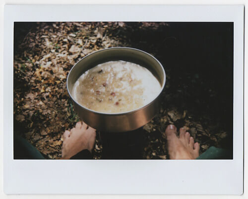

Dedicarsi al trekking introspettivo significa, sostanzialmente, camminare in mezzo alla natura per ritrovare sé stessi, per stabilire, o ristabilire, un nuovo dialogo col proprio _io_ interiore.

A Forlì c'è qualcuno che, sull'errare, ha sviluppato una tesi di laurea: **Simone Enei** vede nel camminare una forma di coscienza.
Simone cammina per boschi e, allo stesso tempo, raccoglie e fotografa rocce, muschi, licheni, foglie, bastoni ed eventuali piccoli ossicini.
Le sue passeggiate hanno qualcosa di introspettivo, di spirituale, e assumono i connotati artistici.

Qualche tempo fa, Simone mi ha consegnato la sua tesi di laurea domandandomi se fossi interessata a leggerla. E così ho fatto.
Si tratta di uno scritto colmo di pensieri e di considerazioni. Ci sono riferimenti a personaggi come Henry David Thoreau, Richard Long e Hamish Fulton. Ed è anche una specie di diario inerente un trekking introspettivo di sei giorni sull'Appennino Romagnolo, partendo da Crespino del Lamone fino ad arrivare al Santuario della Verna.
Lungo questo tragitto, oltre ad aver dormito in tenda o presso alcuni bivacchi e aver mangiato cibi disidratati, Simone ha scattato 3 polaroid al giorno, ha annotato ogni giornata e ha registrato le tracce GPS di tutta la camminata.

### Ciao, Simone. Come ti è venuto in mente di trasformare un trekking introspettivo in una tesi di laurea?

> Ciao, Anna. Mi sono chiesto: "Cos'è che ti piace veramente fare?". La risposta è stata semplice e immediata: vivere la natura e la montagna camminando.
>
> Poco tempo prima avevo conosciuto nomi come Richard Long e Hamish Fulton, persone che hanno fatto del camminare uno stile di vita e un modo di fare arte.
>
> Ho pensato che il mio cammino sarebbe potuto essere una sorta di performance artistica.

### _Walden, ovvero Vita nei boschi_ è un saggio autobiografico di Henry David Thoreau. L'autore cerca un rapporto intimo con la natura e con sé stesso, lontano da una società povera di valori. Quanto ti riconosci in Thoreau?

> Tantissimo! Non mi ritrovo soltanto in tutte le sue considerazioni su quella che è la nostra società, o su quello che è per lui la vita umana. Nelle sue parole ho trovato il mio stesso desiderio di **vivere la natura dei boschi, dei laghi e delle montagne** come esperienza della vita stessa.

### Parlami del tuo trekking introspettivo sull'Appennino Romagnolo: quali sensazioni hai provato in quell'avventura solitaria? Hai avuto paura?

> Le sensazioni che ho provato durante quel trekking introspettivo sono state tante, e tutte davvero intense.
>
> **Camminare per chilometri e chilometri senza incontrare nessuno**, dormire nel bosco, bere dai ruscelli, stare seduto sul terreno in silenzio a guardare e ad ascoltare la vita intorno a me: tutto ti fa sentire parte dell'ecosistema.
>
> 
>
> In un capanno di cacciatori, un ghiro è sbucato dal suo nascondiglio e ha iniziato a fissarmi. Gli ho lasciato un pezzo di biscotto e poco dopo si è avvicinato. Lo ha afferrato con la bocca ed è fuggito nel suo nascondiglio.
>
> Un giorno mi sono trovato di fronte a una mandria di vacche che pascolava attorno all'abbeveratoio dal quale avrei dovuto fare rifornimento d'acqua. Ho aspettato che si spostasse, ma non c'è stato modo: sono tornato sulla mia strada, senza acqua.
>
> Di paura, durante il mio trekking introspettivo sull'Appennino, non è ne ho mai avuta. **Mi sento più sicuro fra i boschi e sulle montagne che in città**.

### Perché scattare delle Polaroid? La tua è una ricerca di essenzialità?

> Sì. E anche un tentativo di concentrare l'attenzione sull'intero valore concettuale del mio trekking introspettivo, non solo sull'estetica.
>
> Volevo che fosse l'intera esperienza del cammino a divenire 'opera'. Per questo ho scattato foto, tenuto un diario e registrato le tracce GPS del cammino: per documentare tutto in modo eterogeneo.
>
> Una Polaroid, oltretutto, non offre le distrazioni tipiche della tecnica fotografica e della ricerca formale che si mettono in atto quando si scatta una fotografia.

### Hai in mente altre avventure per boschi?

> Certo, per boschi e non, ma sempre sulle montagne, che considero il mio habitat naturale.
>
> Il mio sogno è di riuscire a percorrere uno dei grandi trekking nepalesi, come quello dell'Annapurna. Spero di riuscirci, prima o poi.

