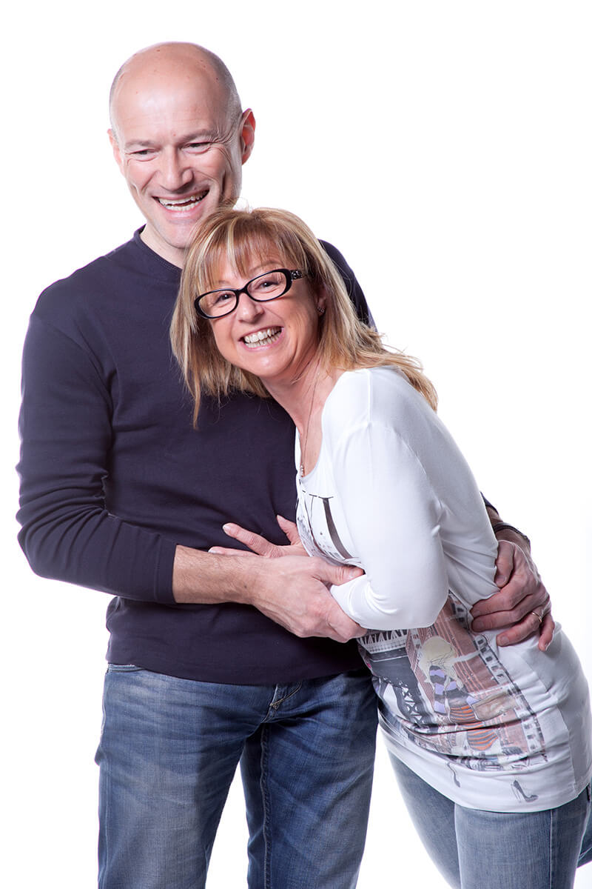

Fino a qualche giorno fa non sapevo che a Granarolo Faentino si producesse intimo italiano donna, uomo e bambino di qualità.
Sono felice di aver conosciuto [Simplycris](https://www.simplycris.com/?gclid=CjwKCAjwnIr1BRAWEiwA6GpwNXBSQJqkh_PSEb-uxQaPdwQX4TWws79yMRacuMhFoh27Cn8DOftzChoCFFEQAvD_BwE), una bella realtà aziendale del mio territorio.

Tutto è nato negli anni Settanta dal signor Giovanni Sangiorgi e dal suo Calzificio Edi, focalizzato sulla produzione di calze e collant da donna per conto di terzi.
A quell'epoca, nel faentino, [Omsa](http://www.omsa.com/it/) la faceva da padrone. Dopo la crisi del collant e il passaggio alla produzione industriale, Giovanni Sangiorgi ha preso una decisione. Ha scelto di fondare un'**azienda di abbigliamento intimo con vocazione artigianale**, coinvolgendo anche la moglie Marisa.
È così che tutto ha avuto inizio.

Nel 1982, **Stefano Tanesini** ha conosciuto **Cristina Sangiorgi**, la figlia di Giovanni e Marisa. Sette anni dopo è entrato a far parte dell'azienda di famiglia che, nel tempo, è divenuta Simplycris.
Stefano è una persona estremamente gentile e sorridente, di quelle che ormai si contano sulle dita di una mano. Circondato da reggiseni con pizzo super sexy, da slip e da perizomi colorati, quello di Stefano è di sicuro l'ufficio che ogni uomo sogna di avere!
Avete voglia di saperne di più sul suo intimo italiano donna, uomo e bambino?

### Stefano, cosa producete tu e Cristina?

> Ciao, Anna! Come giustamente hai detto tu, produciamo intimo italiano donna, uomo e bambino.

### Visitando il vostro laboratorio ho notato che alcune confezioni riportano la dicitura 'Cristina Intimo Donna' e altre 'Simplycris'. Perché?

> Sì, hai ragione. In realtà 'Cristina Intimo Donna' e 'Simplycris' sono la stessa cosa. Il primo marchio è destinato alla vendita diretta nei negozi, il secondo è il nome scelto per le [vendite online](http://www.simplycris.com/negozio/).

### Dove producete il vostro intimo italiano donna, uomo e bambino, e dove si trovano i vostri fornitori?

> Produciamo tutto nel nostro laboratorio di Cotignola, a Ravenna. I nostri fornitori sono nel Nord Italia. **Non acquistiamo all'estero**: i filati provengono da Verona, gli elastici dalla zona di Milano e così via. Con alcune realtà collaboriamo da oltre 30 anni e c'è un rapporto di estrema fiducia. È capitato anche di andare in vacanza insieme, giusto per darti un'idea.
>
> I punti vendita che ci rappresentano sono soprattutto del Nord Italia, ma siamo presenti anche in 6-7 negozi a Napoli.

### È possibile richiedere capo di abbigliamento intimo italiano donna, uomo e bambino su misura?

> Certamente, **produciamo anche su misura**. In questo caso ci occorrono giusto 4 o 5 giorni di lavoro, dopodiché il capo è pronto per la consegna. Grazie al nostro sistema di vendita online, **vendiamo in tutta Italia**.

### Stefano, se ti parlo di *tollerabilità cutanea"* cosa mi rispondi?

> Ti dico che **i nostri capi non sono trattati con sostanze chimiche tossiche**. Per le nostre colorazioni ci rivolgiamo a una tintoria di Cassano Magnago, in provincia di Varese, che garantisce la totale assenza di sostanze nocive nel bagno tintoriale.
>
> Il nostro intimo gode della certificazione **[OEKO TEX Standard 100](https://www.oeko-tex.com/it/business/certifications_and_services/ots_100/ots_100_certification/ots_100_certification.xhtml)**. Questo significa che i tessuti sono stati tinti secondo le direttive della normativa più avanzata in materia di sicurezza tessile a livello mondiale.
>
> Questo è un bel plus in favore della salute e della qualità del Made in Italy. Il nostro intimo italiano donna, uomo e bambino è disponibile anche in **cotone greggio non trattato**.

### L'ultima mia domanda riguarda le persone di Simplycris. Chi siete, esattamente?

> Le persone del nostro team conoscono molto bene il loro mestiere e, ogni giorno, realizzano intimo italiano donna, uomo e bambino di alta qualità.
>
> Amiamo **lavorare con passione**, **curare i dettagli** dei nostri prodotti, **coccolare i clienti** cercando di essere sempre pronti a soddisfare le loro esigenze. Siamo **persone autentiche** che amano il proprio lavoro, semplicemente. Prima di qualsiasi altra cosa, però, siamo una grande famiglia!

