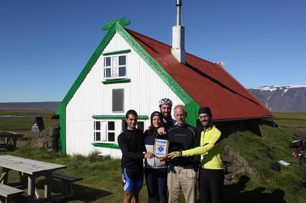

Quattro ragazzi di Cesena, appassionati di cicloturismo nel mondo, si sono cimentati in un'avventura stupenda: percorrere tutta l'Islanda in sella alle loro bici.

Li invidio tantissimo. Ho sempre sognato di vivere un'esperienza come quella.
Finora, l'unico percorso lungo che sono riuscita a compiere è stata la Via del Chianti, che collega Firenze a Siena. Tre giorni durante i quali ho avuto la sensazione di pedalare in una pittura ad olio. In un tratto di strada mi sono pure commossa.

Una vacanza in bicicletta è un'emozione che resta per sempre, e solo chi ama questo genere di esperienze può capirlo. Sono sicura che i quattro protagonisti di questo nuovo articolo, ad esempio, lo capiscano benissimo!
La loro passione per il cicloturismo nel mondo è qualcosa di profondo e di tangibile. Ne ho parlato insieme a uno di loro: **Stefano Milini**.

### Ciao, Stefano! Per te, come per me, la bici è una passione. Com'è nato questo tuo interesse?

> Ciao, Anna! Innanzitutto grazie per l'intervista.
>
> La passione per la mountain-bike è nata nel 2009 quando, assieme al mio amico Enrico, ho iniziato a organizzare viaggi in bicicletta. La passione per il viaggio mi ha sempre accompagnato e così, forse per fuggire dal lavoro in ufficio o per un'irrefrenabile voglia di avventura, ho pensato a una vacanza all'estero in sella alla bici.
>
> Il primo viaggio è stato in Olanda, un posto bellissimo dove sono entrato in contatto con le pianure e le chiuse fiamminghe per una decina di giorni.
>
> Partiti con il solo zaino, io ed Enrico abbiamo cercato un noleggio bici ad Amsterdam. Obiettivo: percorrere in senso orario l'Olanda, per un totale di circa 400 chilometri.
>
> Fare cicloturismo nel mondo è davvero una grande avventura!

### Nel 2012 prende vita _Scopri il Mondo sui Pedali_: alla scoperta dell'Islanda per oltre 1000 chilometri, in sella a una mountain-bike, senza mezzi di supporto. Un modo per promuovere e invogliare al cicloturismo nel mondo. Come e perché è nato questo progetto, e quali sensazioni hai avuto nel viverlo?

> Il [CAI di Cesena](http://www.caicesena.com) ci ha aiutati a organizzarlo. Obiettivo è stato condividere il desiderio di **conoscenza**, di **rispetto** e di **solidarietà** nei confronti di altri popoli e di altre culture grazie a viaggi 'scomodi' in bici. Un cicloturismo nel mondo solidale, per capirci.
>
> 
>
> Nell'agosto 2012, Enrico, Thomas, Federica ed io siamo partiti e, per 3 settimane, abbiamo pedalato in mezzo a paesaggi mozzafiato e strade desertiche ricoperte dal _tôle ondulée_. È il pavimento ondulato delle zone aride che non dà tregua al ciclista, tra ghiacciai e geyser prorompenti.
>
> Il viaggio si è svolto in totale autonomia con tenda, sacco a pelo e tutta l'attrezzatura indispensabile per affrontare gli altopiani.
>
> Abbiamo acquistato le cartine islandesi alla Libreria del Viaggiatore a Sondrio, famosa agli esploratori, che ci hanno permesso di percorrere l'Islanda attraverso la Kjölur Road. Il totale è stato di oltre 1200 chilometri. Abbiamo attraversato tratti di completa solitudine con sfide durissime e venti fortissimi.
>
> Abbiamo consegnato il gagliardetto del CAI di Cesena al rifugio più antico d'Islanda, il Hvitárnes Hut, costruito nel 1930.
>
> In Islanda il cicloturismo è esplorazione. E **il cicloturismo nel mondo, per noi, è introspezione**.

### Avete conosciuto altri 'pellegrini su due ruote' lungo il vostro cammino islandese? Ce n'è uno, in particolare, che non dimenticherai mai?

> **Di persone ne abbiamo incontrate tante** lungo il nostro peregrinare, dai viaggiatori solitari ai grandi gruppi. Tante persone con cui condividere momenti unici di felicità o tristezza, a seconda dei casi.
>
> Ricordo, in Islanda, l'incontro con un viaggiatore tedesco, Thomas, che aveva percorso una quantità inimmaginabile di chilometri in solitaria.
>
> Sono soprattutto due ragazzi ad essere rimasti nel mio cuore: Andrea e Michela, entrambi fotoreporter di guerra con la passione per il cicloturismo nel mondo. Ciò che per noi è stata una sfida ai limiti dell'impossibile, per loro è stata una specie di passeggiata.

### E se ti dico Capo Nord? Cosa rispondi?

> Beh, qui mi tocchi al cuore perchè mi fai ripensare al mio secondo viaggio in bici, nell'agosto 2010. Quell'estate Enrico e Thomas ed io volevamo spingerci un po' oltre, mossi sempre dal desiderio di sfida.
>
> 
>
> Così siamo partiti alla volta della Finlandia e della Norvegia per raggiungere **Capo Nord**, con inizio da Rovaniemi.
>
> In Finlandia la strada è molto spartana e le accomodazioni sono centellinate, date le grandi distanze tra le città. Il clima, oltretutto, è imprevedibile.
>
> Ancora una volta abbiamo goduto di un paesaggio da favola, regno della taiga lappone, con immense foreste di conifere e betulle e tantissimi laghi. Arrivati a Capo Nord è stato come arrivare sulla luna per me. Non lo dimenticherò mai.

### Quali altri progetti hai in cantiere?

> Di progetti ce ne sono tantissimi, Anna. Vorrei percorrere le **alte vie dolomitiche** in bici fino agli altopiani tibetani, ai piedi della catena himalayana.
>
> E poi vorrei percorrere la famosa **Friendship Highway**, che collega Kathmandu alla capitale del Tibet, Lhasa. Spero di vivere questa nuova esperienza insieme ai miei amici di avventura!

