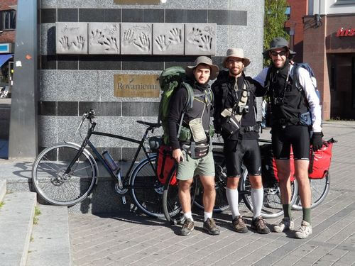

Instagram è un social network fotografico.

Il suo utilizzo è molto semplice: gli utenti, generalmente attraverso uno smartphone, scattano foto che possono successivamente modificare a proprio piacimento ricorrendo ad alcuni filtri.

Ogni utente ha una serie di "seguaci" e di "seguiti", per dirla in gergo, ovvero persone che possono vedere le foto pubblicate e viceversa. In entrambi i casi può trattarsi di persone a noi vicine oppure di completi estranei residenti in chissà quale parte del mondo.

Ad oggi, Instagram è una piattaforma molto popolare.

Ed è proprio attraverso questo social network che sono venuta a conoscenza di una gran bella avventura cicloturistica: quella intrapresa da quattro ragazzi di Cesena che, dopo un lungo pianificare, hanno deciso di percorrere l'Islanda in mountain-bike e di perdersi per quasi un mese tra immense vallate, ghiacciai e sperduti geyser.

Nello specifico, ho appassionatamente seguito le avventure pubblicate da uno di loro, Stefano Milini.

Ho sempre sognato di intraprendere un'avventura cicloturistica come quella. Finora, l'unico percorso lungo che sono riuscita a compiere è stato la Via del Chianti, che collega Firenze a Siena: tre giorni indimenticabili durante i quali ho avuto la sensazione di pedalare all'interno di una pittura ad olio. E per un tratto di strada mi sono pure commossa, che lo crediate oppure no.

Se pensate che tutto ciò sia roba da ciclisti romantici vi sbagliate di grosso: credetemi, una vacanza in bicicletta è un'emozione che resta per sempre.

Mi auguro, in un futuro nemmeno troppo lontano, di riuscire ad intraprendere alcune cicloavventure come, ad esempio, la ciclabile del Danubio e il Cammino di Santiago...

In attesa di realizzare questi sogni, torniamo ai nostri amici cesenati e, più precisamente, a Stefano, che ho personalmente seguito su Instagram.

### Ciao Stefano! Per te, come per me, la bici è divenuta una passione. Com'è nato questo interesse?

> Ciao Anna! Innanzitutto grazie per l'intervista.
> 
> La passione per la mountain-bike è nata nel 2009 quando, assieme al mio amico Enrico, ho iniziato ad organizzare viaggi in bicicletta. Fin da giovane la passione per il viaggio mi ha sempre accompagnato e così, forse per fuggire dal lavoro in ufficio, o forse per un'irrefrenabile voglia di avventura, ho pensato di realizzare una vacanza all'estero con il solo ausilio della bicicletta.
> 
> Il primo viaggio è stato in Olanda, un posto bellissimo dove sono entrato in contatto con le tipiche pianure e le chiuse fiamminghe per circa una decina di giorni.
> 
> Partiti con il solo zaino, io ed Enrico siamo andati alla ricerca di un noleggio biciclette ad Amsterdam che potesse offrirci un mezzo adeguato a percorrere in senso orario l'Olanda, per un totale di circa 400 km.
> 
> La vacanza si è rivelata davvero una grande avventura, così come pure la scoperta della bici: un mezzo semplice, ma di grande efficacia ed ecologico.

### Nel 2012 prende vita un progetto che vede coinvolti te ed altri tre tuoi amici, "Scopri il Mondo sui Pedali": alla scoperta dell'Islanda per oltre 1000 km in sella ad una mountain-bike senza alcun mezzo di supporto. Io ho seguito le vostre avventure su Instagram e ammetto che le fotografie che postavi toglievano il fiato. Ora raccontami: com'è nato questo progetto e quali sensazioni hai avuto nel viverlo?

> Esatto. Dopo due anni di viaggi prevalentemente su strada volevo cimentarmi in un'avventura più esplorativa dove la natura facesse da sovrana incontrastata.
> 
> Ed ecco spuntare l'Islanda, un posto che solo a dirlo mi fa ancora venire i brividi.
> 
> Per organizzare il viaggio ho avuto una mano dal [Club Alpino Italiano (CAI) di Cesena](http://www.caicesena.com), dove pratico regolarmente mountain-bike.
> 
> E qui è nato il progetto "Scopri il Mondo sui Pedali": l'obiettivo di questo progetto è condividere il desiderio di conoscenza, di rispetto e di solidarietà nei confronti degli altri popoli e delle diverse culture effettuando viaggi 'scomodi' in bicicletta (ma non solo) che garantiscano di vivere esperienze indimenticabili.
> 
> 
>
> Dopo tanti mesi di preparativi, finalmente nell'agosto 2012 io e i miei amici Enrico, Thomas e Federica siamo partiti in mountain-bike e, per ben tre settimane, abbiamo pedalato lungo paesaggi mozzafiato e strade desertiche ricoperte dell'inevitabile *tôle ondulée*, il pavimento ondulato delle zone aride che non dà tregua al ciclista, tra ghiacciai e geyser prorompenti.
> 
> Il viaggio si è svolto in totale autonomia con tenda, sacco a pelo e tutta l'attrezzatura indispensabile per affrontare gli altopiani interni lontani dalla civiltà islandese, composta di soli 319.575 abitanti.
> 
> Per muoverci in sicurezza e per programmare la spedizione abbiamo acquistato le cartine islandesi alla Libreria del Viaggiatore a Sondrio, famosa agli esploratori, che ci hanno permesso di percorrere l'intero periplo dell'Islanda attraverso la strada desertica F35, meglio conosciuta come "Kjölur Road", per un totale di oltre 1200 km.
> 
> Nel percorso abbiamo attraversato tratti di completa solitudine con sfide durissime e venti fortissimi.
> 
> Inoltre, abbiamo consegnato il gagliardetto del CAI di Cesena al rifugio più antico d'Islanda, il Hvitárnes Hut, costruito nel 1930.
> 
> In Islanda il cicloturismo è esplorazione e per noi si è rivelato un viaggio introspettivo.
> 
> Come dice Walter Bonatti: *"Da quassù il mondo degli uomini altro non sembra che follia, grigiore racchiuso dentro sé stesso. E pensare che lo si reputa vivo soltanto perché è caotico e rumoroso"*.

### Avete conosciuto altri "pellegrini su due ruote" lungo il vostro cammino islandese? Quale, in particolare, non dimenticherai mai?

> Assolutamente sì. Di personaggi ne abbiamo incontrati tanti lungo il nostro peregrinare, dai viaggiatori solitari ai grandi gruppi, tante persone con le quali condividere momenti unici di felicità o tristezza a seconda dei casi.
> 
> Ricordo, in Islanda, l'incontro con un viaggiatore tedesco, Thomas, che aveva percorso una quantità inimmaginabile di chilometri in solitaria.
> 
> Lo conoscemmo in un camping e ci raccontò tutto di lui e dei modi che aveva trovato per pedalare e per sopravvivere lungo deserti e zone inaccessibili alla civiltà. Grazie ad una bici con una particolare trasmissione (un pacco pignone integrato, per l'esattezza) poteva percorrere interi deserti senza problemi di polvere agli ingranaggi.
> 
> Tuttavia, sono soprattutto due ragazzi ad essere rimasti nel mio cuore: Andrea e Michela, entrambi foto-reporter di guerra con la passione per l'avventura e il cicloturismo.
> 
> Ciò che per noi era una sfida ai limiti dell'impossibile, per loro era solo una passeggiata lontana dai posti caldi dove vivevano tutti i giorni.

### E se ti dico "Capo Nord"? Cosa rispondi?

> Beh, qui mi tocchi al cuore perchè mi fai venire in mente il mio secondo viaggio in bicicletta nell'agosto 2010. In quell'estate io, Enrico e Thomas volevamo spingerci un po' oltre, mossi sempre dal desiderio di sfida.
> 
> 
>
> Così partimmo alla volta della Finlandia e della Norvegia per raggiungere Capo Nord con inizio da Rovaniemi, città di Babbo Natale.
> 
> In Finlandia la strada è molto spartana e le accomodazioni sono centellinate date le grandi distanze tra le città. Inoltre, il clima è imprevedibile e con il frequente gelo tipico delle zone oltre il Circolo Polare Artico.
> 
> Ancora una volta abbiamo goduto di un paesaggio da favola, regno della Taiga Lappone, con immense foreste di conifere e betulle e numerosissimi laghi. Una volta giunti a Capo Nord (Nordkapp), il punto più settentrionale d'Europa situato sull'isola di Magerøya, è stato come arrivare sulla Luna per me. Non lo dimenticherò mai.
> 
> Tra l'altro, per una serie di sfortunate coincidenze, abbiamo rischiato di dormire all'addiaccio, ma questa è un'altra storia....

### Quali altri progetti hai in cantiere?

> Di progetti ce ne sono tantissimi, Anna. Ho tanti sogni nel cassetto che un giorno mi piacerebbe realizzare, dalle lunghe Alte Vie Dolomitiche in bicicletta fino agli altopiani tibetani ai piedi della Catena Himalayana.
> 
> Ma ce n'è uno che mi ispira particolarmente, ed è la famosa Strada dell'Amicizia, meglio conosciuta come "Friendship Highway", che collega la capitale del Nepal, Kathmandu, alla capitale del Tibet, Lhasa.
> 
> Spero di poterla percorrere presto in mountain-bike in compagnia dei miei inseparabili amici di avventura.

