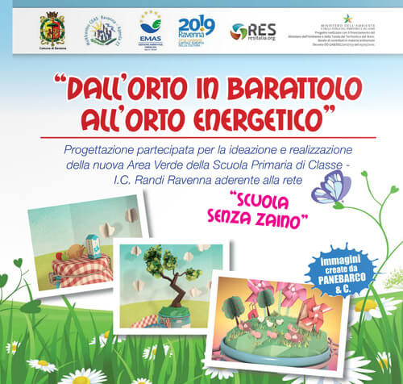

Qualche tempo fa, intenta a bere un caffè al bar, ho appreso da un giornale ravennate a proposito di una bella iniziativa incentrata sull'educazione ambientale a scuola. Un progetto ambizioso che valorizza i concetti di ecologia e di sostenibilità sottolineando il legame fra cibo, energia e inquinamento.

Una delle persone coinvolte in questo progetto didattico è l'ingegnere **Stefano Silvi**, un amico che, al momento, è in Gran Bretagna per collaborare con ["The Facility"](http://www.the-facility.co.uk) nell'ambito del progetto europeo _Erasmus Young Entrepreneurs_.

Il nome di questo progetto di educazione ambientale a scuola è _Dall'orto in barattolo all'orto energetico_ e la brochure è consultabile a questo link: [http://issuu.com/comra/docs/orto_in_classe](http://issuu.com/comra/docs/orto_in_classe).

Il progetto, promosso e sostenuto dal Comune di Ravenna, ha coinvolto l'Istituto Comprensivo "Vincenzo Randi" con la sua scuola primaria di Classe. E poi il comitato cittadino di Classe, gli esperti ortolani Vittorio Casanova e Antonio Gasperoni, [RES](http://www.resitalia.org) e l'azienda agricola di Luca Miserocchi.
[Panebarco&Multimedia](http://www.panebarco.it) ha realizzato un bellissimo cartone animato che potete vedere a questo link: [https://www.youtube.com/watch?v=uSy1zvsO7JM](https://www.youtube.com/watch?v=uSy1zvsO7JM)

Grazie a _Dall'orto in barattolo all'orto energetico_, i bambini smettono di essere ascoltatori passivi per diventare protagonisti del loro apprendimento. Partecipano a **laboratori di ricerca e di sperimentazione**, coltivano in situ e imparano la **cultura della responsabilità**.
Il giardino della scuola diventa, così, un luogo pieno di stimoli capace di ripristinare gli equilibri ecosistemici grazie agli animali attratti dalle piante tipiche dell'orto.

Stefano Silvi, con l'architetto Elisabetta Socci e il tecnico ambientale Giuseppe Pesce, ha attuato il percorso formativo del progetto differenziando la complessità delle lezioni in base alle età degli alunni.

### Ciao, Stefano! Ti eri mai cimentato in attività di educazione ambientale a scuola?

> Ciao, Anna! È stata la prima volta che i miei collaboratori ed io ci siamo trovati ad affrontare un percorso formativo in una scuola primaria.
>
> È stato complesso differenziare l'approccio formativo a seconda delle età dei nostri piccoli studenti. Serviva coinvolgerli tutti allo stesso modo ma, chiaramente, utilizzando linguaggi e approcci diversi.
>
> Le maestre della scuola primaria hanno contribuito a stimolare e ad approfondire l'interesse per temi non certo semplici per tutti gli alunni. L'entusiasmo e le competenze di Elisabetta e Giuseppe verso questo progetto di educazione ambientale a scuola sono stati fondamentali.

### Quali temi avete deciso di affrontare? E quali attività avete proposto?

> Voleva mettere in luce i **vantaggi del consumo di cibi locali e di stagione** in termini di consumo di energia e di riduzione dell'inquinamento. E poi l'energia consumata per la produzione e la conservazione degli alimenti, l'opportunità di produrre energia da scarti e fonti rinnovabili, e i piccoli gesti quotidiani volti al risparmio energetico.
>
> Per fare questo, abbiamo coinvolto gli alunni sia in **attività manuali**, sia attraverso **lezioni e laboratori didattici**, nei quali abbiamo trattato gli argomenti sopra citati.
>
> 
>
> La risposta, in termini di coinvolgimento e di attenzione, è stata entusiasmante, al di sopra di qualsiasi nostra più rosea previsione.
>
> Alla fine di questo percorso di educazione ambientale a scuola, abbiamo consegnato a ciascun alunno il diploma di _Ortolano Energetico_. E poi un vasetto di confettura realizzata con le fragole coltivate insieme, per il quale ciascun bambino era stato chiamato a disegnare la propria etichetta.

### Quanto successo ha riscosso il vostro modo di fare educazione ambientale a scuola?

> Tantissimo. A tutti gli studenti abbiamo fatto capire il **legame tra cibo, energia e inquinamento**.
>
> Le attività nell'orto ci hanno permesso di dimostrare l'importanza dell'attesa e del rispetto dei cicli e dei tempi della natura.
>
> I laboratori del nostro progetto di educazione ambientale a scuola cementavano, negli studenti, le idee e i concetti-chiave affrontati a lezione.
>
> Abbiamo anche effettuato una dimostrazione con un piccolo **digestore anaerobico** in plexiglass, mostrando come dagli scarti si potesse generare energia. A questo proposito, abbiamo realizzato una **dimostrazione di pirolisi**.
>
> 
>
> In ultimo, abbiamo preparato un vero **essicatore solare in legno e plexiglass**, perfettamente funzionante, che rimarrà alla scuola insieme alla serra. Gli alunni potranno continuare a utilizzarlo negli anni a venire.

### Pensi che il progetto verrà riproposto nell'a.s 2014/2015?

> **Il nostro progetto di educazione ambientale a scuola ha avuto molto successo** e ci sono arrivate tantissime dimostrazioni di apprezzamento dai bambini, dai genitori e dalle istituzioni.
>
> Per questo motivo verrà riproposto nel piano di offerta formativa per l'anno scolastico 2014/2015 del Comune di Ravenna.
>
> Ci piacerebbe proporre _Dall'orto in barattolo all'orto energetico_ anche al di là del territorio comunale, e non solo in ambito scolastico.
>
> Insomma, come vedi le idee non mancano e speriamo di riuscire a dare a questa bellissima esperienza la giusta visibilità e il giusto seguito. La voglia di rimboccarci le maniche, e di zappare, non ci manca!

