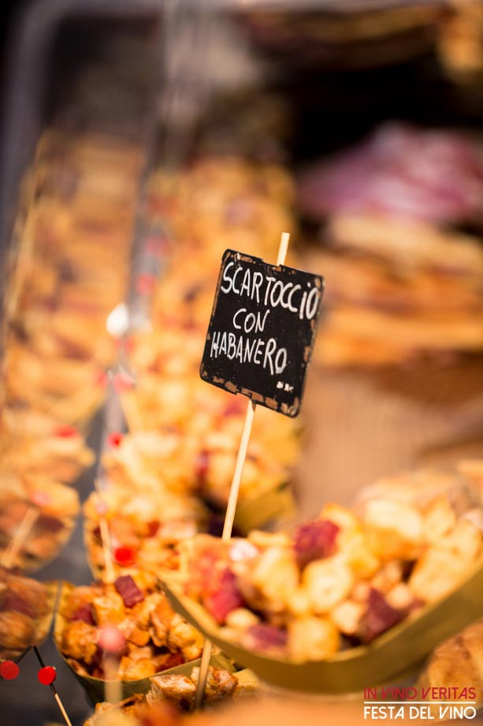
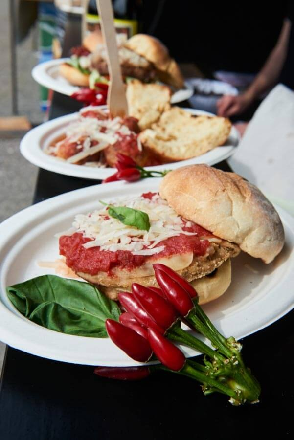

Sembra a me o lo street food sta prendendo sempre più piede?
Soprattutto con l'arrivo della bella stagione, mercati, fiere e strade dei centri storici cittadini si trasformano sempre più spesso in punti di ristoro a cielo aperto in cui gli operatori, alcuni dei quali dotati di food truck davvero belli, cercano di soddisfare le esigenze gastronomiche di un pubblico sempre più curioso ed esigente.
Lo spirito dello street food, tendenzialmente informale, è spesso legato alle tipicità regionali. Ora la domanda è: il cibo da strada è sinonimo di qualità? È o non è in grado di promuovere il made in Italy?
Ne parliamo insieme a Maurizio Cimmino, direttore di [*To Business Agency*](http://www.tobusinessagency.it/), un'agenzia di eventi che sta promuovendo il cibo da strada nel Bel Paese.

#### Salve, Dott. Cimmino. Come prima cosa, mi dica: che cos'è To Business Agency e perché ha iniziato a interessarsi di street food?

"Salve Anna! Attualmente *To Business Agency* è una delle principali società di organizzazione eventi italiana.
È soprattutto negli ultimi anni che ci siamo specializzati negli eventi legati allo street food: ne abbiamo colto le potenzialità e abbiamo voluto offrire agli italiani un modo differente di consumare il cibo, più semplice, immediato e conviviale.
L'idea è nata da un mio viaggio di piacere a Londra. Nei food market di Camden Town e di Portobello Road ho scoperto un mondo magnifico che ho voluto trasferire anche nel nostro Paese".

#### Che tipo di eventi organizzate? Qual è il format che avete adottato?

"Negli eventi di street food diamo spazio alle **specialità di tutto il mondo** con una particolare attenzione alle infinite proposte culinarie italiane.
Nella *Street Food Parade* e nell'*International Street Food Parade* il cibo da strada è il protagonista indiscusso, insieme agli operatori che lo cucinano e che lo portano in giro per tutto il Bel Paese.
Abbiamo ideato anche dei **festival che danno visibilità alla birra e al vino**. Sono nati, ad esempio, eventi come il *World Beer Festival* e *Hallowine*: in questo caso trionfano le specialità artigianali dei birrifici e dei vitigni d'eccellenza, sempre accompagnati dall'immancabile street food.
Il format è semplice: **uno spazio ampio per accogliere tante persone, un numero variabile di operatori street food e di produttori e un programma di musica e spettacoli per il pubblico di ogni età**".

#### Quanto viene apprezzato lo street food nel Bel Paese? Viene ancora associato al concetto di junk food?

"Sono in pochi a pensarci ma in Italia, in realtà, lo street food esiste da sempre. Pensiamo soprattutto al nostro Sud, ai nostri mercati, alle nostre piazze. Il fatto di organizzare gli eventi dedicati è stato soltanto un passo successivo, determinante, però, per permettere a tante realtà di farsi conoscere da un pubblico sempre più vasto ed eterogeneo.
C'è grande rispetto per il cibo da strada, apprezzato in tutte le sue forme, e l'elevato numero di persone che partecipa ai nostri eventi lo dimostrano".

 

Gli eventi che la Sua agenzia ha organizzato hanno coinvolto un gran numero di persone (si parla di 23 appuntamenti dal 2014 ad oggi con oltre 2 milioni di partecipanti e 300 operatori enogastronomici).

#### Ora la mia domanda è: come si riescono a conciliare qualità e quantità quando si hanno cifre come queste?

"Dirlo può sembrare scontato ma, per quanto riguarda i nostri eventi, **alla base di tutto deve esserci la qualità del prodotto finale**. Ciò non significa solo qualità dell'intero processo produttivo e distributivo, ma anche, e soprattutto, serietà dell'operatore.
In ogni singolo nostro festival c'è un enorme lavoro proprio in questo senso: selezioniamo gli operatori, li controlliamo e, soltanto dopo un lungo percorso all'insegna della fiducia reciproca, li coinvolgiamo nella nostra rete.
È vero, tuttavia, che negli ultimi anni sono sorti tantissimi eventi di piazza, alcuni legati anche allo street food, in cui la qualità non è certificata.
Questo è un problema che si ripercuote sull'intera categoria e che rischia di minare il lavoro di chi si comporta in modo serio".

#### Quali caratteristiche deve avere, oggi come oggi, lo street food? E in che cosa si differenzia l'Italia rispetto ai Paesi esteri?

"Oltre alla qualità del cibo e alla serietà di chi lo produce, credo che un'altra caratteristica molto importante sia la **varietà di proposte**. Gli eventi di street food devono permettere a tutti di testare sapori diversi, altrimenti sconosciuti.
Un altro aspetto che ritengo essere importante è la **semplicità**: lo street food è una tipologia di consumo accessibile a tutti e, come tale, deve essere semplice nel format di evento e genuina nei prodotti che offre".

#### L'Italia è un Paese che sta investendo in questo settore?

"In linea generale, si sta cominciando a raccogliere dati sul fenomeno dello street food.
Dal mio punto di vista posso dire che, in due anni, il numero degli amanti di street food che partecipa ai nostri eventi è aumentato in modo esponenziale, così come gli operatori che sono entrati nel nostro circuito.
Ma attenzione: come dicevo prima, l'affollarsi di eventi del genere, soprattutto quando non basati sul concetto di qualità, potrebbero saturare questo fenomeno e condurre a una preoccupante inversione di tendenza".

#### Per concludere, perché una persona dovrebbe investire in questo specifico settore? Avrebbe qualche consiglio utile da dare ai lettori di MyHumus?

"Come in tutte le attività imprenditoriali, **bisogna avere pazienza, serietà, spirito imprenditoriale e capacità di gestione**. Decidere di aprire un'attività di street food non è un gioco e coloro che pensano sia semplice sono i primi a trovarsi in difficoltà.
Consiglio sempre di iniziare con le specialità gastronomiche che si conoscono già, meglio ancora se tipici della propria zona di provenienza.
Non ci si improvvisa street fooder così come non ci si improvvisa cuochi, in entrambi i casi si rischierebbe di commettere un gravissimo errore: ciò che paga realmente, e che permette di crescere, è la qualità".

> A proposito di street food, hai letto l'articolo su [Green Pepper](https://myhumus.com/green-pepper-food-truck/)? E quello della [scorsa settimana](https://myhumus.com/stili-alimentari-alimentazione/)?

