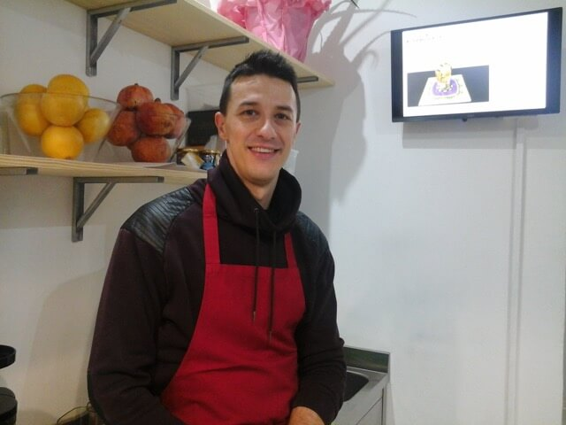
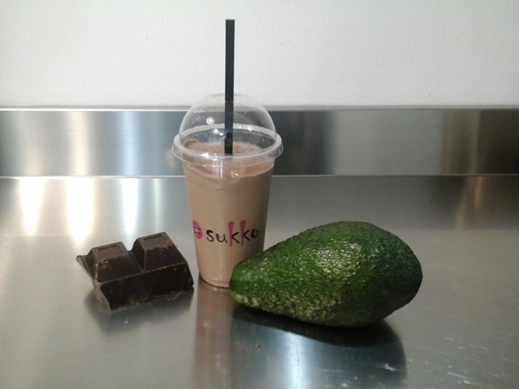
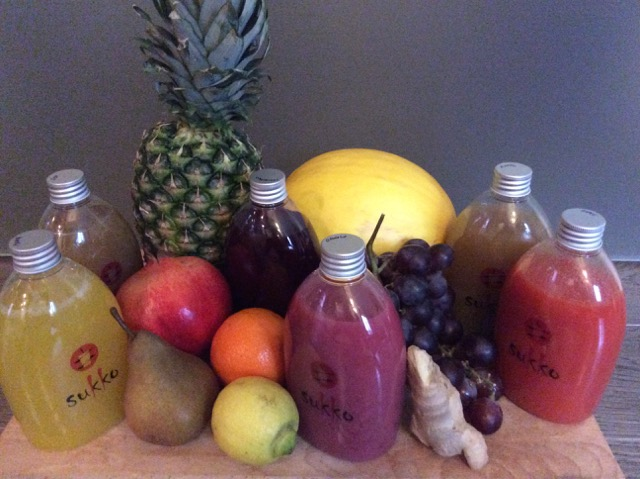

Qualche settimana fa gironzolavo per le vie del centro di Ravenna con i nipotini di Giorgia, una mia cara amica. Quand'ecco sopraggiungere, all'improvviso, l'ora della merenda.

Dopo una serie di _dove si va, dove non si va_, ho portato i bambini in un nuovo locale del centro, [Sukko](https://www.facebook.com/pages/Sukko/847827491948339?ref=ts&fref=ts), un piccolo locale di nuova generazione in via Corrado Ricci.
Ad accoglierci abbiamo trovato **Manuele Cricca**, ex pallavolista di serie A nonché titolare del locale.

### Ciao, Manuele! Perché hai aperto una frutteria a Ravenna?

> Ciao, Anna! Sono cresciuto a Santerno, un piccolo paese della campagna ravennate, e, da sempre, sono appassionato dei prodotti della terra.
>
> Come atleta, inoltre, ho sviluppato un forte interesse verso l'alimentazione.
>
> Sukko, la mia frutteria a Ravenna, abbina la **salubrità** di frutta e verdura al **gusto** di cui ogni persona è alla ricerca durante pasti e spuntini.

### Quali sono i tuoi prodotti? Quali caratteristiche possiedono e quali benefici apportano all'organismo?

> Oltre ai **succhi vivi**, ricette al 100% di frutta e verdura, la nostra frutteria a Ravenna propone **smoothies**, **frullati** e **succhi caldi**. Per il pasto, abbiamo **insalatone** e **vellutate**. Naturalmente, per la prossima stagione estiva, l'offerta comprenderà anche altre bevande e piatti dedicati.
>
> 
>
> Quanto a caratteristiche e benefici, i succhi vivi apportano grandissime quantità di vitamine, enzimi e sali minerali senza impegnare troppo la digestione. Questo perché la polpa e la fibra vengono separate dopo la spremitura.

### Chi è il cliente-tipo della tua frutteria a Ravenna?

> Tutte le nostre creazioni sono state selezionate e sperimentate in prima persona. Ho la presunzione di offrire sapori semplici, ma anche molto gustosi. Ecco perché il mio cliente ideale non ha una determinata età o professione.

### Sukko offre anche la possibilità di pranzare? Proponete il servizio take away?

> Il menù invernale prevede vellutate e insalatone. Per la stagione più calda saranno disponibili altri piatti semplici a base di cereali, legumi e verdure.
>
> Per il take-away, al momento, non siamo ancora sufficientemente strutturati.
>
> 
>
> È iniziata con successo una prima fase di prenotazione delle **bottigliette di succo vivo** per venire incontro alle esigenze della clientela con poco tempo a disposizione.

### Chi sono i fornitori di frutta e verdura della tua frutteria a Ravenna?

> **Scelgo le materie prime al mercato ortofrutticolo di Cesena**. Collaboro anche con distributori locali, per le culture romagnole, e con un distributore dedicato alle eccellenze del Sud Italia.

### Qual è la risposta del pubblico? Curiosi o diffidenti?

> I ravennati si sono dimostrati molto curiosi verso la novità. Sono molte le persone che hanno approfondito il loro interesse verso i macchinari tramite indagini personali. Questo dimostra una grande attenzione e sensibilità verso i prodotti e le lavorazioni. La ricerca della qualità nei nostri prodotti è stata immediatamente recepita dai clienti.

### Prima di salutarci, dimmi una cosa: giochi ancora a pallavolo?

> Il lavoro, in questa fase iniziale, occupa gran parte della mia giornata. Il mio obiettivo, però, è tornare quanto prima a calcare i campi in maniera squisitamente amatoriale.

Foto di copertina: [Jessica Fiess-Hill](http://www.flickr.com/photos/13499683@N00/7178714273) via [Photopin](http://photopin.com).
