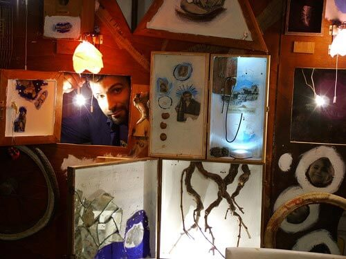

Qualche tempo fa, _googlando_ in cerca di nuove mete da visitare, sono venuta a conoscenza di un centro di educazione ambientale a Brindisi: [Thalassia](http://www.cooperativa-thalassia.it).
Nata come società di attività e servizi per il parco brindisino, collabora con musicisti, attori, compagnie teatrali, maestri, guide naturalistiche, animatori, astrofili e tecnici ambientali. E lo fa per dar vita ad attività che spaziano dall'educazione ambientale alle attività escursionistiche, dal teatro all'ecoturismo.

La combo arte&ambiente m'intriga parecchio. Ecco perché ho intervistato **Antonio Fiume**, amministratore unico di Thalassia, fotografo naturalista ed esperto di gestione aziendale e conduzione d'impresa.
Scopriamola più nel dettaglio, questa cooperativa!

### Salve, Dott. Fiume, benvenuto su MyHumus. Mi dica, per quale ragione avete dato vita a Thalassia?

> Ciao, Anna. Thalassia nasce nel 2001 insieme all'istituzione della [Riserva di Torre Guaceto](http://www.riservaditorreguaceto.it) come società di attività e servizi per il parco brindisino.
>
> Negli anni, il nostro centro di educazione ambientale a Brindisi è cresciuto. Con il tempo è riuscita a occuparsi di progetti connessi allo **sviluppo sostenibile**, all'educazione ambientale e alla cittadinanza attiva.
>
> Nel 2007, Thalassia ha ottenuto la certificazione DNV per il sistema di gestione della qualità nella progettazione ed erogazione di servizi informativi, educativi e turistici relativamente alle tematiche ambientali.

### Quante attività svolgete nel vostro centro di educazione ambientale a Brindisi?

> Ci occupiamo di **educazione ambientale**, di **teatro ambientale**, di **turismo sostenibile** e di **vendita al dettaglio** di prodotti da agricoltura biologica.

### Da quali figure professionali è composto il vostro team?

> Ci sono attori, scrittori, tecnici e guide naturalistiche, ma anche addetti alla segreteria e alle vendite.

### Per quanto concerne l'ecoturismo e l'educazione ambientale, cosa propone Thalassia?

> Il nostro centro di educazione ambientale a Brindisi propone visite guidate nella Riserva di Torre Guaceto e nei parchi limitrofi. Organizza anche tour di più giorni. L'educazione ambientale si esercita sia grazie a progetti per le scuole di ogni ordine e grado, sia tramite eventi naturalistici. E poi ci sono gli spettacoli teatrali...

[

### In quali studi è coinvolto il vostro centro di educazione ambientale a Brindisi?

> Abbiamo realizzato diverse **mappe biocenotiche** di tratti di costa del litorale pugliese e diversi **studi dell'avifauna**.

### Un'ultima curiosità: cosa riserveranno i prossimi mesi?

> Ora siamo impegnati al [Teatro Comunale di Mesagne](http://www.teatropubblicopugliese.it/teatro/teatro-comunale_38.html) con la rassegna [Rapimenti](http://www.cooperativa-thalassia.it/Home/tabid/88/aid/64/Default.aspx). Al termine di ogni spettacolo, 'rapiamo' letteralmente 16 persone del pubblico per far vivere loro un'esperienza di bellezza e resistenza. Serve a sperimentare un nuovo modo di essere e a non essere spettatori passivi.
>
> Inoltre, porteremo il nostro progetto teatrale _La Grande Foresta_ in Cile.
