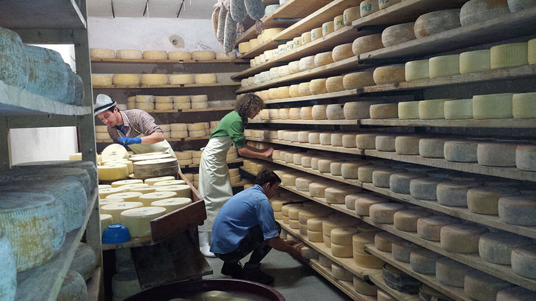

Non ho mai pensato di adottare una mucca, ma potrei iniziare a farlo!
Specie perché ho avuto modo di conoscere più da vicino un progetto super simpatico e interessante il cui nome, obiettivamente, dice tutto: [Adotta una mucca](http://www.visitvalsugana.it/it/vacanze-in-valsugana/adotta-una-mucca/).

Se qualche tempo fa, su MyHumus, si parlava di [adottare un albero](https://www.treedom.net/it/), oggi vi parlo di fare lo stesso con una mucca.
Come dire, vi sto offrendo un sacco di spunti interessanti per i vostri prossimi regali!
Insieme a Ilaria Sordo, ideatrice e curatrice del progetto, ho conosciuto meglio questa nuova iniziativa.

### Ciao, Ilaria! Mi parli delle origini di _Adotta una mucca_?

> Ciao, Anna! Il progetto è nato nel 2005 per **far conoscere e valorizzare le malghe e i prodotti caseari della Valsugana e del Lagorai**. Grazie alla veicolazione dell'universo malga, il progetto propone un approccio educativo alla montagna, all'ambiente e alla tradizione casearia d'alta quota.
>
> Il progetto di adottare una mucca è stato oggetto della mia tesi di laurea.

### Come si può adottare una mucca?

> Adottare una mucca è molto semplice: a fronte di un contributo di 60 euro si ha diritto a scegliere l'animale consultando un catalogo cartaceo oppure [www.visitvalsugana.it](http://www.visitvalsugana.it/it/vacanze-in-valsugana/adotta-una-mucca/?R=1).
>
> 
>
> Ad ogni adozione, 10 euro vengono destinati a **progetti di beneficenza**, mentre 50 euro vanno alla malga per il **mantenimento estivo della mucca adottata**.
>
> Da metà giugno a metà settembre, la famiglia adottante ha diritto di andare in malga e ritirare **prodotti caseari** per un valore di 50 euro.
>
> All'adesione vengono rilasciate la carta d'identità della mucca scelta e la lettera che ne ufficializza l'adozione, da esibire al ritiro dei formaggi in malga.

### Perché adottare una mucca? Quali aspetti del territorio si vuole promuovere?

> Questa iniziativa permette all'APT Valsugana Lagorai di promuovere il proprio ambito come territorio ancora integro. Ancora oggi si può conoscere l'antica arte della **caseificazione di montagna**, di cui malghe, alpeggi, pastori e casari sono i testimoni più importanti.
>
> **Non spediamo i prodotti caseari** per invitare gli aderenti al progetto a vivere un'esperienza in prima persona in malga. Chi ha scelto di adottare una mucca deve conoscerla, così come deve conoscere la Valsugana e il Lagorai.
>
> Vogliamo avvicinare sempre più persone all'ambiente naturale e rurale della Valsugana e del Tesino, promuovendone il rispetto e la tutela.
>
> Promuoviamo una maggior consapevolezza verso l'alimentazione sana e genuina. Lo facciamo promuovendo i nostri formaggi prodotti con metodi antichi.

### Qualsiasi realtà, anche una scuola, può adottare una mucca?

> _Adotta una mucca_ è nato pensando ai più piccoli e a coloro che vivono in città. Intendiamo offrire un'opportunità di avvicinamento alle malghe della Valsugana e del Lagorai, ma anche un contatto diretto con la natura.
>
> Oltre alla buona **partecipazione dei residenti** in provincia di Trento, sono soprattutto i **turisti da fuori regione** ad adottare una mucca. Un'azione che, in molti casi, è stata vista come un'occasione per un simpatico regalo.

### Come promuovete questo progetto?

> L'iniziativa viene promossa ogni anno attraverso la stampa di **30.000 cataloghi** distribuiti presso gli uffici dell'APT Valsugana e alle fiere cui partecipa.
>
> Al progetto è dedicata una precisa sezione del [sito](http://www.visitvalsugana.it/it/vacanze-in-valsugana/adotta-una-mucca/?R=1). Poi abbiamo [Facebook](https://www.facebook.com/adottaunamucca) e [Twitter](https://twitter.com/visitvalsugana) (vi ricordo l'hashtag _\#adottaunamucca_!).
>
> L'iniziativa viene raccontata spesso dagli aderenti sul [blog](http://blog.visitvalsugana.it), a garanzia della positiva esperienza vissuta in malga.
>
> Fin dall'inizio, _Adotta una mucca_ ha destato l'**interesse della stampa** e ha permesso di parlare del territorio su **quotidiani** e **periodici nazionali**. Ora, adottare una mucca è qualcosa di meno sconosciuto!

### Domanda doverosa: cosa succede quando la mucca adottata diventa anziana?

> Le mucche adottabili sono mucche da latte e non da carne. Non sono destinate al macello.

### Prima di salutarci, dimmi: cosa vi aspettate per il futuro?

> Visto il **successo crescente**, l'iniziativa andrà avanti anche nei prossimi anni.
>
> Nuove malghe della Valsugana e del Lagorai si sono fatte avanti. Il catalogo 2016, quindi, sarà ancora più ricco.
>
> Proseguiranno anche le attività di _Malghese per un giorno_. Da metà giugno a metà settembre, tutte le settimane, ci si incontra nelle malghe che aderiscono all'iniziativa. Questo per assistere alla lavorazione del latte da parte del casaro e per capire cosa significhi vivere e lavorare in malga.
>
> Con il loro lavoro, i malghesi di questa zona sono diventati l'anello di congiunzione tra un passato dalle radici profonde e un presente sempre più bisognoso di ritmi naturali. Grazie a _Malghese per un giorno_, riescono a coinvolgere residenti e turisti in uno spaccato della loro vita. L'obiettivo è di recuperare alcune peculiarità del territorio nell'ottica di uno sviluppo, anche economico, di tipo sostenibile.
