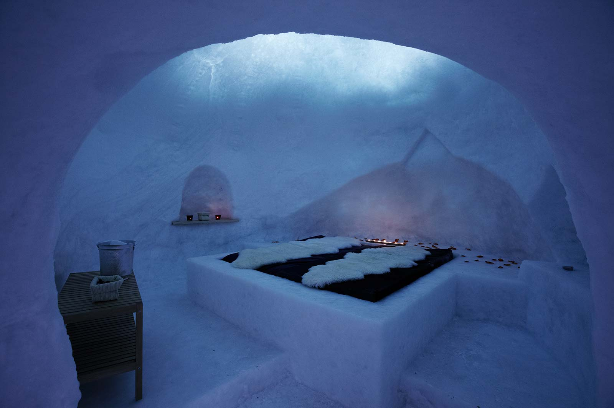

In Italia, viaggi e alloggi ecosostenibili sono qualcosa di utopico?
Come possiamo viaggiare, o anche solo spendere una giornata nella natura, e impattare il meno possibile sugli ecosistemi naturali?
Insediato all'interno di [Progetto Manifattura](http://www.progettomanifattura.it)) c'è un progetto che si occupa proprio di questo, cioè di viaggi responsabili o, meglio ancora, di [ViaggiVerdi](http://viaggiverdi.it).
**Silvia Ombellini** ne è co-founder.

### Ciao, Silvia! Di cosa si occupa ViaggiVerdi?

> Ciao, Anna! ViaggiVerdi è il punto d'incontro tra viaggiatori responsabili e strutture ricettive che stanno investendo in un viaggi e alloggi ecosostenibili. Entrambe le parti vogliono contribuire attivamente a un futuro migliore.

### Su quali principi basate il vostro lavoro? Secondo quali criteri proponete viaggi e alloggi ecosostenibili?

> Crediamo in un **nuovo modo di viaggiare**, rispettoso dell'ambiente, attento ai luoghi e alle persone che li abitano. Più della meta contano il percorso e il modo con cui ci si mette in cammino.
>
> ViaggiVerdi promuove un'idea di viaggio sostenibile, incoragia ai viaggi e alloggi ecosostenibili.
>
> Il nostro, al momento, è il principale sito italiano in cui trovare e prenotare **strutture ricettive rispettose dell'ambiente**. Le proposte di ospitalità sono le più svariate, ma tutte accomunate dall'attenzione al rispetto della natura, dei luoghi e delle persone.
>
> 

### Quali sono i problemi ambientali legati al turismo?

> Forse non tutti lo sanno, ma il turismo ha un grande impatto sull'ambiente. Secondo i dati dell'Unione Europea (_Consumption and Environment 2012_), è la quarta causa di produzione di anidride carbonica in Europa.
>
> Il dato è preoccupante, se pensiamo che il numero di turisti a livello globale è in continua crescita. Nel 2030 saranno 1,8 milioni all'anno, quasi il doppio rispetto ad oggi!
>
> Il tipo di turismo che più è cresciuto negli ultimi anni, oltretutto, è quello più inquinante. Parliamo di persone che scelgono una crociera o la vacanza tropicale con volo aereo e hotel all inclusive.
>
> ViaggiVerdi vuole cambiare le cose partendo proprio dalle strutture ricettive, che sono la seconda causa d'impatto del turismo sull'ambiente dopo i trasporti.

### Quali concetti, a vostro parere, non sono ancora stati ben assimilati dal pubblico?

> Serve **rendere più sostenibile il nostro stile di vita, anche in viaggio**. C'è chi erronemante associa il turismo sostenibile a una moda. Diciamo, piuttosto, che è una necessità a cui non possiamo sottrarci.
>
> **Viaggi e alloggi ecosostenibili non sono più costosti rispetto al turismo inquinante**. Come potrebbe esserlo? Spostarsi in bici, anziché in auto, conviene sia a livello ambientale, sia a livello economico.
>
> Analogamente, un hotel che riduca i propri consumi di energia e di acqua, oltre a minimizzare le emissioni inquinanti, ha meno spese. Come potrebbe essere più costoso per gli ospiti?

### In che modo una struttura alberghiera potrebbe migliorare il proprio impatto ambientale?

> ViaggiVerdi ha adottato un **decalogo** confrontando le principali certificazioni ambientali europee.
>
> Abbiamo individuato **dieci azioni principali per ridurre l'impatto ambientale degli hotel**: Ci riferiamo, ad esempio, al cibo biologico, all'energia pulita, alla raccolta differenziata, ai trasporti, ai detergenti naturali, alle lampadine a basso consumo e ai riduttori di flusso per l'acqua.
>
> Oltre a queste, ci sono molte altre azioni virtuose che segnaliamo sul nostro sito per migliorare l'impatto ambientale di una struttura alberghiera.

### Quali feedback avete da chi si sceglie i vostri viaggi e alloggi ecosostenibili?

> I riscontri sono molto positivi e ci danno la forza per continuare questa avventura.
>
> Ci ha emozionato ascoltare Jacopo Fo, fondatore della Libera Università di Alcatraz, parlare di ViaggiVerdi e del suo progetto di turismo sostenibile.
>
> `youtube: kdKAolA1AcA`

### I viaggi e alloggi ecosostenibili che promuovete riguardano il solo territorio italiano? Oppure anche quello estero?

> Oggi i viaggiatori di tutto il mondo possono contattare strutture ricettive ecologiche solo in Italia.
>
> Stiamo iniziando a ricevere richieste di iscrizione da strutture estere e, a breve, sarà online _Ecobnb.com_, che riporterà anche gli hotel ecologici di altre parti del mondo.

### Un'ultimissima domanda: proponete soluzioni ecofriendly anche per gli amici animali?

> Vogliamo che i nostri viaggi e alloggi ecosostenibili tengano conto anche degli **animali**!
>
> Cliccando i filtri di ricerca sul nostro sito, le persone possono selezionare le ospitalità ecofriendly ospitanti cani di piccola o grande taglia.
>
> Le strutture ricettive rispettose dell'ambiente hanno spesso un'attenzione in più verso gli ospiti a quattro zampe!
