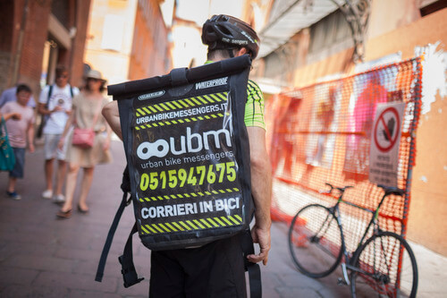
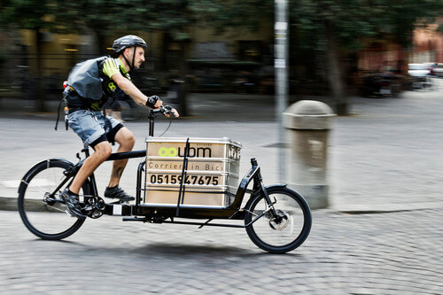

[UBM Bologna](http://www.ubmbologna.it) è la prima compagnia italiana di corrieri in bici a Bologna. UBM, nello specifico, sta per _urban bike messenger_.
Ogni giorno effettua le consegne utilizzando unicamente la bicicletta. Ed è proprio questo, a mio parere, il suo punto di forza: riuscire a muoversi agilmente in città accedendo a qualsiasi zona urbana.

Questa compagnia di corrieri in bici (detti _bike messengers_) opera all'insegna dell'**ecologia**, dell'**affidabilità** e della **velocità di consegna**, e si rivolge a **qualsiasi utenza**. Non solo privati, ma anche aziende, professionisti e negozi.

Questi corrieri in bici a Bologna trasportano tutto ciò che pesi al massimo 10 kg e che riesca ad essere contenuto all'interno delle loro borse.
Per i carichi di peso maggiore c'è la _bici cargo_, appositamente studiata per permettere il trasporto dei pacchi più ingombranti e voluminosi.
Gioite: trasportare con UBM non comporta alcun tipo di inquinamento urbano!

UBM Bologna ha perfino ricevuto il _Premio Giovani Imprese 2012_ di CNA Giovani Imprenditori ed è la prima impresa di corrieri in bici della Regione.
Pierpaolo Sartori, classe 1980, ne è il titolare.

### Ciao, Pierpaolo. Com'è arrivata la bici nella tua vita?

> Ciao, Anna! La bici è sempre stata una mia grande passione, fin da bambino. Il vero amore è nato nel 2008, quando ho convertito una bici da corsa a scatto fisso e ne ho fatto il mio unico mezzo di trasporto.
>
> La bici mi dà un forte senso di libertà, mi rende veloce e libero di muovermi con naturalezza. In continuo movimento, allontanando lo stress, osservo la città e la vedo sempre nuova.

### Prima di fondare UBM Bologna, eri un educatore. Perché hai deciso di diventare un bike messenger di professione?

> Da semplice passione a lavoro, il passaggio è stato breve. L'interesse per il ciclismo urbano mi ha fatto conoscere il mondo del _bike messenging_. Ne ho percepito subito le potenzialità, la forza, l'innovazione. In America, e nel resto del mondo, non solo è attivo da anni, ma funziona con successo.
>
> **A Bologna le consegne leggere possono essere effettuate con la bicicletta**, ottimizzando i tempi di consegna e apportando beneficio all'ambiente.
>
> Nel 2010 ho lasciato il mio lavoro di educatore per diventare un bike messenger. Da due anni sono manager e corriere di UBM Bologna, la prima e unica compagnia di corrieri in bici a Bologna.

### Quanti corrieri lavorano insieme a te, oggi?

> Oggi i corrieri in bici a Bologna sono cinque.

### Quale feedback avete ricevuto dalla cittadinanza? Se dovessi definire la fascia di età media delle persone che ricorrono ai corrieri in bici, quale indicheresti?

> Bologna, fortunatamente, è una città a misura di bicicletta, anche se inizialmente il riscontro non è stato immediato. Dopo tre anni di attività, **il feedback è molto positivo**. I cittadini ci riconoscono per strada, si complimentano con noi, entusiasti, e ci scattano foto. E **sempre più privati si affidano ai nostri corrieri in bici a Bologna per le consegne**.
>
> Ad oggi i nostri clienti sono soprattutto aziende ed enti, per questo è difficile definire una fascia di età media.

### Cosa ti auguri per il futuro di UBM Bologna?

> Mi auguro che l'impresa cresca, che si posizioni come la più valida alternativa per consegnare in città, al pari delle compagnie di bike messenging del mondo.

### Quanto è popolare, secondo te, la figura professionale del bike messenger nel nostro Paese?

> In Italia è meno popolare di quello che sembri. E questo nonostante siano già molte le compagnie di corrieri in bici attive con successo in varie città italiane.
>
> Siamo molto popolari nell'ambiente del ciclismo urbano e tra le realtà della green economy. Il bike messenger, però, è una figura ancora tutta da scoprire: **non siamo semplici pony e non siamo postini**, siamo corrieri in bicicletta!
