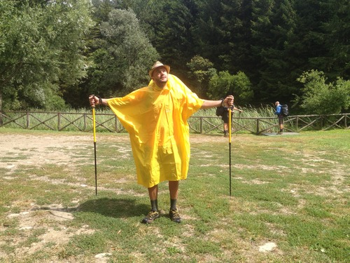
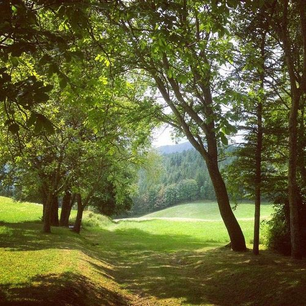
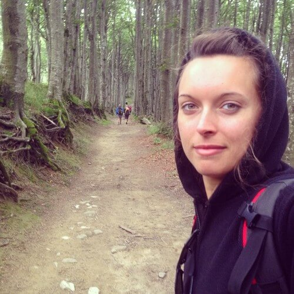
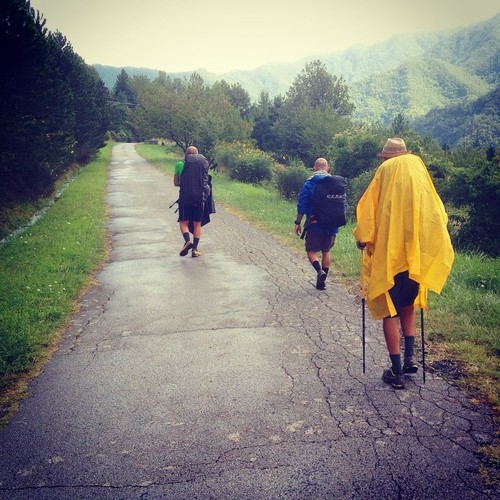
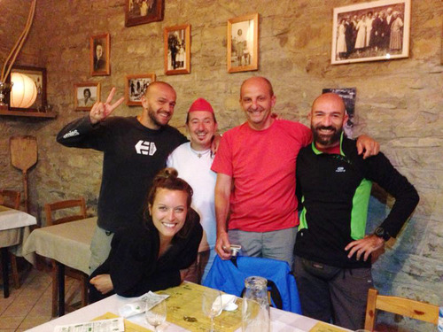
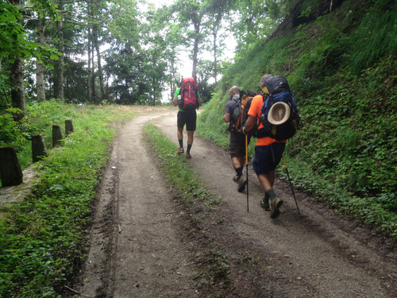

Se è vero che tutte le strade portano a Roma, io dico che quelle del Cammino d'Assisi, oltre a condurre ad Assisi, portano alla pace interiore. Sono sentieri segnalati dal CAI, i suoi, che ti portano altrove, insinduandosi nel cuore delle foreste casentinesi.

Voglio raccontarvi l'avventura che ho affrontato la scorsa settimana insieme a due miei amici, Andrea e Patrik.
Zaino in spalla, voglia di camminare e tanto, troppo bisogno di fuggire dalla città.
Un'esperienza, quella del Cammino d'Assisi, che ha superato ogni mia aspettativa, e che si è rivelata essere davvero molto profonda. Per tutti e tre.

Il percorso completo di questo Cammino comincia dall'eremo di Sant'Antonio di Montepaolo (Dovadola) e finisce, appunto, ad Assisi. In totale sono più di 300 chilometri suddivisi in 13 tappe, percorribili in una quindicina di giorni.
Per ragioni di tempo, delle 13 tappe noi ne abbiamo percorse solamente 4: Dodavola, Premilcuore, Corniolo e Camaldoli.

Lungo il percorso ci si imbatte in diversi **eremi** e in piccoli **paesi storici**. In sostanza, si ripercorrono molte tappe fondamentali della vita spirituale di San Francesco.
Per affrontare al meglio il Cammino d'Assisi, è bene essere un minimo allenati. Il percorso, specie all'inizio, presenta diverse salite e discese.

Una bella notizia per i _bike addicted_: parte del percorso è percorribile in mountain-bike. La discesa nei pressi dell'eremo di Camaldoli vi divertirà, io già lo so!

I panorami del Cammino d'Assisi sono meravigliosi, a tratti paradisiaci.
Troverete lo **splendore delle foreste tosco-romagnole**, interrotte solo sporadicamente da **vallate** con **rifugi isolati** e **bivacchi** dalle sembianze alpine.

Lungo il pellegrinaggio abbiamo incrociato decine di persone, ognuna spinta da un buon motivo. Qualcuno era in cerca di risposte, qualcuno stava fuggendo da qualcosa, qualcun altro era in sfida con sé stesso.
Nessuno si trovava lì per puro caso.

Camminare diventa un viaggio introspettivo in cui l'aspetto avventuroso passa quasi in secondo piano. I sentieri assumono i connotati simbolici della vita.
È così che inizi a riflettere come non hai mai fatto prima. Pensi al tuo vissuto, a ciò che sei stato e che hai fatto. Pensi a cosa avresti potuto fare e non hai fatto. Pensi a ciò che faresti ancora in tempo ad essere.
**Un cammino regala nuove opportunità**.

Murakami, autore di _Kafka sulla spiaggia_ e di molte altre meraviglie letterarie, afferma:

> Proprio nello sforzo enorme e coraggioso di vincere la fatica riusciamo a provare, almeno per un istante, la sensazione autentica di vivere. Raggiungiamo la consapevolezza che la qualità del vivere non si trova in valori misurabili in voti, numeri e gradi, ma è insita nell'azione stessa, vi scorre dentro.

Bene, percorrendo i sentieri del Cammino d'Assisi io l'ho percepita, quella 'sensazione autentica di vivere'. E ho avvertito anche la consapevolezza di trovarmi al momento giusto nel luogo giusto, in una dimensione sicura e protetta, con persone fidate.
Da un cammino, seppure di breve durata, si torna sempre a casa arricchiti, rigenerati.
Si torna a casa così, autenticamente vivi.

