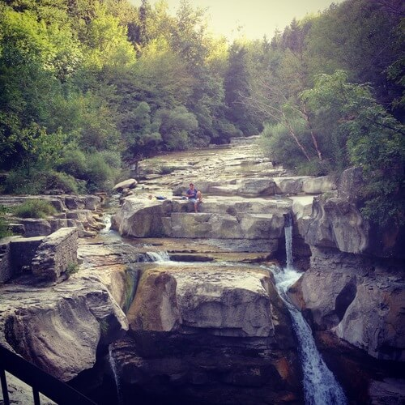

> E senti allora, se pure ti ripetono che puoi,
> 
> fermati a mezza via o in alto mare,
> 
> che non c'è sosta per noi, ma strada, ancora strada,
> 
> e che il cammino è sempre da ricominciare.
> 
> _(Eugenio Montale)_

Il cammino ricomincia sempre da noi stessi e dalle scelte che compiamo nella vita, giorno dopo giorno.

Se a volte ho iniziato a camminare conoscendo la destinazione finale, ci sono stati casi in cui avrei avuto bisogno di far ricorso ad una bussola.

La verità è che ci si perde mille volte, lungo la strada, soprattutto durante il difficile percorso di crescita e di miglioramento personale. Un percorso senza fine che continua anche quando crediamo di avere tutte le verità in mano.

E mi torna alla mente un famoso passaggio di "Sulla strada" di Kerouac:

*"\[...\] Sal, dobbiamo andare e non fermarci mai finché non arriviamo".*

*"Per andare dove, amico?".*

*"Non lo so, ma dobbiamo andare"*.

E se è vero che tutte le strade portano a Roma, io, dal canto mio, dico che, in verità, ce ne sono alcune che conducono altrove, attraverso silenziosi sentieri che, come vene sottili, si insinuano all'interno delle foreste casentinesi fino ad arrivare ad una cittadina: Assisi.

Questa volta infrango le regole del mio blog: al posto di intervistare qualcuno, ho intenzione di narrare una meravigliosa avventura che ho affrontato la scorsa settimana insieme a tre amici, zaino in spalla, voglia di camminare e tanto, troppo bisogno di fuggire dalla città: alla volta del cammino d'Assisi, per l'appunto.

Un'esperienza che ha superato ogni mia aspettativa e che si è rivelata essere davvero molto profonda, almeno per quanto mi riguarda.

Come primissima cosa, però, vi riporto qualche cenno geografico inerente al cammino in questione, così che possiate avere un'idea più precisa del tragitto: il pellegrinaggio completo del cammino d'Assisi inizia dall'eremo di Sant'Antonio di Montepaolo (Dovadola) e termina ad Assisi, per un totale di oltre 300 km suddivisi in 13 tappe e percorribili in una quindicina di giorni.

Per quanto riguarda la nostra avventura, per motivi di tempo, di tutte le 13 tappe abbiamo potuto percorrerne solamente 4 (Dodavola - Premilcuore - Corniolo - Camaldoli).

Ecco il percorso completo:

- da Dovadola a Marzanella (21 km);
- da Marzanella a Premilcuore (21 km) passando per Portico;
- da Premilcuore a Corniolo (18 km);
- da Corniolo a Camaldoli (22 km) tramite il passo della Calla;
- da Camaldoli a Biforco (19 km) tramite Badia Prataglia;
- da Biforco a La Verna (9 km);
- da La Verna a Caprese Michelangelo (23 km) passando per l'eremo La Casella;
- da Caprese Michelangelo a Sansepolcro (25 km);
- da Sansepolcro a Città di Castello (29 km), passando per l'eremo di Montecasale;
- da Città di Castello a Pietralunga (30 km), passando per la pieve de' Saddi;
- da Pietralunga a Gubbio (27 km);
- da Gubbio a Valfabbrica (30 km) passando per l'eremo di San Pietro del Vigneto e Biscina;
- da Valfabbrica ad Assisi (16 km).

Lungo il cammino ci si imbatte in diversi eremi e cittadine storiche di piccole dimensioni, e si ripercorrono molte tappe fondamentali della vita spirituale di Francesco.

Piccolo suggerimento: se si vuole affrontare questo cammino è bene essere un minimo allenati per via del percorso che, soprattutto inizialmente, è soggetto alle salite e alle discese sui sentieri del CAI (sempre ben segnalati).

In poche parole, il consiglio è quello di non cimentarvi in un'avventura di questo tipo se siete reduci da mesi e mesi di birra e di divano.

Una bella notizia per tutti i *bike addicted* è che si può percorrere parte del percorso in mountain bike: vi attendono discese piuttosto divertenti, soprattutto quella nei pressi dell'eremo di Camaldoli.

Se intraprenderete il cammino d'Assisi, preparatevi emotivamente: lo scenario che vi attende è a dir poco meraviglioso, a tratti paradisiaco.

Ciò che si rivelerà ai vostri occhi sarà l'infinita distesa di foreste tosco-romagnole, interrotte, solo sporadicamente, da vallate ospitanti isolati rifugi e bivacchi dalle sembianze alpine.

Intraprendere un cammino insieme a buoni amici è qualcosa di fantastico, sfiora quasi il misticismo.

Lungo il pellegrinaggio si incrocia la strada di decine e decine di persone che stanno percorrendo lo stesso itinerario: chi in cerca di risposte, chi in fuga da qualcosa, chi in sfida con sé stesso e chi, invece, spinto semplicemente dalla passione per l'escursionismo.

Nessuno si trova lì per caso.

Ed è così che il cammino diventa un vero e proprio viaggio introspettivo in cui l'aspetto avventuroso diviene quasi un fattore secondario. E i sentieri assumono i connotati simbolici della vita.

Quando cammini per ore ed ore, dopo che tutte le parole sono state pronunciate ed è calato il silenzio profondo dei boschi, che tu sia sotto il calore del sole o sotto una pioggia battente, cominci a pensare come non hai mai fatto prima: a te, al tuo vissuto più o meno recente e a ciò che sei stato e che hai fatto; a cosa avresti potuto fare o dire, a ciò che faresti ancora in tempo ad essere o a proferire e ai gesti non ancora concretizzati.

Insomma, pensieri e considerazioni finalizzati alla ricerca di un posto nel mondo. Un posto che, per chi è giovane come me, oggi come oggi sembra così difficile da conquistare...

Un aspetto su cui ho riflettuto molto, durante il mio cammino, è la condivisione della fatica: è incredibile quanto sia in grado di rafforzare i rapporti interpersonali, tanto con coloro che conosciamo quanto con completi sconosciuti.

Non importa chi tu sia e da dove provenga, si fatica insieme e allo stesso modo.

Trovo che sia interessante la distinzione tra la figura del "viandante" e quella del "viaggiatore" offerta dal mio amico Diego Galizzi, storico dell'arte e museologo, con il quale, recentemente, ho avuto il piacere di parlare in occasione di un aperitivo:*"Secondo me, il viandante è colui che percorre un tragitto senza concentrarsi eccessivamente sulla meta finale, ma dando importanza all'atto del girovagare in sé, mentre il viaggiatore parte con la curiosità di vedere precisi luoghi e sceglie il cammino come strumento migliore per farlo"*.

Murakami, grande autore che ho amato per via di un libro in particolare, il bellissimo "Kafka sulla spiaggia", afferma:

*"Proprio nello sforzo enorme e coraggioso di vincere la fatica riusciamo a provare, almeno per un istante, la sensazione autentica di vivere. Raggiungiamo la consapevolezza che la qualità del vivere non si trova in valori misurabili in voti, numeri e gradi, ma è insita nell'azione stessa, vi scorre dentro"*.

Bene, percorrendo quei sentieri io l'ho percepita, quella "sensazione autentica di vivere", insieme alla consapevolezza di trovarmi al momento giusto nel luogo giusto, in una dimensione sicura e protetta, con persone fidate e circondata da paesaggi che hanno saputo accogliere i miei lunghi silenzi contemplativi.

Da un cammino, seppure di breve durata, si torna sempre a casa arricchiti, rigenerati.

Si torna a casa così, autenticamente vivi.

