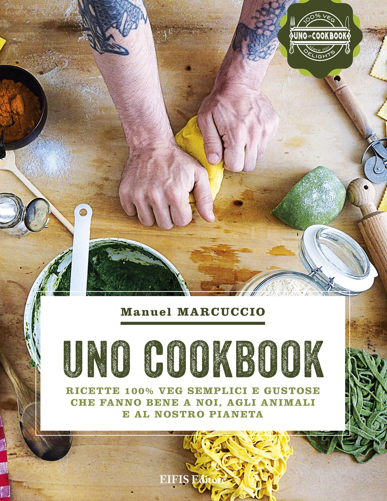
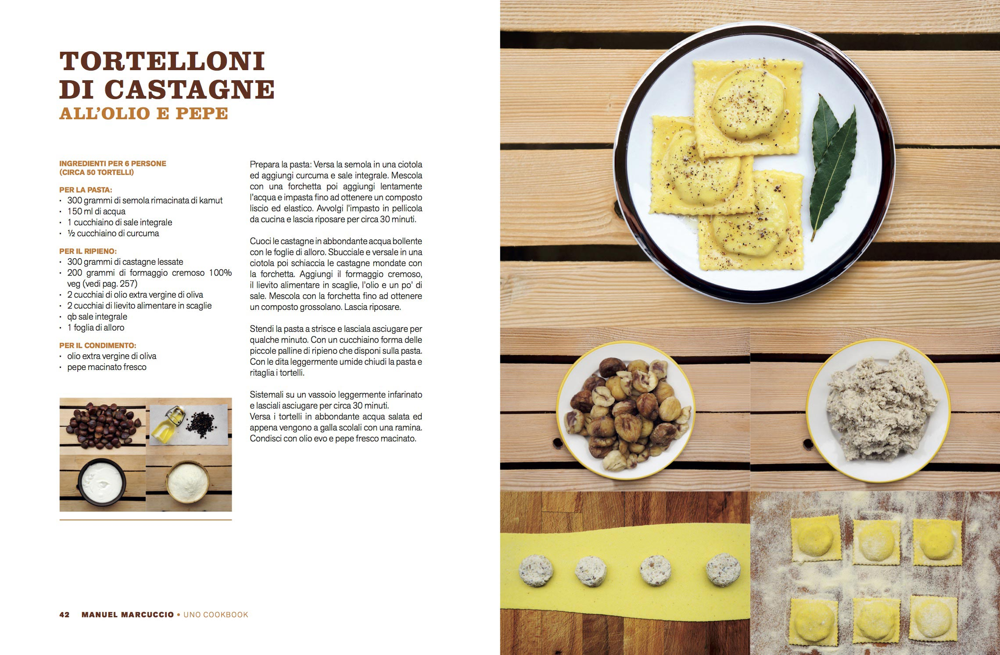
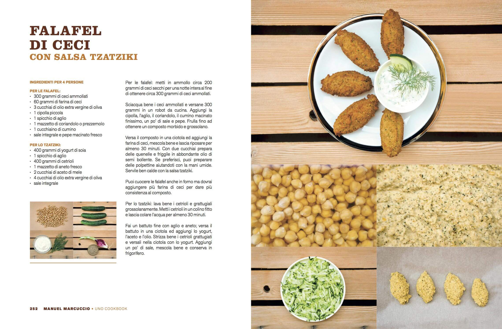
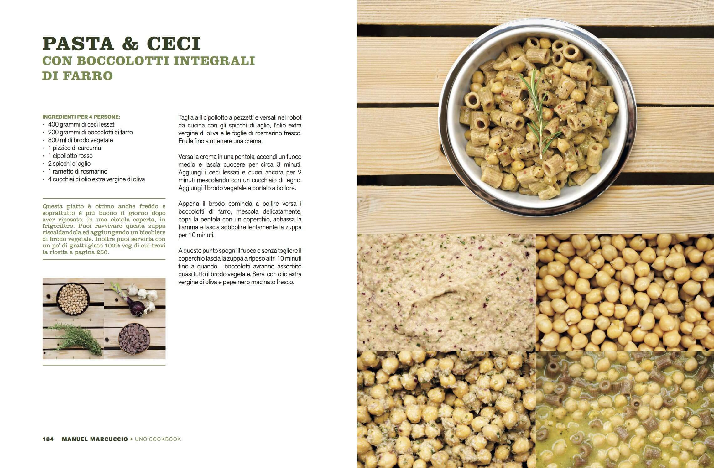
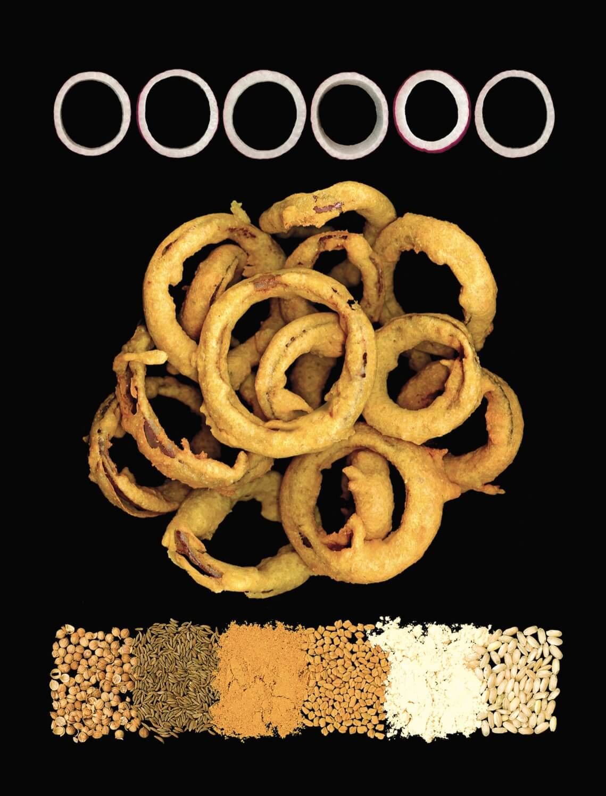
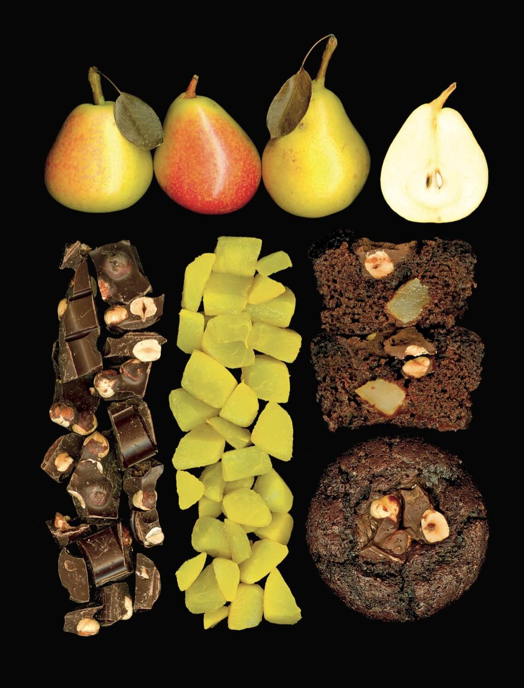
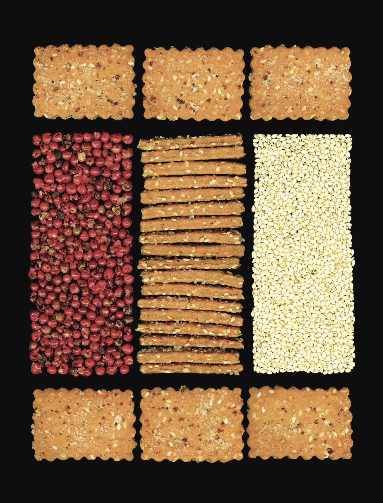

Qualche tempo fa, in occasione del mio compleanno, mi è stato regalato il libro di cucina vegana di **Manuel Marcuccio**, in arte UNO Cookbook.
Manuel è un food blogger nato a Tredozio, emigrato a Milano e autore di un [blog](http://www.unocookbook.com) che sta avendo moltissimo successo.
Le sue ricette di cucina vegana uniscono il gusto alla speranza: il gusto di cibi genuini e la speranza di riuscire a prepararli senza troppe difficoltà.

Per me, che ho maturato interesse e fiducia verso mestoli e padelle solo da qualche anno, la fattibilità di una ricetta è un aspetto fondamentale. Contribuisce concretamente alla mia autostima.
Le ricette di Manuel, tutto sommato, mi sembrano alla portata di tutti...

### Ciao, Manuel! Quando e perché ti sei appassionato alla cucina in generale?

> Ciao, Anna! La mia passione per la cucina nasce quand'ero piccolo, ai tempi delle scuole medie. All'epoca, mia madre, lavorando tutto il giorno, mi lasciava un bigliettino su cui annotava cosa preparare per cena, come prepararlo e dove comprare il necessario.
>
> Grazie a questi primi approcci culinari, ho scoperto che cucinare mi divertiva. Non era assolutamente qualcosa che mi pesasse fare.
>
> Quando mi sono trasferito a Bologna, ho convissuto con amici. L'addetto ai fornelli ero io, e devo dire che me la cavavo piuttosto bene! All'epoca, però, non mi occupavo ancora di cucina vegana.

### Sul tuo primo libro, 'UNO Cookbook', affermi di non cucinare, ma di _far da mangiare_. Che differenza c'è?

> Spesso vengo definito _chef_ o _cuoco_: non sono né l'uno, né l'altro. Cucino per me e per le persone che amo. **Sono semplicemente qualcuno che fa da mangiare prestando attenzione alle materie prime**.
>
> Ho fatto tesoro delle mie conoscenze, mettendomi in gioco per riuscire a cucinare senza perdere l'aspetto ludico. Far da mangiare, per me, è un momento di **condivisione**, di **piacere**, un **momento soddisfacente**. È il ruolo che ho assunto in famiglia.

### Com'è nata 'l'idea di scrivere libri di cucina?

> L'idea non è nata da me. Inizialmente ho raccolto le mie ricette e le ho pubblicate sul mio blog. È stato il mio editore a suggerirmi di farne un libro.

### La tua, quindi, è una cucina vegana, giusto?

> Esatto, è cucina vegana. Tutte le ricette sono **senza ingredienti di origine animale**, alcune provengono dalla tradizione, altre dalla mia storia personale. Ad ogni modo, ricerco sempre un certo tipo di sapore e di consistenza.
>
> Credo che la tradizione sia in continua evoluzione e debba essere mantenuta viva. Quando parliamo di tradizione, ci riferiamo a qualcosa che, di per sé, è piuttosto recente, perché risale al diciannovesimo secolo. È qualcosa che cambia e si evolve in base al tempo che si sta vivendo, sulla base degli aspetti antropologici, politici e sociali del momento.
>
> Perché non concepirla in chiave vegana, quindi?
>
> Prendiamo come esempio i passatelli senza le uova: alcuni pensano che, in versione vegana, siano qualcosa di estremamente recente e _azzardato_. Eppure si preparavano così anche durante la Grande Guerra, quando non tutti avevano la fortuna di possedere le galline o le uova.
>
> E comunque resta il fatto che la Terra è malata e ci sta chiedendo di fare qualcosa: dobbiamo **regredire in nome del progresso**. E la cucina vegana, in questo senso, può offrire un valido contributo.

### Che cosa cerchi nelle materie prime che acquisti? Quali caratteristiche devono avere gli ingredienti della tua cucina vegana?

> I prodotti che uso provengono, in parte, dal mio orto personale. In inverno cerco prodotti che non siano troppo dispendiosi e che mi soddisfino in termini di **etica** e di **qualità**.
>
> Ho alcuni marchi bio e negozietti su cui ripongo la massima fiducia. Tuttavia, essendo curioso per natura, amo cercare gli ingredienti della mia cucina vegana un po' ovunque, anche nelle piccole botteghe etniche.
>
> I tempi di oggi sono quelli che sono, e mi rendo perfettamente conto di una cosa: il biologico è ancora abbastanza elitario.

### I tuoi libri hanno immagini bellissime! Sei anche fotografo?

> No, non sono un fotografo, sono un autodidatta. Eseguo i miei scatti con una normalissima macchina fotografica digitale, la stessa utilizzata anche per il mio blog.
>
> Fotografo le mie ricette di cucina vegana sul balcone di casa, con la luce naturale. Appoggio il piatto su una base neutra per mettere in risalto i cibi. In fin dei conti, sono loro i protagonisti del mio lavoro.
>
> La semplificazione nel rappresentarli, in realtà, vuole metterli in evidenza.

### Parlaci del tuo nuovo libro, 'Fuori Orario': di cosa scrivi, questa volta?

> 'Fuori Orario' parla di momenti come la colazione, lo spuntino, il _guilty pleasure_ della buonanotte.

### Hai mai pensato di realizzare un cooking show come quello della Moskowitz?

> Mi piacerebbe trovare qualcuno con cui realizzare un cooking show dedicato alla mia cucina vegana! Non è certamente qualcosa che mi piacerebbe fare da solo, però.

### Piani per il futuro? È il caso di chiedere cosa bolla in pentola, non trovi?

> Già, hai ragione! Ora sono concentrato sulla promozione di 'Fuori Orario', è la mia priorità. Continuerò a lavorare alle mie collaborazioni con [L'Erbolario](http://www.erbolario.com), [Fine Dining Lovers](https://www.finedininglovers.com) ed [Energie Magazine](http://www.energiemagazine.it).

Foto di copertina: [Brunifia](http://www.flickr.com/photos/23769126@N07/5860057607) via [Photopin](http://photopin.com).
