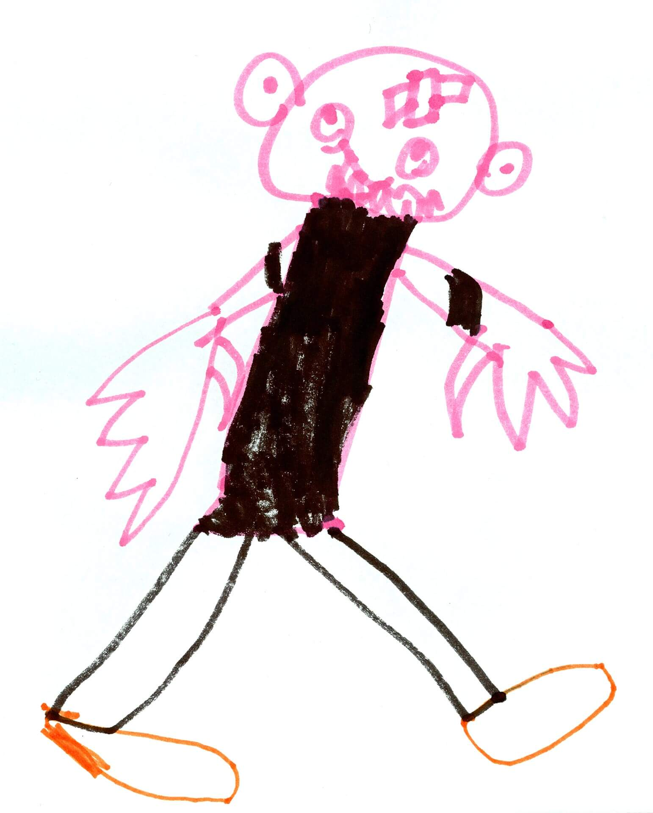

Fino a qualche tempo fa, in cucina, ero una frana patentata. E non lo dico per esagerare, ero veramente terribile (e temibile!).

Non che adesso possa definirmi una chef stellata, ma diciamo che ho fatto parecchi miglioramenti, incrementando le mie conoscenze sull'argomento e facendo un po' di pratica fra le mura di casa.

Per diversi anni sono stata dell'idea che cucinare fosse una *cosa da donne adulte*, ed è proprio a causa di questa convinzione che, per molto tempo, mi sono rifiutata di stare ai fornelli.

Con il tempo, però, ho capito che cucinare era una *cosa per persone di tutte le età*, una *cosa necessaria alla sopravvivenza* ed anche una *cosa divertente*.

E così, per la gioia del mio piano cottura illibato e della bolletta del gas, ho iniziato a socializzare con mestoli e padelle, riuscendo nell'incredibile impresa di mettere a tavola gli amici senza costringerli ad una lavanda gastrica in ospedale.

Qualcuno, in occasione del mio ultimo compleanno, ha provveduto perfino a regalarmi un matterello ed un libro di cucina dal nome criptico ma conturbante: UNO cookbook.

L'autore di questo libro di cucina è Manuel Marcuccio, food blogger nato a Tredozio ma emigrato in quel di Milano e ideatore dell'omonimo blog di cucina vegana ([www.unocookbook.com](http://www.unocookbook.com)).

L'ho intervistato davanti ad una bella fetta di torta in occasione della presentazione del suo secondo libro, "Fuori Orario", avvenuta all'incirca due settimane fa presso l'[Apebianca](http://www.lapebianca.it) di Forlì.

### Ciao Manuel! Benvenuto in MyHumus! Iniziamo dalle origini: quando e come nasce la tua passione per la cucina?

> Ciao Anna! La mia passione per la cucina nasce quand'ero piccolo, ai tempi delle scuole medie. All'epoca, mia madre, lavorando tutto il giorno, mi lasciava un bigliettino in cui scriveva che cosa preparare per cena, come prepararlo e dove comprare le materie prime.
> 
> Grazie a questi primi approcci culinari ho scoperto che cucinare mi divertiva, non era assolutamente qualcosa che mi pesava fare. E pian piano ho iniziato ad essere anche propositivo, inventando nuovi piatti (seppure, a volte, con dubbi risultati!).
> 
> Quando sono andato a vivere a Bologna avevo 15 anni e convivevo con altri amici. Fra tutti, l'addetto ai fornelli ero io, e devo dire che me la cavavo piuttosto bene, o per lo meno riuscivo sempre a rimediare una cena per tutti!.

### Nel tuo primo libro, "UNO Cookbook", affermi che non cucini, ma fai da mangiare: che differenza c'è?

> Spesso vengo definito *chef* o *cuoco*: in realtà non sono né l'uno né l'altro, cucino per me e per le persone che amo, sono semplicemente una persona che fa da mangiare avendo cura delle materie prime.
> 
> Ho fatto tesoro delle mie conoscenze, mettendomi in gioco per riuscire a cucinare senza perdere l'aspetto ludico. Far da mangiare, per me, è un momento di condivisione, di piacere, un momento soddisfacente. Ed è il ruolo che ho assunto in famiglia.

### Come nasce l'idea di scrivere libri?

> L'idea non è nata da me. Inizialmente ho raccolto le mie ricette e le ho pubblicate sul mio blog. È stato il mio editore a suggerirmi di farne un libro.

### Che tipo di cucina promuovi?

> Promuovo la cucina vegana. Tutte le ricette sono prive di ingredienti di origine animale, alcune provengono dalla tradizione, altre dalla mia storia personale. Ad ogni modo, ricerco sempre un certo tipo di sapore e di consistenza.
> 
> A questo proposito, ritengo che la tradizione sia in continua evoluzione e debba essere mantenuta viva. Non dimentichiamoci che, quando parliamo di tradizione, ci riferiamo a qualcosa che, di per sé, è piuttosto recente, perché risalente al diciannovesimo secolo. È qualcosa che cambia e che si evolve in base al tempo che si sta vivendo, sulla base degli aspetti antropologici, politici e sociali del momento.
> 
> E quindi perché non concepirla in chiave vegana?
> 
> Prendiamo come esempio i passatelli senza le uova: alcuni ritengono che, in versione vegana, siano qualcosa di estremamente recente e "azzardato". Tuttavia, sono in pochi a sapere che si preparavano in questo modo anche ai tempi della Grande Guerra, quando c'era povertà e non tutti avevano la fortuna di possedere le galline o le uova.
> 
> E comunque resta il fatto che il Pianeta è malato e ci sta chiedendo di fare qualcosa: dobbiamo regredire in nome del progresso.

### Che cosa cerchi nelle materie prime che acquisti? Quali caratteristiche devono avere i tuoi ingredienti?

> I prodotti che utilizzo provengono, in parte, dal mio orto personale (soprattutto durante il periodo estivo), ma nei mesi invernali cerco prodotti che non siano troppo dispendiosi e che mi soddisfino al massimo in termini di etica e di qualità.
> 
> Ho alcuni marchi bio e negozietti su cui ripongo la massima fiducia. Tuttavia, essendo curioso per natura, amo cercare i miei ingredienti un po' dappertutto, come ad esempio nelle piccole botteghe etniche.
> 
> I tempi attuali sono quelli che sono e mi rendo perfettamente conto di una cosa: il biologico, purtroppo, è ancora abbastanza elitario...

### I tuoi libri hanno dei bei contenuti fotografici. Sei anche fotografo?

> No, non sono un fotografo, sono un autodidatta. Eseguo i miei scatti con una normalissima macchina fotografica digitale, la stessa utilizzata anche per il mio blog.
> 
> Fotografo le mie ricette sul balcone di casa, con la luce naturale, appoggiando il piatto su una base neutra per mettere in risalto i piatti stessi. In fin dei conti, sono loro i protagonisti del mio lavoro.
> 
> La semplificazione nel rappresentarli, in realtà, vuole metterli in evidenza.

### Parlaci del tuo nuovo libro, "Fuori Orario": questa volta di cosa si parla?

> Il primo libro è un racconto generale della mia evoluzione in cucina attraverso determinati momenti e aneddoti divertenti, volevo rendere l'idea della plausibilità della cucina vegana nei momenti di vita sociale (in presenza di persone "onnivore"), esaltando il suo potere di aggregazione, i suoi colori e sapori.
> 
> 
> 
> "Fuori Orario", invece, parla di momenti più particolari: la colazione, lo spuntino, il *guilty pleasure* della buonanotte.

### Hai mai pensato di realizzare un cooking show come quello della Moskowitz?***

> Mi piacerebbe trovare qualcuno con cui realizzare un cooking show. Non è certamente qualcosa che mi piacerebbe fare da solo!.

### Piani per il futuro?

> Al momento sono concentrato sulla promozione di "Fuori Orario", è la mia attuale priorità.
> 
> E poi continuo a lavorare alle mie collaborazioni, come ad esempio quella con [L'Erbolario](http://www.erbolario.com), con [Fine Dining Lovers](https://www.finedininglovers.com) e con [Energie Magazine](http://www.energiemagazine.it).

> Foto di copertina: [Brunifia](http://www.flickr.com/photos/23769126@N07/5860057607) via [Photopin](http://photopin.com).
> *Consulta gli altri [articoli di cucina](https://myhumus.com/category/cucina-2/ "MyHumus Cucina") di MyHumus!*

