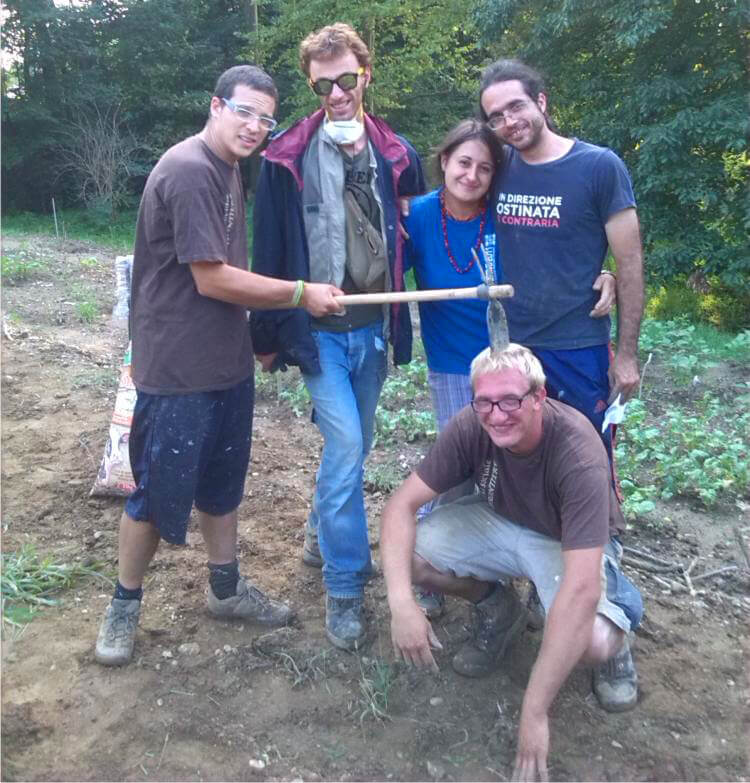
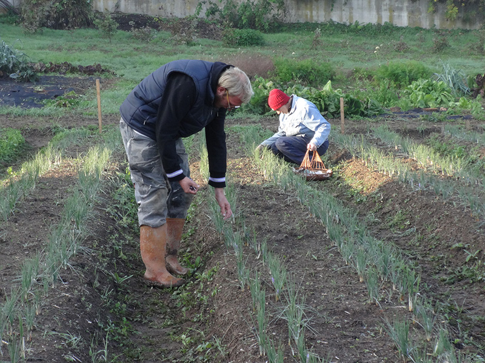
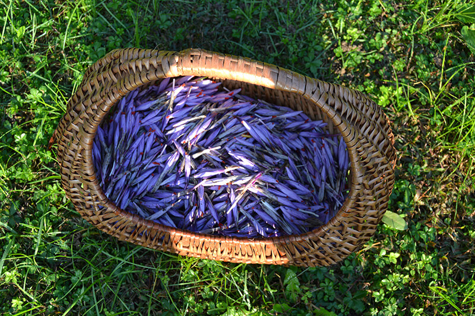
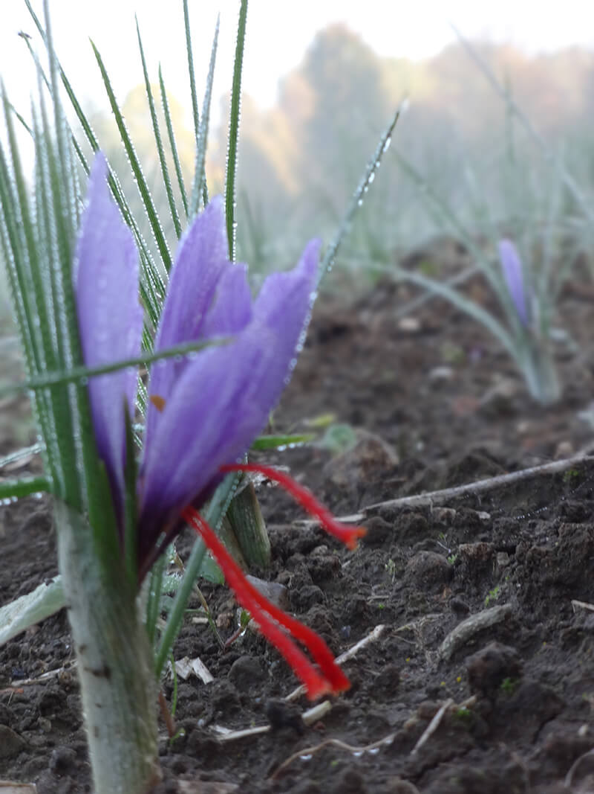

Quando sono venuta a conoscenza di [Vallescuria](http://www.zafferanovallescuria.it), progetto dedicato allo zafferano della Brianza, mi si è scaldato il cuore. Dico sul serio.

Da qualche tempo, Vallescuria coniuga due mondi: l'agricoltura e il sociale.
Nato nel 2014 in Brianza, si tratta di un **piccolo zafferaneto** situato nella zona, appunto, di Vallescuria.
Gestita da 6 soci che coltivano secondo i principi del **biologico**, questa piccola società agricola offre ad alcuni ragazzi con difficoltà cognitive la possibilità di svolgere attività pratiche e formative all'aria aperta.
Condividere la fatica del lavoro agricolo per crescere insieme e per scoprirsi più uniti: lo zafferano della Brianza può fare questo e molto altro!

La scorsa settimana ho intervistato Matteo Cereda, arredatore 5 giorni su 7, contadino nel tempo libero e fondatore di questo progetto.

### Ciao, Matteo. Raccontami, come nasce il progetto legato allo zafferano della Brianza? Da quale presa di coscienza?

> Ciao, Anna! Qualche anno fa abbiamo iniziato a coltivare un orto condiviso per stare accanto ad alcuni ragazzi con difficoltà cognitive.
>
> Il desiderio era quello di far qualcosa di pratico insieme a loro, ed è per questo motivo che abbiamo pensato all'agricoltura.
>
> Ci siamo appassionati a questa attività e sono nati Vallescuria e lo zafferaneto.

### Ciò che fate è meraviglioso, perché è frutto della combinazione fra sfera sociale e mondo agricolo. A quali principi vi siete ispirati?

> Tutto è nato senza grandi riflessioni teoriche. I valori che risiedono in questo progetto sono diversi. Crediamo nella **sostenibilità ambientale**, coltiviamo sostenendo la **filiera corta**, promuoviamo l'**amicizia** e il desiderio di **stare insieme**.
>
> Quella connessa al nostro zafferano della Brianza è un'**'agricoltura solidale**.

### Qual è il vostro sogno e in quanti siete a credere in questo progetto?

> Nella società siamo 6 soci, compresi i ragazzi con i quali lavoriamo. In realtà ci sono tantissime altre persone e amici che ci supportano e che ci danno una mano.
>
> Il sogno è quello di rendere quella di Vallescuria un'**attività lavorativa per i nostri ragazzi**. Ora come ora, non abbiamo grandi risorse, e nessuno, fra noi, può permettersi di lasciare il proprio lavoro. Portiamo avanti Vallescuria nel tempo libero, chiedendo ferie e sfruttando i weekend.
>
> In futuro, se tutto andrà bene, qualcuno dovrà obbligatoriamente cambiare vita e cominciare a fare il contadino di mestiere. I ragazzi non sono autonomi.

### Cosa significa essere contadini nel 2016?

> Significa scegliere uno stile di vita diverso, più vicino alla natura.
>
> Ci si sporca le mani e si guadagna poco, perchè il lavoro agricolo in proprio è una delle attività peggio remunerate. Però si lavora all'**aria aperta**, con **ritmi diversi** e con la soddisfazione di veder crescere qualcosa.
>
> Naturalmente, questo vale per chi intenda l'agricoltura in un certo modo: nell'agricoltura industrializzata, il contadino è imprenditore o operaio.

### Quali metodi di coltivazione state seguendo per il vostro zafferano della Brianza?

> Coltiviamo rispettando le regole dell'agricoltura biologica, anche se non abbiamo ancora affrontato le spese per ottenere la certificazione.
>
> Per fertilizzare il terreno usiamo un **sovescio di senape**, poi ricorriamo a **humus di lombrico** e a **compost autoprodotto**.
>
> Non abbiamo fatto trattamenti ai bulbi, per cui **nessun ricorso ad anticrittogamici o antiparassitari**. Abbiamo giusto sperimentato la concia con ossicloruro di rame, consentito dal biologico, su un lotto di bulbi. Inoltre, abbiamo preparato un trattamento con decotto di equiseto autoprodotto.

### Perché avete scelto di coltivare lo zafferano della Brianza? Proponete anche altro?

> Abbiamo scelto lo zafferano della Brianza perchè nessuno di noi aveva una formazione agricola e c'era troppo da imparare. Da qui la scelta di specializzarci su un prodotto.
>
> Lo zafferano non è meccanizzabile, quindi è ideale da coltivare insieme. Richiede un sacco di lavoro manuale, cosa che non ci spaventa.
>
> Oltre a essere un fiore stupendo, è un prodotto in cui abbiamo modo di raggiungere una qualità molto alta, differenziandoci da altre proposte.
>
> Abbiamo diverse accortezze per mantenere le proprietà nutritive e organolettiche della spezia. Queste attenzioni rendono il nostro zafferano della Brianza completamente diverso da quello del supermercato.
>
> **Al momento vendiamo quasi solo zafferano della Brianza**. Le verdure che coltiviamo servono più che altro a mantenere un orto condiviso, visto che dobbiamo migliorare le tecniche.
>
> Coltiviamo in via sperimentale anche il **rabarbaro**, pianta con un ottimo potenziale e con molti impieghi in cucina.

### Il vostro zafferaneto offre anche attività didattiche per bambini?

> Non abbiamo ancora pensato ad attività didattiche, anche se è una cosa che ci piacerebbe fare in futuro.
>
> Crediamo molto nel **valore educativo dell'agricoltura**.

### Quali sono le difficoltà maggiori che siete costretti a fronteggiare?

> Abbiamo avuto difficoltà soprattutto ad acquistare bulbi sani. È difficilissimo, e molto costoso, trovare bulbi di zafferano della Brianza. In occasione delle nostre prime prove, abbiamo avuto diversi problemi di fusariosi.

#### Dove possiamo trovare - e acquistare - i vostri prodotti?

> Non abbiamo un punto vendita fisico, **vendiamo tutto tramite contatto diretto**. Potete trovarci sul nostro sito o su [Facebook](https://www.facebook.com/vallescuria).
>
> Partecipiamo ai mercatini delle nostre zone e lavoriamo con i gruppi di acquisto solidale, che condividono i principi per cui è nato il nostro progetto agricolo.
>
> L'anno prossimo saremo presenti in alcuni punti vendita.

#### Quali piani avete per il futuro?

> Sicuramente ingrandire lo zafferaneto. Ci piacerebbe anche imparare a coltivare bene qualche altro prodotto.
>
> Dal punto di vista commerciale, dobbiamo ancora esplorare l'universo dei punti vendita e della ristorazione. Vorremmo essere presenti soprattutto sul nostro territorio.
