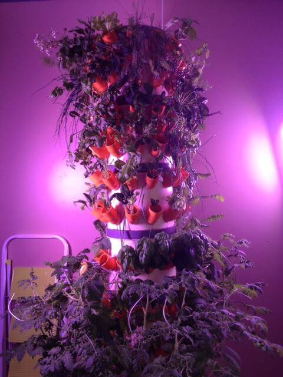
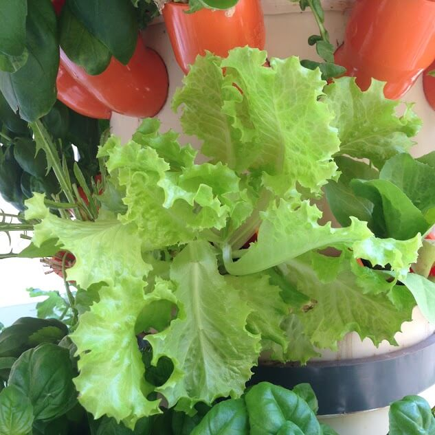
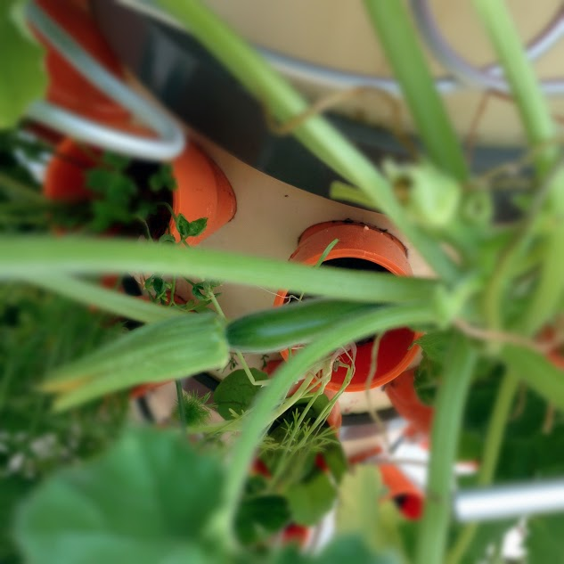
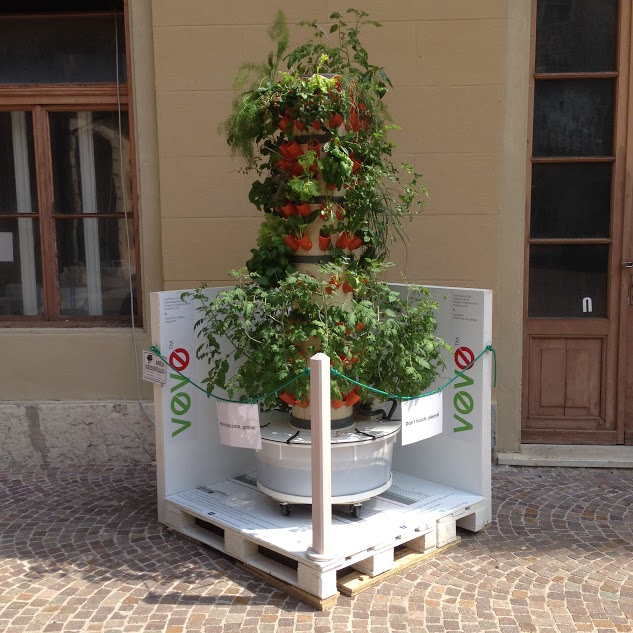

Sono una persona curiosa e quando noto qualcosa che attira la mia attenzione divento un essere spudorato.

Mio fratello ne sa qualcosa: ho trascorso ore ed ore della mia infanzia sbirciando le sue fidanzatine dal buco della serratura per capire che faccia avessero e se, a primo acchito, potessero essere definite "simpatiche". Lui non lo sa, ma ho anche origliato svariate volte le sue conversazioni telefoniche con gli amici (attività illecita grazie alla quale ho imparato un sacco di nuovi termini e di parolacce di cui ignoravo l'esistenza).

Posso quindi annunciarlo con immenso orgoglio: all'età di 12 anni avevo un vocabolario di tutto rispetto. O quasi.

E comunque ritengo che la (sana) curiosità sia un valore aggiunto. A questo proposito, c'è una citazione di Bernard Baruch che esprime un bel concetto e che rafforza la mia tesi: *"In milioni hanno visto la mela cadere, ma Newton è stato quello che si è chiesto perché"*.

E se sono state milioni le persone che hanno visto la mela cadere, altrettanti (milione più, milione meno) sono coloro che attraversano ogni giorno i corridoi di [Progetto Manifattura](http://www.progettomanifattura.it). Quanti di loro, però, si sono soffermati ad osservare l'ufficio di Matteo Sansoni? Il numero esatto non lo so, ma io posso dire di averlo fatto.

Ad essere sincera credo che Matteo, l'intervistato di questa settimana, mi abbia confusa per una stalker.

Nelle scorse settimane, infatti, ho camminato avanti e indietro per i corridoi di Progetto Manifattura, l'hub in cui è insediato MyHumus, sbirciando dentro al suo ufficio come se fossi alla ricerca di chissà quale segreto di Fatima.

Con la scusa di riempire d'acqua il bicchiere al distributore automatico, ho spudoratamente ficcato il naso dentro al suo ufficio alla ricerca di un indizio che mi consentisse di scoprire cosa caspita si celasse in quell'angolino illuminato di viola (a coprire la struttura che vedete nella foto a fianco, fino a qualche giorno fa, c'era un telo che non lasciava svelare nulla).

Di positivo c'è che, con la scusa di sbirciare con discrezione (ma neanche troppa), ho finito col bere bicchieri e bicchieri d'acqua che hanno agevolato la mia diuresi e migliorato la luminosità della mia pelle.

Se la cosa può interessarvi, posso dire di sentirmi molto più drenata e idratata. Così, giusto affinché sappiate che le mie cellule cutanee se la passano bene.

Ma qual è l'ufficio in questione? Di cosa stiamo per parlare?

L'intervistato di questa settimana, Matteo Sansoni, è l'ideatore di Veve ([www.veve.bio](http://www.veve.bio)), un orto verticale che consente di coltivare gli ortaggi comodamente sul balcone di casa. E quello che avete appena visto in foto è il prototipo che ha realizzato.

### Ciao Matteo! Iniziamo con le presentazioni: chi sei?

> Ciao Anna! Sono un architetto curioso che va a mettere il naso un po' dappertutto...

### Quando nasce Veve e da quali esigenze?

> A questo progetto mi hanno portato due grandi passioni: il disegno industriale e la botanica.
> 
> Un anno fa ho avuto l'idea di permettere a tutti di avere un orto in casa e così ho fatto delle ricerche sui sistemi fino ad allora in uso, studiando le metodologie più adatte, ricercando i materiali e le strumentazioni. Ho voluto dar loro nuove funzionalità declinandole, ovviamente, alle esigenze dei vegetali.
>
> E così è nato *Veve - vegetali in verticale* o *vertical veggies,* che dir si voglia.
> 
> Poi c'è stato il complesso passaggio dalla carta ai prototipi, l'ultimo dei quali è quello in funzione presso la Greenhouse di Progetto Manifattura a Rovereto.
> 
> In questo incubatore green ho trovato la sede ideale per sviluppare in modo coerente il progetto che è in continuo sviluppo e ricerca.
> 
> Il prototipo attuale utilizza materiali già presenti sul mercato (prodotti idraulici, elementi di irrigazione, pompa, ecc.), qui utilizzati in modo differente dal loro uso consueto. Questo per avere una riduzione dei costi relativi alla progettazione".

### In cosa consiste Veve? Cosa intendi per "orto automatizzato"?

> Veve è un orto verticale costituito da un catino alla base (di capacità pari a 100 litri) che contiene la soluzione composta da acqua e da nutrimenti biologici (quelli che utilizzo li trovi descritti a questo link: [http://it.eurohydro.com/biosevia.html](http://it.eurohydro.com/biosevia.html)), un coperchio sul quale appoggia la struttura cilindrica superiore, composta da sei elementi sovrapponibili a seconda delle esigenze dell'utenza, una serie di raccordi a 45°, dove vengono sistemati i semi o le piantine, un tubo interno di erogazione della soluzione nutritiva ed una pompa elettrica.
> 
> L'automazione di Veve consiste nel fatto che, ad intervalli regolari, la pompa si attiva e distribuisce per nebulizzazione (tecnica aeroponica) i nutrimenti all'interno della struttura dove si sviluppano le radici. In questo modo non dobbiamo più pensare di innaffiare l'orto!.

### Perché, sul tuo sito, accosti la parola "elettrodomestico" a Veve?

> Veve nasce dall'esigenza di dotare ogni casa di un orto: un obiettivo che è alla base del progetto stesso. Il concetto di elettrodomestico sottolinea come Veve debba diventare un prodotto di uso comune come, ad esempio, la lavatrice. Ogni famiglia che ha a disposizione un piccolo balconcino - basta un metro quadrato - può dotarsi di Veve ed avere fino a duecento piante. Tutto in uno spazio così ridotto!

### Di cosa si ha bisogno se ci si vuole affidare a Veve?

> Quello di cui si ha bisogno per installare Veve è, appunto, un piccolo spazio all'aperto (1 m x 1 m), una presa elettrica per l'alimentazione della pompa e il gioco è fatto. Da quel momento in poi si avranno a portata di mano la freschezza e la salubrità di numerosi prodotti vegetali controllati direttamente dall'utilizzatore... comodamente da casa.

### Dammi un'idea delle quantità: quanto si riesce a produrre grazie a Veve?

> Le quantità di produzione sono modulabili a seconda del nucleo famigliare: un single potrà installare la versione base a tre moduli (per un centinaio di piante), mentre la famiglia numerosa potrà avere quella completa per raddoppiare la produzione.
> 
> Calcola che un orto in terra può accogliere circa una decina di piante per metro quadrato di media (dipende dal tipo di ortaggi). Veve ne ospita fino a duecento! Non ci sono paragoni.

### Ho una piccola curiosità: il sapore degli ortaggi di Veve è diverso rispetto a quelli coltivati tradizionalmente?

> Il sapore è migliore rispetto a quello degli ortaggi provenienti dall'orto tradizionale in quanto i nutrimenti che nebulizzo sugli apparati radicali, che sono responsabili del sapore, raggiungono in modo più efficace foglie e frutti.

### Quali vantaggi si hanno grazie a Veve?

> I vantaggi di una simile coltivazione *in house* sono innumerevoli: innanzitutto, la tecnologia aeroponica permette uno sviluppo eccezionale delle piante (aumentandone il volume e i cicli produttivi nell'arco del periodo vegetativo), nessun substrato, niente terra: le radici si sviluppano nell'aria nebulizzata di soluzione nutritiva sviluppandosi al meglio e in minor tempo.
> 
> Per non parlare del fatto che il sistema, non utilizzando substrati o terra, non permette il passaggio di eventuali elementi inquinanti (troppo spesso presenti nei terreni) alle piante: ciò significa cibo sicuro!
> 
> Non tutti hanno la possibilità di avere un orto e pochi possono dedicargli tempo ed energie, ricordiamoci che nell'orto si eseguono lavori pesanti quali la zappatura, le concimazioni, i trattamenti antiparassitari ed antifungini, ecc).
> 
> Con Veve è tutto semplificato: nessuna lavorazione, nessun trattamento. Dall'orto al piatto!
> 
> Si pensi anche alle persone che hanno difficoltà motorie, quali ad esempio gli anziani e i disabili, alle quali potrebbe essere preclusa la possibilità di avere un orto.

### Stai riscontrando interesse verso questo tuo progetto? Lo stai esportando?

> Veve sta riscuotendo molto interesse sia sui social sia dai visitatori di Progetto Manifattura e ricevo diverse richieste e congratulazioni che sono la giusta spinta per proseguire nel percorso che mi porterà alla sua industrializzazione e successiva produzione.

### Programmi per il futuro? Sarai presente ad Expo?

> Per ora è un prototipo in via di sviluppo al quale stanno collaborando altre realtà presenti in Manifattura (Nevicam e Witlab) al fine di raggiungere un livello sempre maggiore di efficienza.
> 
> Nell'immediato futuro Veve dovrebbe essere esposto ad Expo di Milano (ma alla data attuale non so ancora in quale preciso periodo) e si parla anche di Muse a Trento.
> 
> Ah dimenticavo! Veve è in bella mostra di sé nel cortile dello stabile di Progetto Manifattura!.

*\[Vuoi scoprire altri progetti interessanti? E allora leggi subito [The Barefoot Conservation Center](https://myhumus.com/natura/), [BringTheFood](https://myhumus.com/bring-the-food-spreco/), [Ecologina](https://myhumus.com/ecologina-artigianato/), [L'Armadio Verde](https://myhumus.com/armadio-verde-swapping/) ed [Our Design Concept](https://myhumus.com/our-design-concept-design/)!\]*

Foto di copertina: [Brunifia](http://www.flickr.com/photos/23769126@N07/5860052179) via [Photopin](http://photopin.com).

