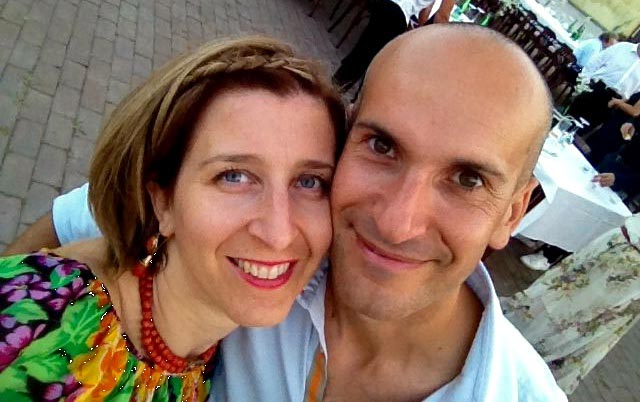

## Parte I: "*Presa di coscienza*"

Osservo gli infissi di casa mia in compagnia del ticchettio dell'orologio: chissà quanti spifferi ci sono...

Guardo i miei doppi vetri e mi chiedo: isoleranno abbastanza?

E quei termosifoni? Ne vogliamo parlare? Vogliamo affrontare anche questo discorso?

Per non parlare dell'acqua potabile destinata alle utenze del bagno...

Insomma, devo dire le cose come stanno: **casa mia non è abbastanza passiva**. Anzi, per il momento non lo è per niente!

Tutto questo non va affatto bene, urge un cambiamento.

## Parte II: "*Natale 2015 e la divina illuminazione*"

Non amo granché i giri natalizi finalizzati ai regali da acquistare ma per le amiche del cuore sono disposta a fare un'eccezione. Nel senso che mi lascio corrompere molto facilmente, mi basta un sorrisone.

È così che, durante le ultime feste di Natale, ho accompagnato Giorgia in uno dei suoi giretti: "*Vieni con me da Toys che devo comprare qualcosa per i due figli di una mia amica super green*".

Altolà, qui c'è qualcosa da chiarire: "Toys" e "green" non fanno affatto rima e non sono per niente accostabili.

Dopo questa rapida (ma doverosa) considerazione ci siamo dirette ad un altro punto vendita, questa volta dedicato ai giocattoli artigianali made in Italy, parlando della mamma dei due bimbi e della loro abitazione passiva. "*E poi devi vedere la casa che hanno, è bellissima!*", continuava a ripetermi Giorgia.

[

Dopo 10 minuti avevo il contatto mail di Anna Baruffaldi e di suo marito Alberto Berardi, i due protagonisti di questa intervista.

Anna e Alberto sono semplicemente entusiasti della loro **abitazione eco-friendly**: 380 mq di prestazioni tecniche super performanti.

Quella che segue è la chiacchierata che ho avuto insieme ad Anna un po' di tempo fa...

### Ciao Anna, è un piacere conoscerti. Dimmi, quando e da dove nasce la vostra attenzione verso l'ambiente?

"Ciao Anna! La nostra attenzione verso l'ambiente è iniziata ancora prima che io e Alberto ci conoscessimo in occasione di un capodanno all'interno di un vecchio casolare in pietra nelle Foreste Casentinesi, insieme ad un gruppo di persone che avevano scelto di trascorrere quella festa a stretto contatto con la natura".

### Abitate in campagna?

> "Abitiamo a San Mauro Pascoli, tra Rimini e Cesena, il paese natale di Giovanni Pascoli. La nostra proprietà è nella primissima campagna, non troppo distante del centro abitato".

### Quali sono le caratteristiche della vostra abitazione?

> "Si tratta di una **casa passiva** con [certificazione *Passivhaus*](http://www.zephir.ph). È una casa costruita in **latero-cemento** con **materiali altamente isolanti** e il più possibile **riciclabili**".

### A chi vi siete affidati per rendere la vostra casa ad impatto zero?

> "Già da diverso tempo sapevamo che all'estero, solo in qualche caso nel nord Italia, si stavano costruendo case con un **bassissimo fabbisogno energetico** e con **alte qualità di vita**.
>
> Quando nel 2006 abbiamo deciso di costruirci la nostra nuova casa abbiamo cominciato ad interessarcene e, assieme al fratello di mio marito - che è architetto - abbiamo percorso molte volte l'autostrada del Brennero per ricevere informazioni, vedere e trattare l'acquisto di
una casa prefabbricata. Ricordo ancora che, all'ennesimo incontro ad una fase avanza di trattativa con un'azienda altoatesina, ci alzammo dalla sedia molto disturbati dal fatto che ci stavano proponendo una casa con certificazione passiva, come volevamo, ma con finiture interne di scarsissima qualità. Non che avessimo pretese particolari ma, vista la nostra esperienza nel settore immobiliare, avevamo sufficiente competenza per capire che l'impianto elettrico, i pavimenti e le porte interne non erano ciò che cercavamo. Nel viaggio di ritorno ci siamo chiesti: "*Possibile che con le nostre competenze e conoscenze non riusciamo a costruirci da soli un fabbricato passivo?*". È così che è nata la nostra ricerca che ci ha portati a conoscere i **certificatori italiani** delle case passive e ad acquistare da loro la consulenza specifica per trasformare le nostre idee in realtà, ma con la soddisfazione di farlo insieme ad imprese locali seguendo direttamente la costruzione e tutti i dettagli. 
>
> Abbiamo dato il via a questa avventura sotto lo stretto controllo e la supervisione dei certificatori, sempre pronti a controllare l'esecuzione e ad offrirci soluzioni tecniche per eliminare i ponti termici e tutti i vari problemi che si presentavano".

#### Quale percentuale di risparmio annuale state riscontrando?

> "Non sono in grado di dirti quanto risparmiamo rispetto a prima perché la casa è nuova, ma sappiamo per certo che rispetto ad un'abitazione di simili dimensioni noi spendiamo pochissimo (se vogliamo dare un'idea indicativa, circa 1/3) con un **comfort interno nettamente migliore**, difficile da spiegare e al quale, ora come ora, faremmo molta fatica a rinunciare".

#### Che cosa consigliereste a tutti coloro che sono interessati a migliorare le prestazioni tecniche della propria abitazione?

> "Per noi è importante la qualità della vita. Vivere in una casa dotata di un buon comfort, e ad impatto energetico limitato, dovrebbe essere possibile per chiunque.
> 
> Ciò è ottenibile riqualificando energeticamente i fabbricati esistenti o costruendo in maniera più accurata i nuovi fabbricati. Oggi esistono **tante soluzioni** e, per fortuna, a **prezzi più vantaggiosi** (infissi e ogni altro materiale di costruzione di immobili).
> 
> Le competenze tecniche sono migliorate ed è molto più semplice migliorare le prestazioni energetiche delle case".

Se volete contattare Anna ed Alberto per ricevere tutte le specifiche tecniche riguardanti la loro abitazione green, ecco il sito di riferimento: [casa passiva alberto berardi - costruzione di casa passiva](https://casapassiva.wordpress.com).
