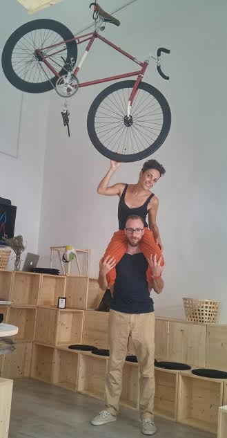
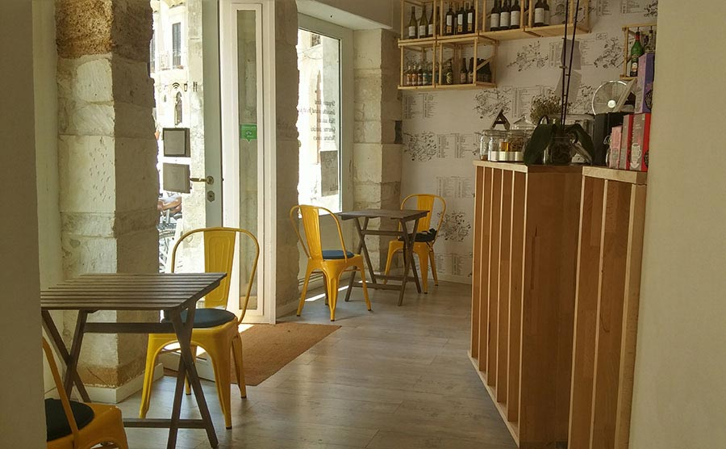
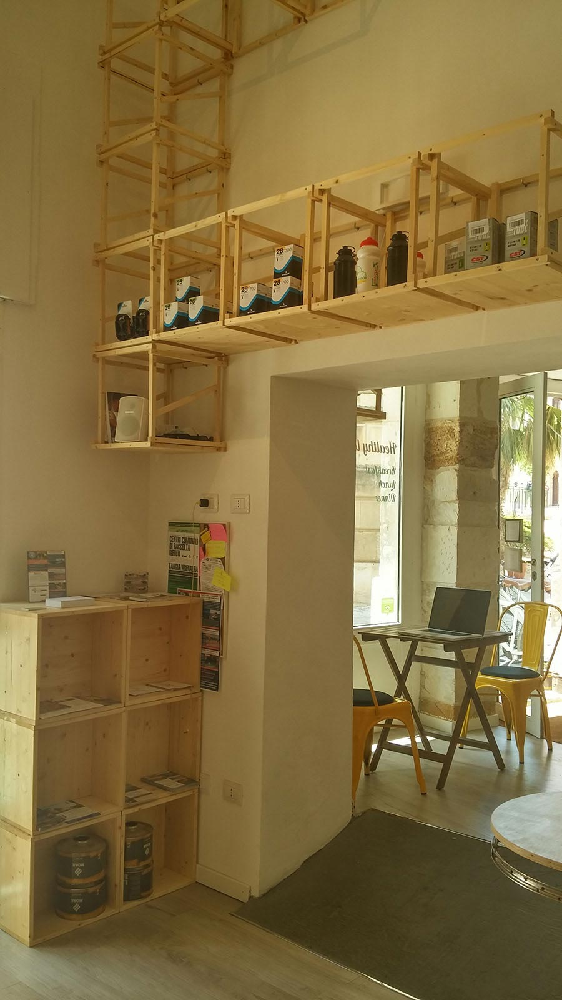
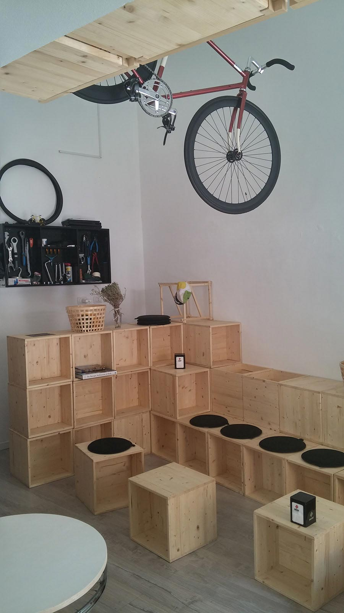
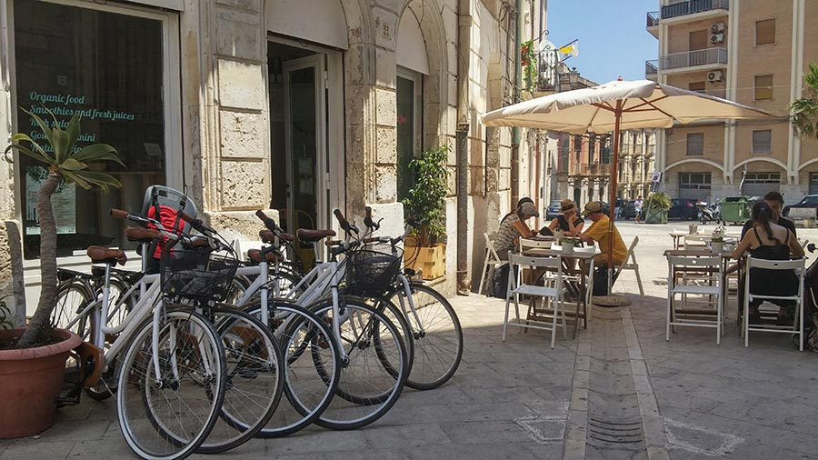
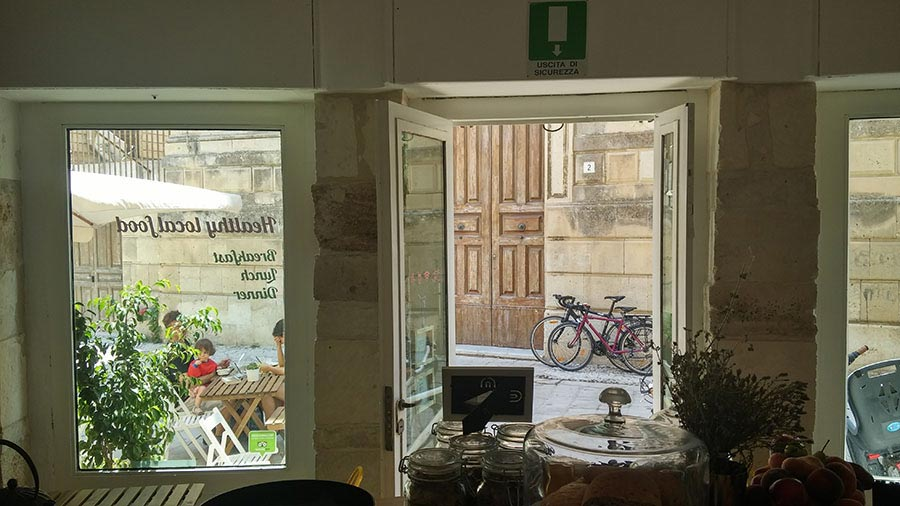

Se alla domanda "*Hai mai visitato la Sicilia?*" la tua risposta è "*No*", sii cosciente di una cosa: la tua è una mancanza estremamente grave. Sappilo.
Puoi essere stato ovunque, dalle Americhe all'Oceania, puoi aver alloggiato in qualsiasi capanna nella giungla o addirittura in un'igloo; puoi aver mangiato cibi più o meno orripilanti insieme agli indigeni-di-non-so-dove, puoi aver attraversato i deserti più ostili e bevuto l'acqua direttamente dalle foglie nel mezzo della foresta pluviale; puoi aver dormito dentro alla carcassa di un dromedario in stile Bear Grylls e scalato l'Everest indossando un paio di tacchi a spillo, o aver fatto bungee jumping vestito da Superman... ma se non sei mai sbarcato in terra sicula, mi spiace, il tuo bilancio è comunque negativo. Per favore, consulta subito un'agenzia viaggi o qualche specifico sito e vedi di rimediare al danno.

Il fatto è che la Sicilia è una terra magnifica!
Diversi anni fa ebbi il privilegio di percorrere la sua porzione sud-orientale, visitando Pozzallo, Ispica, Marzamemi, Noto, Modica, Vendicari, Caltagirone e Siracusa...e fu subito amore.
I panorami siciliani sono semplicemente mozzafiato, non ricordo una sola meta che non mi sia piaciuta. Che profumi e che colori incredibili, soprattutto al tramonto, e poi i magnifici centri storici delle cittadine e dei piccoli paesi che conservano ancora il sapore e l'aspetto d'altri tempi.
Altre considerazioni da non sottovalutare: arancini da urlo, granite pazzesche e pasticcerie con dolci talmente buoni da indurre le lacrime (giusto per dovere di cronaca, ogni tanto restavo immobile a fissare le loro vetrine, osservando i cannoli siciliani con uno sguardo simile a quello del piccolo Charlie in *La fabbrica di cioccolato*, trasognante davanti alle tavolette di cioccolato di Willy Wonka...).
Della Sicilia mi colpì molto anche l'ospitalità delle persone. Una sera mi recai a cena in un ristorante e, dopo aver ordinato alla carta, il cameriere mi portò un polpo gigante che io non avevo richiesto.
"*Cameriere, credo ci sia un errore, io non ho ordinato questo polpo*", gli dissi. E lui, sorridente: "*Lo so, è offerto dalla casa!*". Hai capito, la Sicilia?
In una mattina di sole, ad un forno di Ispica, incontrai una signora che si lamentava dell'inverno appena trascorso, troppo rigido per i suoi gusti: era stata costretta ad indossare un foulard. Semplicemente fantastica.

Ma torniamo a noi e all'argomento di questa settimana...
Amanti della bici di tutta Italia, cercate un itinerario per le vostre vacanze? Semmai il vostro viaggio dovesse condurvi in Sicilia, spingetevi fino a Siracusa e portate i miei saluti a Chiara Pota, milanese, e ad Alfonso Peralta, siracusano, due ragazzi che, spinti entrambi dall'amore per la bici, hanno deciso di aprire un bike café nel centro storico di questa bellissima città.

L'hub si chiama [Movimento Centrale](http://www.movimentocentrale.net)...

***Ciao ragazzi! Ditemi: quando nasce Movimento Centrale? Da quali esigenze?***

"Ciao Anna! Abbiamo inaugurato Movimento Centrale lo scorso aprile, qui a Siracusa. Avevamo bisogno di cambiare lavoro, stile di vita e luoghi. Desideravamo un po' di tempo libero e perseguire i nostri interessi.
L'intenzione iniziale era di trasferirci a Siracusa, città natale di Alfonso, per aprire un piccolo B&amp;B orientato ai cicloturisti, una sorta di ostello.
Dopo aver valutato quelle che potevano essere le nostre possibilità economiche, abbiamo progettato l'apertura di questo café instaurando partnership relative ai servizi che non offriamo noi personalmente, quali, ad esempio, l'alloggio, l'affitto di grandi quantità di bici, l'organizzazione di tour, l'accompagnamento, ecc.
Dall'idea iniziale alla realizzazione vera e propria dell'hub è trascorso un anno, diciamo che siamo stati abbastanza veloci".

***Tu, Chiara, di cosa ti occupavi prima di intraprendere questa avventura? E Alfonso?***

"Io lavoravo presso uno studio legale internazionale nell'ambito della comunicazione e del marketing, mentre Alfonso lavorava per [L'Espresso](http://espresso.repubblica.it) in qualità di web trafficker".

***Cos'è Movimento Centrale? Quali servizi offre?***

"Movimento Centrale è una caffetteria-tavola fredda con ciclofficina annessa. Ciò che facciamo, fondamentalmente, è promuovere la bici ed il cicloturismo.
La nostra ristorazione è coerente con i principi del progetto: si tratta di cibi a km zero, biologici e sempre freschi. Vogliamo promuovere le colture tipiche locali e privilegiare tanto le piccole realtà a conduzione familiare quanto le tipicità del territorio (salumi e formaggi provengono entrambi dal territorio circostante).
Abbiamo deciso di mettere a disposizione di tutti, gratuitamente, l'officina: chiunque abbia bisogno di effettuare una riparazione può servirsene, abbiamo pezzi di ricambio per il primissimo soccorso e piccoli accessori per personalizzare la propria bici.
In questi giorni stiamo mettendo a punto una mappa della Sicilia sud-orientale che mostrerà alcuni percorsi ciclabili, tutti mappati con QR Code e scaricabili in formato GPX (GPS Exchange Format) così da poter essere visualizzati sul navigatore.
Offriamo il 10% di sconto a tutti coloro che arrivano alla caffetteria in sella alla bici, noleggiamo biciclette e organizziamo tour cicloturistici insieme ad un nostro partner costruendo percorsi *ad hoc*.
Movimento Centrale è un progetto che sta prendendo vita un po' alla volta. Desideriamo avvicinare coloro che hanno deciso di visitare la Sicilia cercando un contatto diretto con le persone".

***Avete ricevuto finanziamenti o altri aiuti di tipo economico?***

"Abbiamo ricevuto un finanziamento a tasso agevolato tramite la [Banca Etica](http://www.bancaetica.it) ed il [Fondo Sociale Europeo"](http://ec.europa.eu/esf/home.jsp?langId=it).

***Al di là del cibo che proponete, in che modo il vostro bike cafè può dirsi sostenibile?***

"I nostri arredi sono interamente in legno e sono il frutto di una sana autocostruzione. I tavolini sono stati ottenuti dal riciclo di vecchi cerchioni di biciclette. Se per l'illuminazione abbiamo scelto i led, per il riscaldamento non abbiamo ancora deciso come comportarci, valuteremo diverse soluzioni".

***Organizzate anche incontri culturali?***

"Vogliamo organizzare mostre, incontri culturali con cicloturisti e con viaggiatori.
Poco tempo fa abbiamo intervistato un ragazzo brasiliano che sta attraversando le coste di tutto il mondo per contribuire a sensibilizzare le persone riguardo al tema dei rifiuti negli oceani. Lo abbiamo invitato a raccontare la sua esperienza.
Da ottobre vogliamo stringere rapporti più stretti con il cicloturismo, invitando persone e realizzando incontri.
Lo spazio riservato alla ciclofficina è stato studiato proprio per organizzare presentazioni, installazioni e mostre: le sedute sono costituite da cubi modulari che consentono di creare ambienti diversi sulla base delle esigenze".

***Come siete stati accolti da Siracusa?***

"Le persone ci stanno ancora conoscendo. L'approccio è complessivamente positivo, c'è molta curiosità. Vogliamo agganciarci al cicloturismo su mountain bike per esplorare il territorio".

> *Vuoi leggere ancora a proposito di bici? Ti consiglio i progetti di [Luca Savini](https://myhumus.com/luca-savini-bici/), [Gianluca Sada](https://myhumus.com/sada-bike-bici-pieghevole/), [Aldo Mandato](https://myhumus.com/aldo-mandato-scattofisso/) e [Abici](https://myhumus.com/abici-biciclette/)!*

