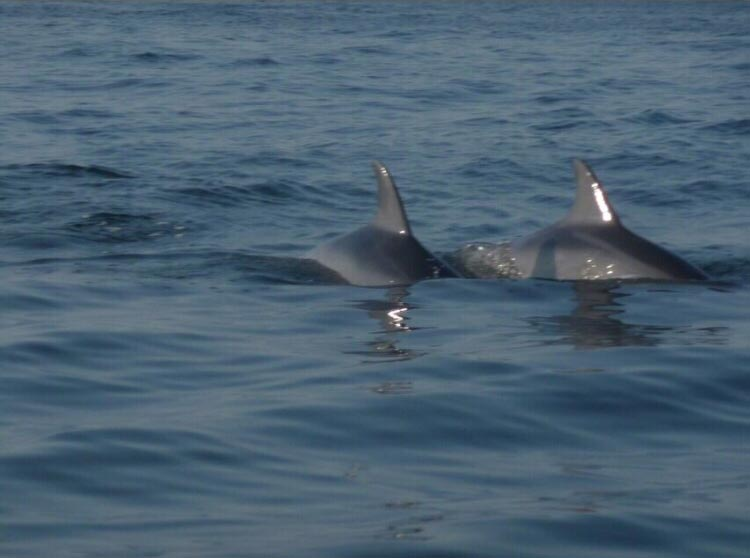
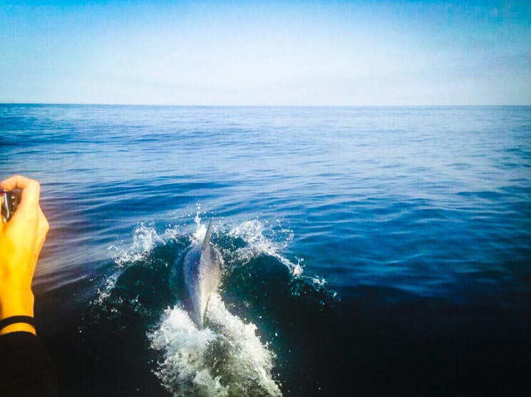

Quello di questa settimana è un argomento tenerissimo. Siete pronti?
Non serve che rispondiate, lo so che lo siete (non chiedetemi su cosa stia basando questa affermazione. Certe cose, le blogger, le sanno e basta, senza ricorrere eccessivamente alla razionalità).
Stavamo dicendo? Ah, sì, che l'argomento di questa settimana è ad alto indice glicemico. E il motivo di ciò, fondamentalmente, risiede nel protagonista di questo nuovo articolo di MyHumus, un animale che, di per sé, rappresenta l'emblema della dolcezza: il delfino!
Immagino che tutti sappiate che i delfini sono presenti anche in Adriatico, non è vero? Sì che lo sapete (anche in questo caso non chiedetemi perché, lo so e basta...sono onnisciente!).
Durante le diverse stagioni balneari ravennati di questi ultimi anni ho sperato più e più volte di riuscire ad avvistare un delfino dell'Adriatico, ma invano...

Fortuna che, ad individuarli e a tutelarli, ci sono Rebecca Andreini, Nicola Aurier, Michela Spreafico e Carlo Pezzi, i quattro componenti del team di *[Delfini Bizantini](https://www.facebook.com/pages/Delfini-Bizantini/1427017697619968?fref=ts),* una recentissima associazione nata per tutelare i *Flipper* e i *delfini curiosi* di casa nostra.
Qualche giorno fa ho avuto il piacere di incontrare Rebecca e di conoscere più nel dettaglio questo interessante progetto di tutela.

***Ciao Rebecca! Cominciamo dalle origini: quando è nato il tuo interesse per il mondo naturale?***

"Ciao Anna! Sono nata con una particolare sensibilità ed empatia nei confronti del mondo animale.
Ero una bambina molto timida e introversa, mi sono sempre sentita più mio agio con gli animali che con le persone. Con il passare del tempo, gli animali sono diventati anche un mezzo per riuscire ad aprirmi e a comunicare con la gente. Molto presto ho scoperto che l'amore per gli animali è un fortissimo mezzo di unione.
Ognuno di noi ama profondamente il proprio cane o il proprio gatto. In questo senso, l'animale diventa anche un tramite per conoscersi, per scoprirsi e per apprezzarsi indipendentemente dalle distanze mentali che intercorrono tra noi esseri umani".

***Come hai conosciuto gli altri componenti del team di cui fai parte ?***

"La nostra associazione, *Delfini Bizantini*, è basata su un team composto da 4 ricercatori di cui 2 sono biologi ed altri 2 sono prossimi veterinari.
La solida amicizia che mi lega a Carlo ed a Michela si è costituita nel tempo grazie alla *forma mentis* e all'interesse scientifico che ci accomunano. Tutti abbiamo fatto della nostra passione, dapprima, un duro percorso di studi, e poi, in seguito, una professione. La capacità di comprendere realmente le rispettive difficoltà e condividere i successi è diventato un collante sempre più efficace.
Nicola ed io, invece, ci siamo incontrati in ambito accademico durante il suo tirocinio formativo in Francia. Nicola stava svolgendo un'interessante ricerca sulla bioacustica dei delfini.
È un biologo estremamente appassionato e competente, motivo per cui ho subito pensato di coinvolgerlo in questo progetto. Lui, fortunatamente, ha accettato con entusiasmo".

***Quando nasce questo progetto di tutela dei delfini ? È già attivo?***

"Il progetto di monitoraggio e di tutela dei delfini in Alto Adriatico è nato, lentamente e progressivamente, nell'ultimo anno grazie al percorso formativo personale di ciascuno di noi, guidato, per quanto mi riguarda, dalle mani esperte di Annalisa Zaccaroni, ricercatrice presso il dipartimento di Scienze mediche Veterinarie di Cesenatico, un distaccamento dell'[Università di Bologna](http://www.unibo.it/it).
Tengo a precisare che, dietro a questa iniziativa, c'è un duro lavoro di formazione, di studio e di ricerca e che il lento sviluppo che ci ha portato, oggi, a poter concretizzare il progetto tramite la costituzione dell'associazione *Delfini Bizantini* è stato frutto di molte domande, ricerche e di prese di coscienza che ci hanno permesso di agire consapevolmente e in modo professionale.
In particolare, l'idea nasce dall'assenza di dati significativi sulla popolazione di delfini che insiste in questo tratto di mare, condizione che ci ha spinto a voler colmare questa lacuna.
Il progetto è già attivo da maggio nella sua fase di ricerca sul campo. Ad essa seguiranno numerose iniziative aperte al pubblico che potrete consultare sulla nostra [pagina Fb](https://www.facebook.com/pages/Delfini-Bizantini/1427017697619968?fref=ts) e, prossimamente, sul sito web ad esso dedicato".

***Perché monitorare i delfini dell'Adriatico? Quali specie prendete in esame?***

"I delfini sono animali verso i quali le persone provano una forte empatia, l'attenzione su di essi è sempre maggiore sia da parte del privato cittadino che degli enti pubblici e privati che operano nel settore marittimo.
L'ottenimento di dati certi sulla presenza frequente degli animali, in particolare della specie *tursiope*, rappresenta sicuramente un punto di forza per la nostra area costiera, con ricadute positive sia dal punto di vista economico che sociale, ma anche di immagine e sociale in termini di educazione e rispetto ambientale.
Purtroppo i delfini sono animali a forte rischio di estinzione ma, fortunatamente, sono sempre più tutelati dalle normative nazionali, europee e mondiali (si pensi alla convenzione di Washington ed al progetto [ACCOBAMS](http://www.accobams.org) che riunisce i paesi del Mediterraneo con lo scopo comune di tutelare i cetacei presenti nelle nostre acque).
Nonostante ciò, gli sforzi e le attività di ricerca nell'Adriatico sono sempre state penalizzate e messe scarsamente in evidenza.
La carenza di dati inerenti questo tratto di mare non consente di avere un quadro reale e chiaro dello stato di salute e dell'abbondanza dei delfini nelle nostre acque e non permette nemmeno una collaborazione proficua con altri enti di ricerca operanti nel settore.
Inoltre, non va dimenticato che il delfino rappresenta, dal punto di vista scientifico, una *specie sentinella* in grado di fornire informazioni importanti sullo stato di salute del mare, sull'inquinamento e sui cambiamenti climatici che si stanno verificando.

A questo proposito, il progetto non si limita alla sola ricerca sui delfini, ma prende in esame anche gli altri grandi veterbrati marini che frequentano il mare Adriatico come, ad esempio, le tartarughe, gli squali ed alcune specie ittiche. Tutto ciò per non dimenticare come ognuno di noi sia integrato in un bellissimo e complesso ecosistema".

***Puoi descrivermi i vari passi del progetto?***

"La prima fase del progetto inizia dalla ricerca sul campo*:* dalle schede di avvistamento compilate per noi da pescatori, sommozzatori, scuole di nautica e capitaneria di porto, otteniamo informazioni circa il luogo, la data e l'ora di avvistamento degli animali, concentrando gli sforzi di ricerca su queste particolari aree marittime.
Avvistati gli animali, l'approccio avviene secondo un preciso protocollo scientifico che ha lo scopo di non disturbare l'attività dei delfini e di non creare alcun danno ai soggetti.
Si procede con la fotoidentificazione scattando fotografie delle pinne dorsali che, attraverso l'utilizzo di un software, permettono di distingure i singoli soggetti verificando progressivamente se vengono riavvistati o se compiono migrazioni.
Compiliamo anche una scheda di segnalamento, raccogliendo i dati clinici degli animali ed annotando i comportamenti e le attività degli stessi. Tramite l'utilizzo di un idrofono registriamo le emissioni sonore dei delfini cercando, successivamente, una corrispondenza con le attività comportamentali che abbiamo osservato.
La seconda fase del progetto prevede la costruzione di una piattaforma informatica, in cui inserire i dati, che sarà *open source* per poter condividere e confrontare liberamente i dati raccolti con altri enti di ricerca.
Il progetto si propone anche di svolgere attività di divulgazione e di informazione scientifica dirette agli appassionati, alle scuole primarie e secondarie, così come attività dimostrative in mare aperte al pubblico".

***I vostri metodi sono invasivi?***

"I metodi utilizzati per la ricerca sul campo sono totalmente non invasivi per gli animali.
L'approccio ai delfini e le attività di raccolta dati sono stati stilati seguendo le regole di ingaggio scientifiche ufficiali del 2011.
Tutte le attività vengono svolte in modo tale da non arrecare alcun disturbo ai soggetti ed unicamente qualora siano gli stessi animali a non dimostrare segni di insofferenza o di stress.
In caso contrario, l'attività di ricerca viene interrotta".

***Il vostro studio contribuisce anche a fornire dati sulla salute dell'ambiente?***

"Lo studio non è finalizzato unicamente a valutare l'integrità della popolazione di delfini ma, essendo l'ecosistema marino un complesso insieme di organismi tra loro collegati ed integrati, l'intenzione è quella di valutare, attraverso il delfino, la salute del mare nel suo insieme.
Verranno considerate le specie ittiche e le loro migrazioni, le tartarughe e gli squali, al fine di ottenere un quadro complessivo e realistico della condizione di salute dell'Adriatico.
Questi dati sono essenziali per sviluppare, in collaborazione con chi opera nel settore marittimo, quelle attività di tutela e quelle misure correttive concretamente attuabili nel rispetto del nostro mare".

***Collaborate con altre realtà di ricerca? Siete supportati da qualche ente specifico?***

"L'associazione collabora attivamente e costantemente con l'Università di Bologna, dipartimento di Scienze Mediche Veterinarie, organismo che permette di coordinare e controllare l'operato della Associzione sul campo.
Attraverso la preziosa guida di Annalisa Zaccaroni permetterà lo sviluppo e l' interpretazione dei dati raccolti.
L'associazione, inoltre, collabora con il [Circolo Velico Ravennate](http://www.cvr.ra.it) ed il [Circolo Velico di Punta Marina](http://www.cvpuntamarina.com) (che, gentilmente, hanno messo a disposizione i mezzi nautici per la ricerca sul campo), con l'[Associazione Paguro](http://www.associazionepaguro.org) e la Ditta Ciappini - Trasporti Marittimi che ci hanno accolti sulle loro imbarcazioni fornendoci informazioni essenziali.
*Delfini Bizantini* ha già ricevuto altre numerose richieste di collaborazione e creazione di reti per lo scambio di dati scientifici con altre realtà italiane già da tempo operanti sul campo e per le quali sono in corso gli agreement necessari.
Tutto ciò ci rende molto fieri".

***Cosa bolle in pentola nei prossimi mesi?***

"Nei prossimi mesi verrà intensificata la ricerca sul campo e verranno organizzati eventi aperti al pubblico con lo scopo di sensibilizzare l'opinione pubblica sul tema di ricerca e far conoscere a tutti la meravigliosa realtà che il nostro mare può offrire.
L'associazione, per il momento, è totalmente autofinanziata, quindi per coloro che desiderassero contribuire alla realizzazione di questo nostro sogno e progetto c'è la possibilità di sostenerci attraverso donazioni al sito [buonacausa.org](http://buonacausa.org) al nome *[Delfini Bizantini](http://buonacausa.org/cause/proteggi-i-delfini)* e di rimanere informati sui progetti e le attività aperte al pubblico tramite la pagina Facebook".

> *Ti interessa la ricerca scientifica finalizzata alla tutela degli animali? Allora leggi anche il progetto di [Flavio Sacco](https://myhumus.com/natura/)!*

