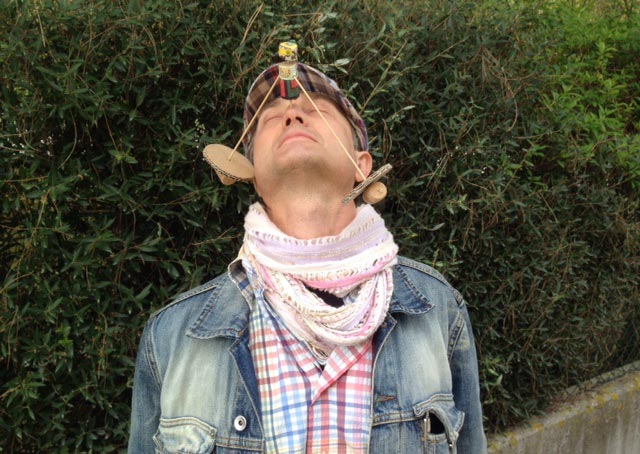
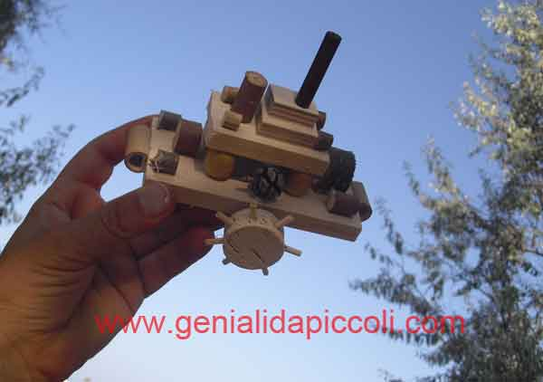
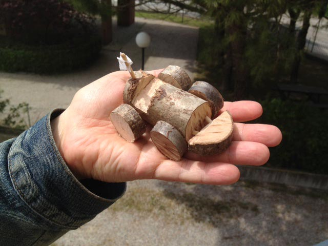
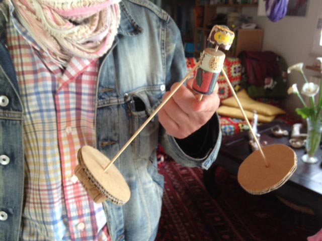

Io vi avviso: per introdurre questo articolo ho pensato di fare un tuffo nel passato e, più precisamente, nella mia infanzia, per cui sappiate che state per leggere un pippone tremendo.

*Ah, l'infanzia! Ricordo quando mamma Lucia mi portava al parco a giocare, lasciandomi libera di correre a piedi nudi sull'erbetta fresca...* Oddio, è troppo? Ok, scusate, mi ricompongo subito.

Se c'è una cosa che, fin dalla nascita, non mi è mai mancata, quella è la fantasia. Ero una bambina dalla fantasia sfrenata, da piccina riuscivo a giocare con qualsiasi cosa, tutto rappresentava una scoperta.

Il mio passatempo preferito era sicuramente il disegno, mi piaceva molto inventare storie a fumetti.

E c'è da dire che ho avuto al mio fianco un fratello maggiore molto giocherellone, complici anche i nostri 11 anni di differenza: trovava che fossi un vero spasso, s'inventava mille giochi e io non avevo alcuna paura di incrinarmi una costola pur di farlo divertire. Ricordo che giocavamo a rugby e a pallavolo in salotto (non chiedetemi come ciò sia stato possibile, so che ci riuscivamo e che ci divertivamo come pazzi!).

Quando ripenso alla mia infanzia mi torna sempre alla mente quell'unica parola che ha rischiato di compromettere la mia salute mentale: *Risiko*.

Posso dire di aver versato più lacrime giocando a Risiko contro mio fratello che in tutto il resto della mia vita. Io ero così ingenua, lui così furbo.

Non si sa in quale modo, ma riusciva sempre a vincere (e invece sì che lo so, in che modo: leggeva i miei obiettivi mentre mi assentavo per far merenda!) ed era capace di attaccare i miei Stati utilizzando 20.000 carri armati... insomma, un'apocalisse.

Ma cerchiamo di dimenticare queste atrocità del passato presentando l'argomento di questa settimana che, ormai, avrete intuito: il gioco.

Era da un po' di tempo che cercavo qualcuno in grado di realizzare giocattoli, quand'ecco che, la scorsa settimana, una persona molto speciale mi ha suggerito un nome ed un cognome: Renzo Laporta.

Renzo è un *toy maker* che vive a Ravenna e che costruisce giocattoli servendosi di materiali riciclati.

### Ciao Renzo! Dimmi, a quali principi si ispira il tuo lavoro?

"Ciao Anna! Sai, credo che il gioco debba collegarsi alla terra, alla materia e all'esperienza.

Occorre ritornare alla genuinità del gioco riconoscendo la genuinità dell'infanzia che, oggi come oggi, è andata un po' persa. Per quanto riguarda la concezione dell'infanzia, mi piace la visione di Eugenio Montale in *"Fine dell'infanzia"*, una poesia che parla del momento il cui bambino avverte l'arrivo della pre-adolescenza e abbandona ciò che era stato fino ad allora.

La verità è che la modernità ha portato a vedere il bambino come un piccolo adulto. Il minore ha sì la necessità di essere protetto, accudito, ma non sottomesso. Non concordo con un approccio eccessivamente autoritario e con i genitori che sovraccaricano i figli con un numero abnorme di impegni.

Dico *no* all'iper protezione e *sì* alla possibilità di sperimentare e di conoscere attraverso l'esperienza del gioco.

Ricerco l'autenticità dell'infanzia proponendo attività che si esprimono all'interno dei contesti educativi in generale come, ad esempio, le scuole.

Diversi anni fa conobbi il fondatore del centro [La Lucertola](http://www.lalucertola.org/italiano/introduzione.html) di Ravenna, Roberto Papetti, ora ormai in pensione. Fu con lui che riscoprii il fascino del giocattolo fatto a mano. Devi sapere che, da bambino, ero noto fra i miei amichetti perché inventavo giochi, trasformando qualsiasi cosa.

Un po' di tempo fa, durante gli 8 anni trascorsi a Londra, ho avuto la possibilità di insegnare l'arte della costruzione di giocattoli utilizzando materiali di scarto presso numerose scuole e centri. Credo sia stata un'esperienza molto formativa, quanto meno perché mi ha permesso di scoprire una cultura molto diversa in questo senso: il gioco inteso dal punto di vista del bambino".

### Qual è il valore aggiunto dei tuoi giocattoli?

"A Londra ho scoperto la parola "accessibilità" e credo che sia proprio questo il valore aggiunto dei miei giocattoli.

Fino a qualche tempo fa si aveva una concezione adulto-centrica dei giochi, fondamentalmente legata ad un modello tradizionale. Io credo che la cosa importante sia riuscire a costruire giocattoli utilizzando pochi strumenti accessibili, in modo tale che i bambini possano cimentarsi nell'impresa anche a casa, senza troppe difficoltà.

In questi anni, ho lavorato attorno alla parola "accessibilità" per costruire il mio stile: utilizzo il cartone, la carta, la colla liquida, la plastica ed il nastro isolante da elettricista. Nei miei lavori non c'è utilizzo di strumenti elettrici o, comunque, ritenuti pericolosi dagli adulti. L'obiettivo è quello di essere creativi ricorrendo a ciò che si può trovare in casa.

Amo stimolare la loro creatività, così come la manualità e la partecipazione".

### Dove lavori? Hai un laboratorio?

"Anni fa il mio laboratorio risiedeva presso il centro *La Lucertola*, ma ora non ce l'ho più. Porto il gioco negli ambienti educativi in generale: scuole, centri ricreativi estivi, doposcuola, gruppi di famiglie e laboratori al mare.

Nei weekend di quest'estate, ad esempio, potrete trovarmi presso il bagno Ruvido di Punta Marina Terme, in provincia di Ravenna.

Mi piace vedere nel mio trolley il mio laboratorio: tutto quello che mi serve è contenuto al suo interno".

### Quanto interesse c'è da parte dei genitori ad acquistare giocattoli fatti a mano anziché quelli delle grandi distribuzioni? Trovi che gli adulti di oggi abbiano senso pratico?

"Noto sempre un grande interesse nei confronti dei giocattoli artigianali. Un ostacolo è sicuramente la visibilità: a differenza di quelli commerciali, non è così comune vederne in giro.

C'è da dire che gli adulti di oggi, rispetto a quelli di ieri, hanno un po' meno manualità ma, in compenso, sono più propensi al dialogo e all'accordo. Quello che noto è una maggiore disponibilità a negoziare, considerando un ipotetico problema anche dal punto di vista del bambino.

E comunque, durante i laboratori che ho condotto finora, è stato più frequente vedere gli adulti tagliarsi rispetto ai bambini!"

Per restare aggiornati sulle attività creative di Renzo, ecco 4 link utili:

[www.lalucertola.org](http://www.lalucertola.org) / [www.genialidapiccoli.org](http://www.genialidapiccoli.com) / [www.medioeisuoiaquiloni.it](http://www.medioeisuoiaquiloni.it) / [www.dirittoalgioco.net](http://www.dirittoalgioco.net)

Renzo sarà anche alla Festa del Diritto al Gioco che si terrà domenica 24 maggio presso il Parco "Mani Fiorite" e via Eraclea a Ravenna, dalle 15:00 alle 19:00 (per maggiori informazioni, consultate il sito dell'[Associazione Lucertola Ludens](http://www.lalucertola.org/italiano/progdirittoalgioco2015.html).).

Foto di copertina: [Wolfgang Lonien](http://www.flickr.com/photos/99713555@N00/5967155061) via [Photopin](http://photopin.com).

