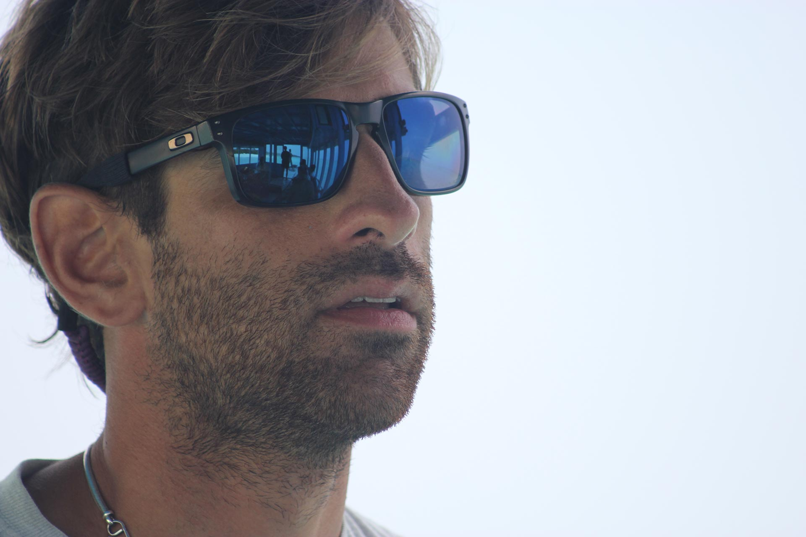
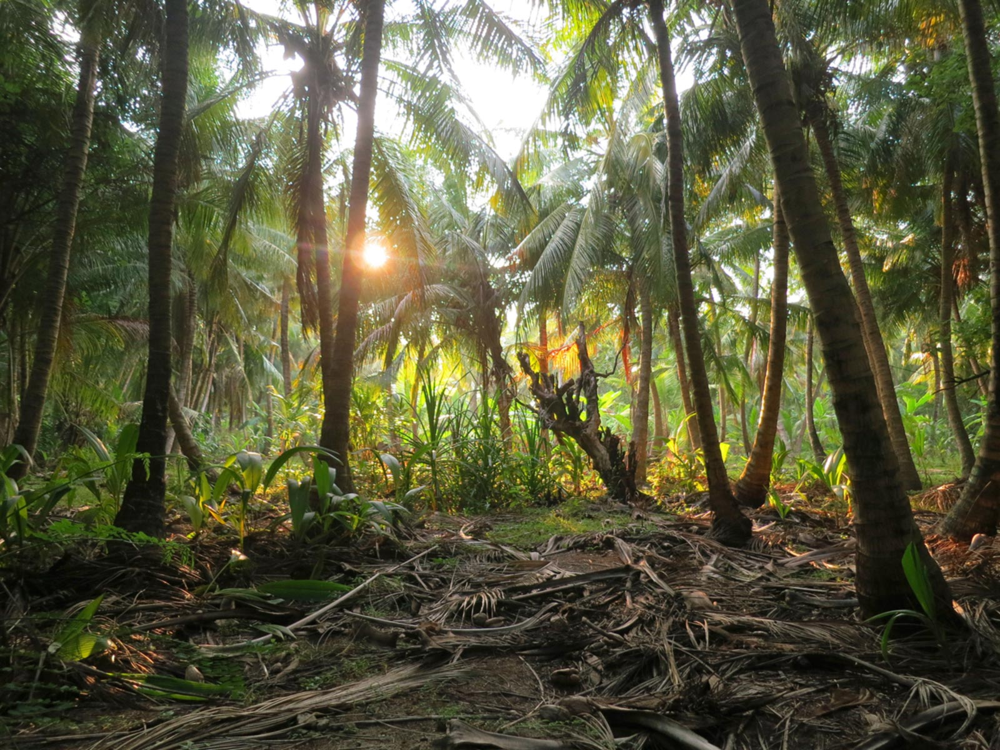
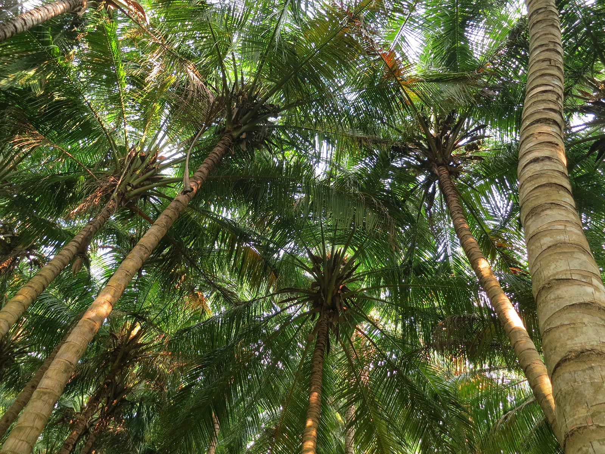
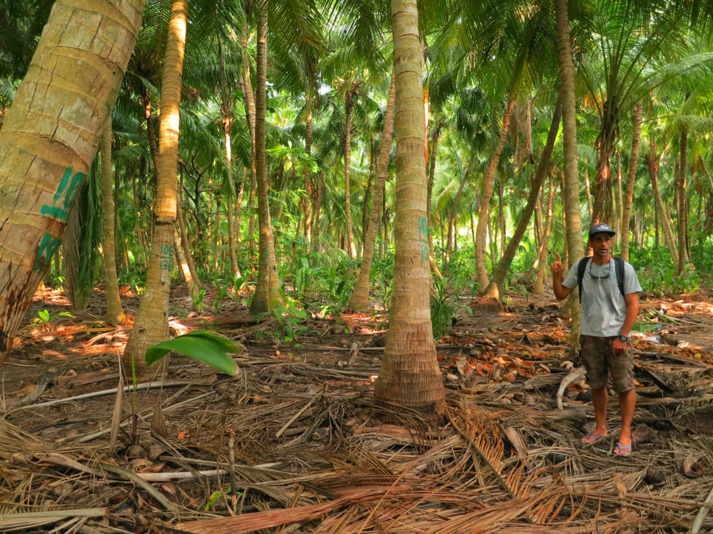
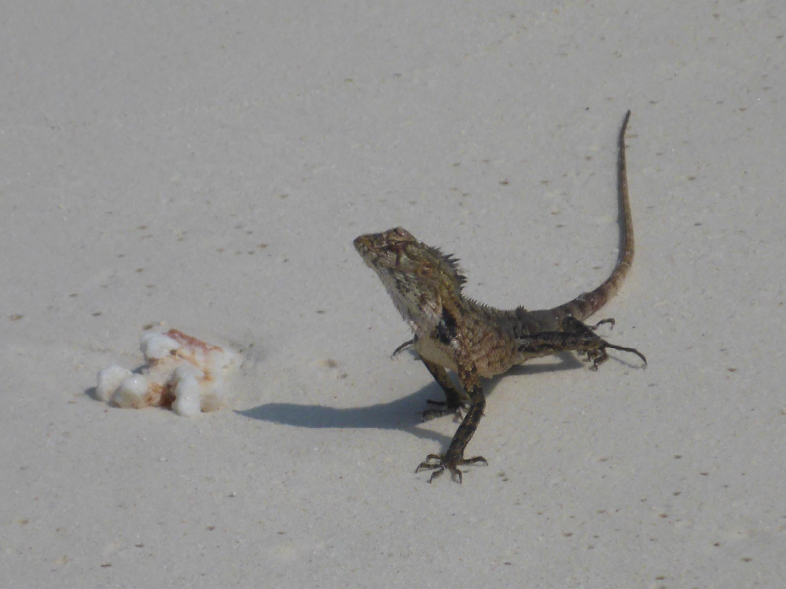
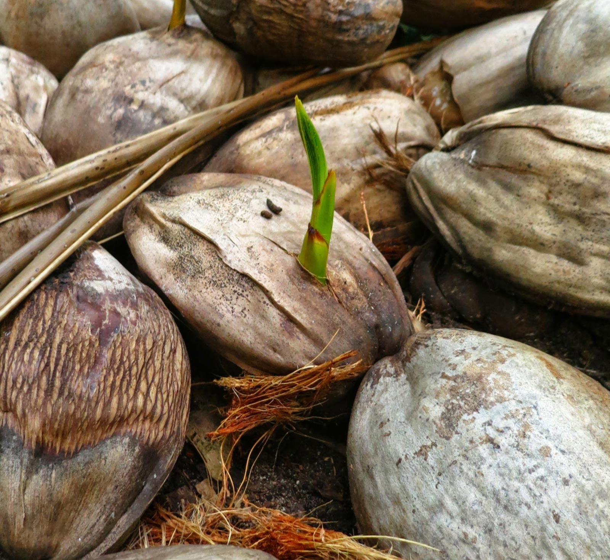
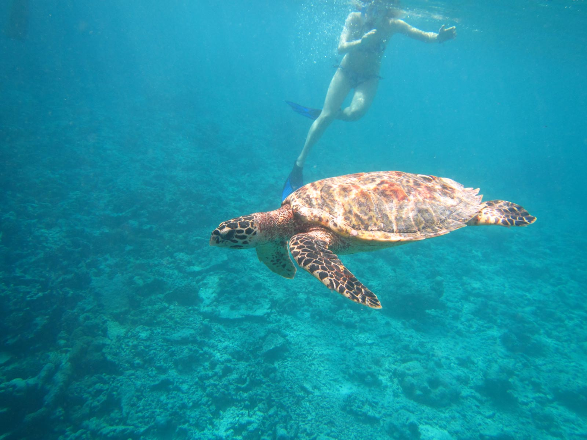
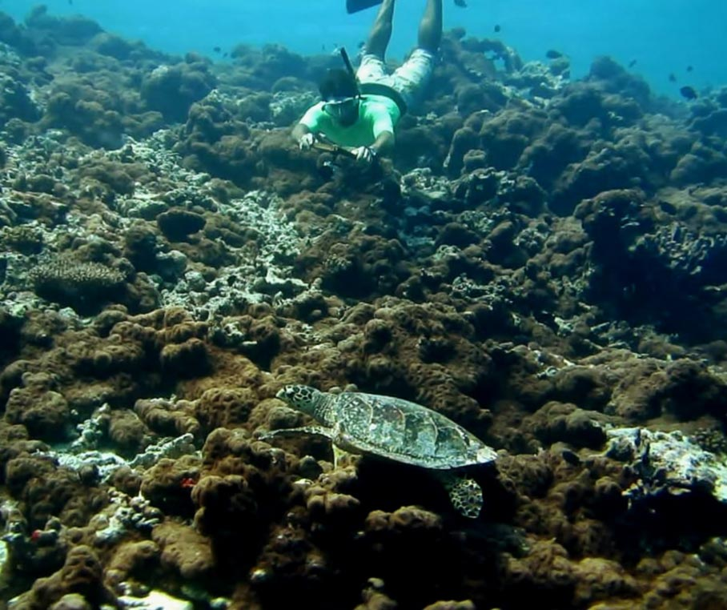
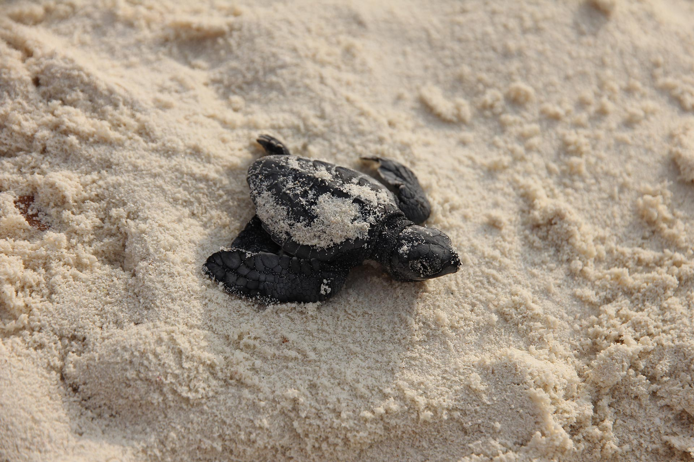
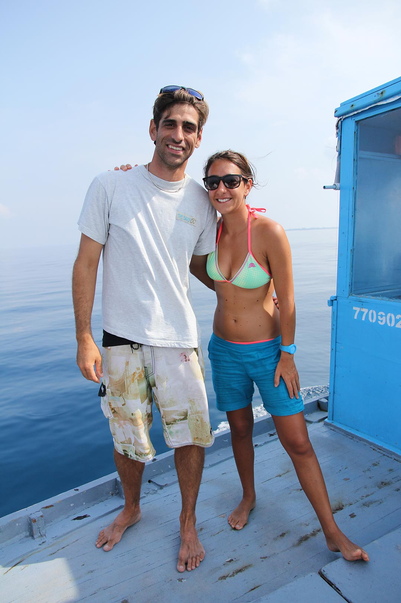

Alzi la mano chi non ha mai pronunciato la frase: *"Basta! Mollo tutto e me ne vado su un'isola deserta"*.

Non so voi, ma io l'avrò detto miliardi di volte. Qualcuno pensa che non resisterei nemmeno un'ora, sull'isoletta con la palma, ma io non ne sarei tanto convinta.

Preparatevi, sto per proporvi il classicone di sempre: *quali oggetti portereste con voi se doveste partire alla volta di un'isola deserta?*

Dunque, vediamo... io porterei con me una valigia colma di libri. Credetemi, ci sono casi in cui questa scelta può davvero salvarvi la vita! E, se non ci credete, ve lo dimostro subito.

Poco più di un anno fa, io, mio fratello e mio padre decidemmo di trascorrere insieme qualche giorno di relax in Thailandia. C'è da dire che, quando decisi di accettare la loro proposta, non avevo la minima idea che a quei due piacesse restarsene spiaggiati sul lettino per tutto il giorno a sorseggiare *coconuts*, ovvero il latte delle noci di cocco.

Ogni giorno era identico a quello precedente: guardavo il mare e poi guardavo mio padre e mio fratello intenti ad acquistare cononuts e a spalmarsi la crema solare. E quando osservavo gli altri turisti per cercare un po' di solidarietà e di conforto, scoprivo che stavano facendo esattamente la stessa cosa: guardavano il mare, compravano coconuts e si spalmavano la crema solare. Inquietante.

*"Povero Darwin..."* pensai. *"Tutta questa evoluzione gettata in pasto ai lupi!"*.

E così, presa dallo scoramento (ma soprattutto dalla noia), ringraziai il Padreterno per aver avuto l'accortezza di infilare in valigia l'opera completa di Flaubert. Sì, avete capito bene: l'opera omnia del buon Gustave era stipata nella mia valigia.

Fortuna che esiste la cultura (e fortuna che riesce a stare dentro al bagaglio in stiva!).

Ma torniamo a noi. C'è chi, come me, partirebbe per l'*Isola che non c'è* armata di libri e chi, invece, è partito per davvero alla volta di un'isola (non deserta) mettendo in valigia gli strumenti necessari per la ricerca scientifica.

L'intervistato di questa settimana si chiama Flavio Sacco ed è un biologo marino che ha deciso di trasferirsi alle Maldive per sviluppare [The Barefoot Conservation Center](http://www.thebarefoot.com/portfolio-normal-layout/maldives-conservation-center/), un Centro di monitoraggio, di conservazione e di educazione ambientale situato all'interno della struttura turistica [The Barefoot Eco Hotel](http://www.thebarefoot.com), sull'isola di Hanimaadhoo.

Ok, qualunque cosa stiate facendo in questo momento, fatemi una cortesia: per un istante abbandonate tutto, sedetevi e spegnete i cellulari. State per leggere una storia meravigliosa...

***Ciao Flavio! Raccontami, come ti sei appassionato alla biologia marina? Che percorso hai fatto finora?***

"Ciao Anna! Non so, di preciso, quando sia iniziata la mia passione per la biologia marina.

La passione per il mare l'ho eriditata dai miei genitori: ho foto che mi ritraggono in mare già all'età di 4-5 anni, con maschera e pinne. In qualche modo, credo di non aver avuto scelta! Il mare ha fatto parte della mia vita fin dall'inizio, non mi interessava nient'altro.

A scuola, soprattutto durante gli anni delle medie, cominciai a capire come poter lavorare insieme al mare, immaginando di diventare una specie di "guardia marina", cioe' un ranger che monitorasse e proteggesse un particolare tratto di mare e di costa.

Poi, con il tempo, compresi sempre meglio la figura del biologo marino e decisi che avrei fatto quello, come mestiere. Ben prima di iscrivermi alle scuole superiori avevo già chiaro il mio percorso universitario.

Quando si trattò di mettere in pratica gli intenti, mi iscrissi a Scienze Biologiche presso l'[Università di Bologna](http://www.unibo.it/it) per poi specializzarmi in Biologia Marina dopo essermi trasferito all'[Università di Cagliari](http://www.unica.it), città in cui potevo vivere a contatto con un mare stupendo per tutto l'anno.

Dopo la laurea, il Dipartimento in cui avevo sviluppato il progetto di tesi mi chiese di rimanere, così ebbi l'opportunità di intraprendere un percorso lavorativo nell'ambito della ricerca scientifica.

Posso dire di aver affrontato tutti i passaggi di rito: Dottorato di Ricerca in Biodiversità ed Evoluzione, borse di ricerca, contratti come collaboratore di ricerca, ecc., fino a far parte di un team di consulenti selezionati dalla [GFCM](http://www.gfcm.org/gfcm/en) (l'organismo della [FAO](http://www.fao.org/home/en/) che si occupa di pesca nel Mediterraneo) per sviluppare un piano gestionale per la raccolta del corallo rosso da applicare in tutto il Mediterraneo.

Se quello, finora, è stato forse il risultato di maggiore importanza nella mia carriera, devo ringraziare soprattutto due persone-guida del mio percorso lavorativo all'università, la Dott.ssa Rita Cannas e il Prof. Angelo Cau: mi hanno dato sì gli strumenti per imparare a fare ricerca, ma ,soprattutto, mi hanno permesso di sviluppare gli strumenti per andare avanti e per raggiungere gli obiettivi.

Se oggi ho costruito qualcosa in maniera indipendente, lo devo al fatto che loro mi hanno fatto crescere molto durante gli 8 anni trascorsi presso l'Università di Cagliari, proteggendomi quando non ero pronto e facendomi sbattere il muso quando era ora di darsi una svegliata".

***Spiegami meglio: quando e come sei finito alle Maldive? Di cosa ti occupi esattamente?***

"Due anni fa scrissi un progetto per sviluppare un centro di monitoraggio, conservazione ed educazione ambientale all'interno di una struttura turistica. Era un progetto scritto nel tempo libero e basato sulla mia esperienza universitaria.

Ogni anno occorreva trovare fondi per fare raccolta-dati relativamente ad un determinato progetto e, solitamente, tutto si risolveva nell'arco di un mese. I dati raccolti in quel mese erano rappresentativi per tutto l'anno poiché non sempre erano disponibili soldi a sufficienza per fare un monitoraggio continuo e costante.

Per vedere eventuali cambiamenti, in molti ambiti, era necessario ricevere nuovi fondi l'anno successivo.

Le strutture turistiche come i *resort* o i *diving*, invece, vanno a mare ogni singolo giorno e tutte le spese sono pagate dai clienti. Ho visto la potenzialità di sfruttare questo meccanismo e l'ho messo nero su bianco. Di progetti simili ne esistono diversi e io ho scritto il mio adattandolo ad un certo tipo di struttura turistica e ad un certo contesto.

Poi, un giorno, un imprenditore svizzero di nome Christophe Groh mi ha contattato per ricevere qualche informazione a tal proposito. Aveva sentito parlare del mio progetto da una biologa marina particolarmente ispirata e devota alla causa ambientale delle Maldive, la Dott.ssa Enrica Burioli.

Christophe era interessato a sviluppare il centro in una nuova struttura che avrebbe costruito alle Maldive, un Eco Hotel. I due progetti si sposavano perfettamente e così, dopo un paio di incontri a Milano e dopo aver discusso i particolari, il 10 ottobre 2014 ho dato il via a questo progetto sperimentale: sviluppare un Centro di Conservazione all'interno di un Eco Hotel alle Maldive usando i servizi offerti agli ospiti per fare monitoraggio e per sviluppare consapevolezza ambientale nei partecipanti.

Nello specifico, ci occupiamo di:

* organizzare le escursioni in snorkelling per i turisti. Durante ogni uscita, raccogliamo dati sulla presenza di specie di interesse come, ad esempio, tartarughe e cetacei. In questo modo, i turisti vengono guidati seguendo un *codice di condotta sostenibile in acqua* (non toccare gli animali, non rompere i coralli, ecc.) e si sentono parte di qualcosa di importante che non è solo una semplice uscita snorkelling, ma anche un'attività per preservare l'ambiente marino. Dai dati raccolti possiamo portare avanti veri e propri programmi di monitoraggio e di conservazione ambientale, con una quantità di dati da far invidia a molti istituti di ricerca! Infatti, per il futuro, stiamo già mettendo le basi per collaborare con diversi gruppi che si occupano di progetti simili, compresi gli enti governativi delle Maldive, per condividere i dati e per rafforzare il nostro lavoro ad una scala più ampia;
* organizziamo gite a terra per scoprire il villaggio locale (Hanimaadhoo, l'isola dove ci troviamo, è un'isola abitata ed è la seconda isola più grande delle Maldive) e la cultura locale: gli abitanti locali sono molto ospitali e si stanno mostrando uno dei punti forti del progetto. Chi viene da noi non passa una vacanza su un'isola finta, dove tutto è stereotipato. Qui si ha l'occasione di scoprire le vere Maldive. Inoltre, essendo un'isola fuori dalle solite rotte turistiche, presenta una natura davvero ben preservata;
* lavoriamo per trovare soluzioni sostenibili per ogni aspetto dell'Eco Hotel, dalla gestione della spazzatura (un grande problema delle Maldive) all'eliminazione delle bottiglie d'acqua di plastica. Siamo aperti da soli 5 mesi ma abbiamo già introdotto diverse misure per limitare il nostro impatto sull'ambiente. E ne abbiamo tante altre in implementazione;
* promuoviamo azioni per coinvolgere la comunità locale in progetti di educazione ambientale. Nel futuro prossimo inizieremo un progetto di sensibilizzazione sulla raccolta differenziata.

In parole molto povere, cerchiamo di abbracciare *in toto* i principi dell'ecoturismo: conservazione, sostenibilità e coinvolgimento della comunità locale, sia dal punto di vista economico che culturale".

***Qual è l'aspetto peculiare del tuo progetto e perché è nato?***

"L'aspetto peculiare del progetto è quello di applicare l'approccio usato nella ricerca scientifica in un contesto divulgativo. Questa è davvero l'enorme forza del progetto.

Lavorare in ambito accademico richiede serietà e grande impegno. Quando si afferma qualcosa in ambito scientifico bisogna supportarlo con i numeri, non si possono fare proclami senza dire da dove provengano tali affermazioni.

È altresì vero che il mondo scientifico non è ancora abbastanza aperto al grande pubblico ed è troppo autoreferenziale.

Questa è l'idea principale dalla quale nasce questo progetto: cercare il modo di applicare il metodo scientifico in un contesto più vicino alla gente comune come, appunto, quello turistico.

Ciò che facciamo lo raccontiamo ogni giorno alle persone ospitate nella struttura. Immagina se i centri di ricerca fossero quotidianamente frequentati dalle persone comuni, sarebbe un volano enorme per migliorare la società sotto tutti i punti di vista!

Le università, oggi, fanno molto per diffondere i risultati dei progetti di ricerca, ma rimangono comunque iniziative isolate.

Nella mia esperienza, troppo poco di quello che si fa in ambito scientifico viene diffuso al grande pubblico. Probabilmente è proprio per questo motivo che stanno nascendo sempre più progetti *citizen-based,* e credo che anche il nostro si possa definire così, decidendo di portare direttamente la ricerca in un contesto "comune" e facendovi partecipare i cittadini che, nel nostro caso, sono gli ospiti della struttura".

***Qual è il grado di sensibilizzazione e di coinvolgimento nei confronti dell'attività che svolgi?***

"Devo dire che, da questo punto di vista, siamo molto fortunati: il grado di coinvolgimento e di sensibilizzazione è altissimo!

Sicuramente chi sceglie di venire in un Eco Hotel con tutte le premesse del caso è già predisposto a partecipare ed è interessato a scoprire cosa facciamo di concreto per essere *eco*.

Tanti partecipano alle attività in mare con un'attenzione ed un riguardo verso l'ambiente fuori dal comune. Moltissimi, qui, sviluppano domande e curiosità sull'ambiente rendendosi più consapevoli e questo, da solo, basta per vedere un cambiamento nell'atteggiamento verso l'ambiente da quando arrivano a quando ripartono.

Constatare tale cambiamento nelle persone ha un effetto concretamente positivo sull'ambiente che, spesso, è più efficace di mesi di ricerca.

Non insisterò mai abbastanza: oggi la ricerca e la divulgazione al grande pubblico devono essere sempre più le due faccia della stessa medaglia. Bisogna raccontare alla gente comune quello che i ricercatori fanno, tutto!

La gente, oggi, è sensibile e vuole sapere, ma, troppo spesso, si trova ad ascoltare chi fa solo proclami senza aver mai davvero studiato a fondo gli argomenti (e nulla ha a che spartire con il mondo scientifico), perchè non non ha l'occasione di entrare in contatto con i ricercatori ma, magari, solo con persone che, in quel preciso istante, cavalcano qualche onda. Per come è cambiato il mondo, oggi bisognerebbe proporre corsi di comunicazione e PR anche ai ricercatori!

I nostri ospiti, spesso e volentieri, vogliono essere istruiti su come comportarsi su certi aspetti e il nostro lavoro, come Eco Hotel e Centro di Conservazione, in gran parte, è proprio questo".

***Come siete stati accolti dalla popolazione locale?***

"Devo dire molto meglio del previsto. Sapevamo che Hanimaadhoo ha una popolazione felice e aperta, ma non credevamo sarebbero stati tanto entusiasti dell'apertura dell'Hotel.

Malgrado quello che si possa pensare, le Maldive non sono un paese povero in cui manca il lavoro, quindi non sempre una struttura turistica è accettata solo perchè "porta lavoro".

Inoltre, nel nostro caso, il progetto aveva senso se sviluppato su un'isola abitata e con un villaggio locale, mentre la maggior parte delle volte, se non sempre, i resort nascono su isole private (deserte).

Noi volevamo fare un progetto di ecoturismo sotto tutti gli aspetti, compreso il coinvolgimento della popolazione locale, che non significa solo offrire un lavoro, ma coinvolgerli, ad esempio, in una gestione più consapevole dei rifiuti sull'isola (come abbiamo iniziato a fare); far conoscere ai turisti la cultura locale mettendo a disposizione biciclette gratuitamente agli ospiti per visitare il villaggio locale e organizzando visite guidate al villaggio, inclusa una sosta presso una famiglia locale; collaborare con la scuola locale per sviluppare percorsi di educazione ambientale per gli studenti e altri progetti ancora in via di sviluppo. D'altra parte, siamo aperti da appena 5 mesi.

Fino a prova contraria, non esiste un'altra struttura come la nostra, a livello di servizi, situata su un'isola abitata che stia portando avanti un progetto di ecoturismo in collaborazione con la popolazione che vive sulla stessa isola.

Ci sono altri progetti di tutela ambientale e di resort che collaborano con popolazioni locali, ma, quasi sempre, si tratta di popolazioni di isole vicine, perché parliamo sempre di isole resort private.

In quella situazione rimane comunque un muro fra i maldiviani e i turisti, i quali al massimo possono fare una visita guidata all'isola locale vicina per poche ore".

***Ricevete contributi da enti o università?***

"L'intero progetto è totalmente supportato dalla struttura stessa, tutto è autofinanziato.

Questa è una bellissima dimostrazione di come si possa fare conservazione, ricerca ed educazione ambientale riuscendo a coniugare un'attività commerciale con qualcosa che, di commerciale, non avrebbe nulla.

La proprietà ha deciso di intraprendere questa strada fin da subito, capendo che i soldi investiti nel progetto non sono solo un dovere morale verso l'ambiente ma, al tempo stesso, esiste un vero e proprio ritorno economico attraendo settori di mercato che cercano questo tipo di struttura per le loro vacanze e che sono in continua crescita.

Come si dice in inglese, è un *win-win*. La forza di chi ha voluto intraprendere questa strada imprenditoriale è stata quella di capire che, conservando l'ecosistema, avrebbe preservato il suo investimento, oltre ad avere una particolare sensibilità per l'ambiente che lo ha spinto a promuovere un qualcosa di diverso.
Per il futuro abbiamo già messo in cantiere diverse collaborazioni con enti di conservazione della natura, sia privati che pubblici, e speriamo di far crescere sempre di più il progetto per dare anche indicazioni utili a chi volesse seguire la stessa strada".

***Cosa ti auguri per il futuro?***

"Che, nel giro di 10 anni al massimo, andare in una struttura Eco alle Maldive sia la normalità. Che chi deciderà di non intraprendere tale strada venga tagliato fuori dal mercato turistico e non più scelto dai turisti (si tratta di un'affermazione forte, ma è quello di cui abbiamo bisogno per il futuro se vogliano che sia un'economia sostenibile.Non si tratta di una scelta commerciale: oggi è una necessità che si trova al di sopra dell'economia).

Ovviamente, mi auguro che ci siano sempre più progetti ambientali *citizen-based*, ma credo di averlo già sottolineato troppe volte!

Ci tengo tanto a dire un'ultima cosa: il progetto non è solamente mio, ma di tante persone che gli hanno dedicato tutte le loro energie fin dall'inizio, a partire dalla biologa marina, la Dott.ssa Tiziana Saba, colei che maggiormente mi ha aiutato nella realizzazione di questo progetto fin dai primi momenti dello sviluppo, e poi la direttrice dell'Eco Hotel, Domitilla Sciullo, che cito in rappresentanza di tutto lo staff dell'albergo e che ha sempre supportato il progetto".

