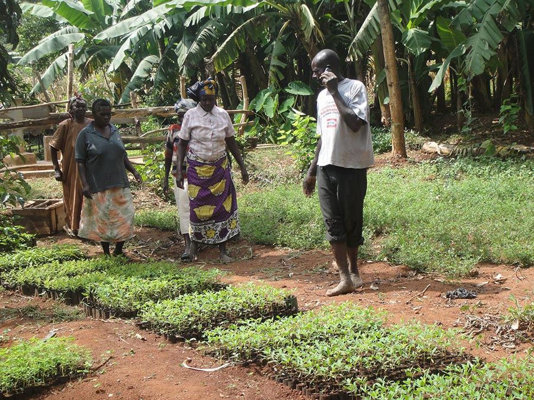
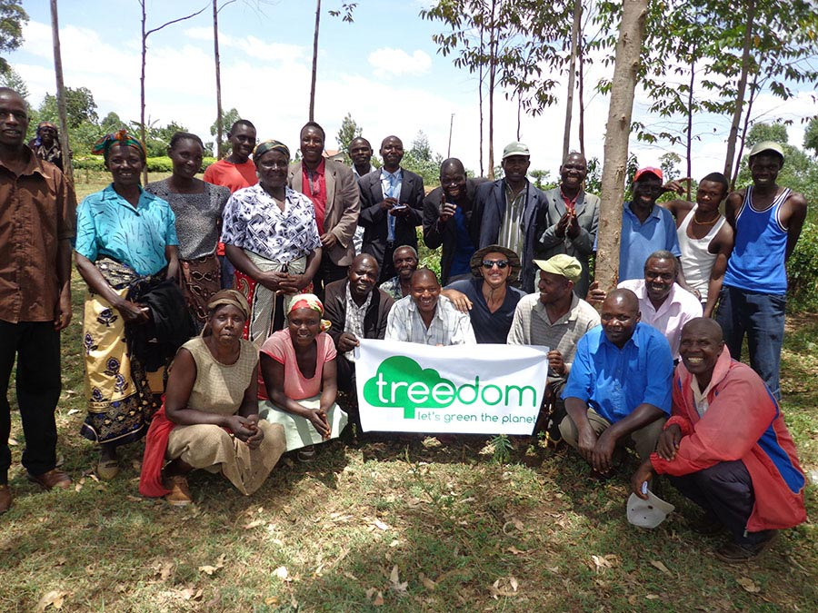
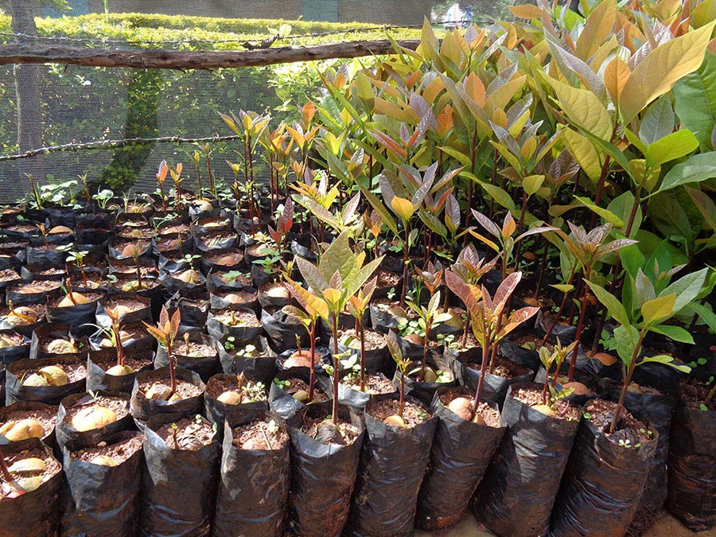
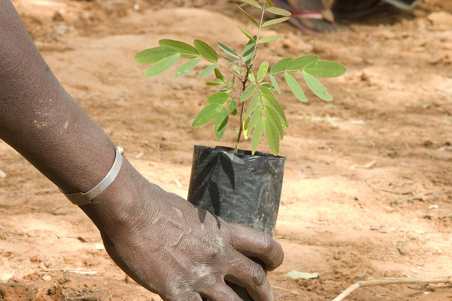

Suvvia, ammettiamolo: a chi non piacciono i regali?

Chi non vorrebbe rientrare a casa e trovare qualcosa di impacchettato, meglio ancora se inaspettato?

Ho pensato di introdurre l'articolo di questa settimana raccontarvi un aneddoto legato alla mia infanzia e, più precisamente, ai tempi delle vacanze natalizie, quando Babbo Natale era una fede incrollabile e inconfutabile...

Dovete sapere che ho creduto a Babbo Natale fin quasi al termine delle scuole elementari, quindi per lungo tempo. Ero certissima della sua esistenza, non c'era verso di convincermi del contrario e provavo sempre una discreta gelosia al pensiero che ogni 24 dicembre si spaccasse la schiena per consegnare regali ai bambini di tutto il mondo.

Pensavo che sarebbe stato molto più semplice (e conveniente) se, anziché volare in lungo e in largo da un capo all'altro del pianeta, avesse depositato tutti i regali direttamente a casa mia. Io, di certo, avrei apprezzato...

Ma torniamo alle vacanze di Natale.

Ogni sacrosanto 23 dicembre, fra le 14:00 e le 15:00, restavo inchiodata davanti al telefono di casa in attesa di udirlo squillare: dall'altra parte del ricevitore c'era mio fratello che, dopo la scuola, si fermava in una cabina telefonica e, simulando la voce di Babbo Natale (quella in stile "*Oh oh oh!*", per capirci), mi domandava se avessi fatto la brava, che cosa volessi per regalo e, mi raccomando, "*Dai tanti baci a tuo fratello!*". Mica scemo!

Ovviamente non avevo la minima idea che si trattasse della sua voce, anche se, ripensandoci, rimanevo sempre un po' sorpresa da quel caos di scooter e di macchine che si percepiva in sottofondo (pensavo: "*Certo che c'è un bel traffico anche in Lapponia... ma non dovevano esserci le renne?*").

Altro che Lapponia, il sottofondo che si percepiva non era altro che il traffico del centro storico ravennate!

Beata innocenza.

Ma torniamo a noi e all'argomento di questa settimana...

*Prima domanda*: quando volete (o dovete) fare un regalo, su cosa basate i vostri acquisti? Sull'estetica o sull'utilità?

*Seconda domanda*: avete mai regalato qualcosa che facesse bene anche al pianeta?

*Terza domanda*: avete mai pensato di regalare un albero?

Se quest'ultima idea vi stuzzica quanto ha stuzzicato me, allora non perdiamo nemmeno un minuto: conosciamo subito Giacomo Sebregondi, communication manager del progetto [Treedom](http://www.treedom.net/it/tropicalpizza), una piattaforma web tutta italiana dedicata alla riforestazione del pianeta.

Tre, due, uno... *let's green the planet!*

### Ciao Giacomo! Quando e dove nasce Treedom?

> Ciao Anna! Treedom, un progetto nato a Firenze nel 2010 da un'idea di Tommaso Speroni e di Federico Garcea, ha un obiettivo molto preciso: sfruttare il coinvolgimento che la rete può offrire per creare qualcosa che piaccia alle persone ma che, al tempo stesso, abbia un impatto positivo sul pianeta.
> 
> Ispirati da Farmville, Tommaso e Federico hanno realizzato una piattaforma che facesse sì che piantare alberi veri fosse meglio che piantarne di virtuali.

### Che cos'è Treedom? Quali obiettivi si pone?

> Treedom è una piattaforma web che fa da copertina ad un [gruppo di giovani](http://www.treedom.net/it/page/about_us) con caratteristiche e skills diverse che promuovono progetti di riforestazione in giro per il mondo incaricandosi di portarli a termine attraverso il finanziamento di privati e di aziende.
> 
> L'obiettivo di Treedom è, appunto, quello di rendere la piantumazione di un albero (presenza data spesso troppo per scontata!) un percorso bello e fattibile per tutti.

### È un progetto importato dall'estero?

> No, anzi, lo abbiamo esportato: abbiamo sede anche a Santa Monica, in California.

### Cosa si deve fare per adottare o regalare un albero?

> È semplicissimo: basta andare su [treedom.net](http://www.treedom.net/it/tropicalpizza) e scegliere tra una delle specie disponibili. In men che non si dica, l'albero sarà vostro ed, eventualmente, potete decidere se regalarlo a qualcuno (via email, via Facebook o trascrivendo il codice su un biglietto regalo).

### Posso adottare e/o regalare alberi in tutto il mondo?

> I progetti attualmente in corso sono otto, dall'Italia all'Africa fino ad Haiti, ma stiamo cercando altre realtà in cui importare il nostro sistema.

### Come monitoro la crescita e lo stato di salute dell'albero?

> È semplicissimo: ogni albero ha una pagina dedicata e ciò è possibile perché, ad ogni piantumazione, raccogliamo materiale fotografico, coordinate e diamo un codice unico all'operazione.
> 
> Chiunque pianti un albero, o chiunque lo riceva in regalo, può "seguire" l'albero registrandosi sul sito.

### Ho letto che le aziende possono affidarsi a Treedom: quali soluzioni proponete per rendere il mondo del business più eco-friendly?

> Treedom offre molte soluzioni per le aziende, dal calcolo dell'impronta di carbonio alla compensazione dei propri prodotti, tramite, appunto, la piantumazione di alberi.
> 
> Tra le attività di maggiore risalto c'è sicuramente la comunicazione: molte aziende scelgono di usare Treedom per parlare ai loro clienti e fare, al tempo stesso, qualcosa che abbia un impatto positivo sull'ambiente.
> 
> Gli alberi regalati dalle aziende, infatti, veicoleranno per sempre il messaggio dell'impegno preso.

### Sogni nel cassetto? Progetti futuri?

> A dire il vero, abbiamo appena realizzato un sogno nel cassetto: volevamo fare qualcosa che avesse un maggiore riscontro sull'Italia e abbiamo dato vita a [PlanBee.bz](http://www.planbee.bz/it/). Vi invito a scoprire di cosa si tratta...

*Vuoi conoscere altri interessanti progetti di ricerca su MyHumus? Non perdere [Delfini Bizantini](https://myhumus.com/delfini-tutela/) e [The Barefoot Conservation Cente](https://myhumus.com/natura/)r!*
