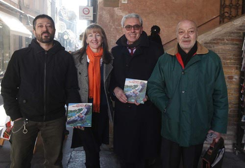

La pigna.

Che cosa rappresenta? Ci avete mai pensato?

Ok, d'accordo: cominciamo subito a snocciolare i termini complicati.

Scientificamente, le pigne sono i fiori delle conifere. Cita lo Strasburger: *"Le infiorescenze strobiliformi maschili sono solitarie o in aggregati lassi. Sui loro assi fiorali si addensano a aspirale numerosi stami dorsoventrali con sacche polliniche sulla pagina inferiore; al contrario, i fiori femminili sono ridotti e formano infiorescenze ricche e per lo più strobiliformi comprendenti numerose squame copritrici disposte a spirale, a verticillo oppure opposte nelle cui ascelle si trovano le squame ovulifere con gli ovuli"*.

Tutto chiaro, vero? Ci siete fino a qui?

Bene, sappiate che questa è la risposta del botanico.

Tuttavia, esiste un'altra interpretazione della pigna: quella offerta dalla guida di storia dell'arte.

Fin dai tempi dei romani, infatti, la pigna è associata alla rinascita, all'immortalità e alla fertilità, complice anche la sua forma molto simile a quella di un uovo. In giro per Ravenna se ne incontrano tante, ce ne sono anche nella stessa Piazza del Popolo e in corrispondenza della tomba di Dante.

Effettivamente, se ci si sofferma a pensare, la pigna, per quanto esternamente risulti secca, in realtà al suo interno racchiude la vita: i famosi pinoli.

Insomma, la pigna come simbolo di continuità. Bello. Mi piace.

E qualcuno, a Ravenna, l'ha resa protagonista di una serie di libri che racconta ai bambini e ai ragazzi la storia della città attraverso il linguaggio delle parole e delle illustrazioni.

Forse qualcuno di voi l'avrà già intuito: la protagonista di questa nuova intervista è Silvia Togni, presidente del Sindacato Guide Turistiche Confcommercio Ravenna.

In collaborazione con l'illustratore, graphic designer e naturalista Enrico Rambaldi, Silvia ha scritto due piccole guide di Ravenna, entrambe pubblicate dalla [Casa Editrice Longo](http://www.longo-editore.it).

Da sinistra: Enrico Rambaldi, Silvia Togni, Sauro Mattarelli (Fondazione del Monte di Bologna e Ravenna) ed Alfio Longo, l'editore (Ph. Giampiero Corelli).

Nella prima, "Una Pigna per Ravenna", Silvia veste i panni di una pigna travestita da Sherlock Holmes che diventa cicerone all'interno delle mura cittadine per raccontarne la storia attraverso i simbolismi nascosti; nel secondo libricino-guida, "A Ravenna una Pigna tira l'altra", la nostra pigna-cicerone ci conduce per mano all'interno del patrimonio naturale ravennate.

Ai fini della pubblicazione e della distribuzione di queste due guide all'interno delle scuole, Silvia ha potuto contare sui finanziamenti offerti dalla [Fondazione del Monte di Bologna e Ravenna](http://www.fondazionedelmonte.it). E' bene ricordare che, da tutto ciò, Silvia non percepisce alcun ricavo economico.

Come dicevo prima, "A Ravenna una Pigna tira l'altra" è un viaggio all'interno del nostro patrimonio naturale.

Ciò che mi ha colpita di più, oltre alle fantastiche illustrazioni di Rambaldi, sono le curiosità che trapelano dalla sua lettura.

Ad esempio, leggendo il capitolo dedicato alle valli ho scoperto da dove deriva il termine "piallassa": *pija* e *lassa*, ovvero due verbi veneti che rimandano al movimento delle maree - l'acqua che viene dapprima 'presa' e poi 'rilasciata'. Non so voi, ma io non lo sapevo.

Nel capitolo in cui si parla delle saline, invece, ho scoperto che il termine "salario" deriva dal sale, antica moneta con cui, anticamente, venivano pagati i soldati romani (il sale è sempre stato un ottimo conservante per i cibi).

"A Ravenna una Pigna tira l'altra" è un libricino capace di stupirti all'improvviso.

Lo dimostra il fatto che, un momento prima, ti parla di piante, di bacche e di funghi... e quello subito dopo ti spiega che, giustamente, i funghi non sono né animali, né vegetali, ma esseri viventi appartenenti al regno dei Miceti.

E da qui è un attimo leggere a proposito dell'eroe greco Perseo che, in seguito ad un lungo viaggio, sfinito e assetato, si salvò la pelle bevendo l'acqua contenuta all'interno del cappello di un fungo per poi fondare, proprio in quel luogo e in virtù di quell'episodio, la città di Micene (non per niente, in greco, *mýkes* significa 'fungo').

Insomma, vedete quante cose si possono scoprire leggendo un libro su Ravenna? Chi l'avrebbe mai detto!

Ovviamente, non potevo farmi scappare un'intervista a Silvia, penserete voi. Avete ragione, vi rispondo io.

### Ciao Silvia! Che piacere ospitarti in MyHumus. Dunque, cominciamo a raccontare la tua storia partendo dagli esordi: perché sei diventata una guida turistica?

> Ciao Anna! L'idea di fare la guida turistica nasce alla scuola elementare, quando una maestra lungimirante mi fa conoscere la storia della mia città e del suo territorio, così io comincio a "prendere in ostaggio" amici e parenti e a trascinarli per chiese e mosaici.
> 
> Ma la conoscenza delle bellezze artistiche di Ravenna nasce molto prima, quando sono piccola e mia madre ha bisogno di trovare un posto tranquillo per lasciarmi libera di correre e di giocare.
> 
> All'epoca (e non sto parlando di cent'anni fa, per fortuna!) ancora non esistevano ZTL, piste ciclabili e parchi giochi per bambini. Così, inconsapevolmente, i polli sultani di Sant'Apollinare Nuovo e le colombine del Mausoleo di Galla Placidia sono diventati i miei primi compagni di giochi.

### Che cosa ami di più della storia di Ravenna?

> Ravenna è una città antichissima, le sue origini si perdono nella notte dei tempi, per questo è piena di misteri che forse non saranno mai svelati e che la rendono ancora più affascinante (da anni, in occasione della Notte d'Oro, faccio le cosiddette "Passeggiate del Mistero").
> 
> Il suo "isolamento cosmico" le è valso, nei secoli, miseria e fortuna, ma anche delle peculiarità che la rendono unica al mondo: basti pensare al patrimonio musivo dei secc. V e VI, il più vasto e meglio conservato a livello mondiale.
> 
> Ma la cosa che più m'intriga della storia di Ravenna è che va sempre controcorrente: diventa capitale di un impero quando tutta Europa è allo sfacelo, è sofferente quando le meraviglie del Rinascimento impazzano ovunque... è una 'città-pigna', come mi piace definirla, cioè chiusa, dura, severa. Tuttavia, al suo interno, coltiva sempre la vita e la voglia di rinascere, proprio come la pigna fa con i suoi pinoli.

### Ora una domanda legata alle vie del centro storico di Ravenna: da quali "celebrità" del remoto passato sono state percorse e quali avvenimenti degni di nota hanno ospitato?

> Su questa domanda potrei scrivere un libro intero o, in alternativa, parlare per qualche decina di ore, ma annoierei te e i lettori di questo blog.
> 
> Allora faccio prima a rimandarvi ai miei due libricini, in cui ho citato anche personaggi legati a Ravenna, quasi ignoti e spesso ignorati dai classici libri di storia; sì perché a me, da sempre, piace la storia non convenzionale, quella dei barbari illuminati come Teodorico e Drogdone, quella delle donne pittrici come Barbara Longhi e quella degli arcivescovi dalle larghe vedute come Rinaldo da Concorezzo, amico di Dante. Anch'io, come la mia città, vado sempre controcorrente.
> 
> Ci vuole coraggio, come ne ha avuto Ravenna, a resistere, per secoli, incastrata tra la terra e il mare, in balia delle acque e della subsidenza, ma alla fine il risultato ci guadagna in qualità.

### Com'è nata l'idea di scrivere queste due guide illustrate e per quale motivo ti sei identificata in una pigna?

> La Pigna è un simbolo antichissimo: si trova a quasi tutte le latitudini del globo e, ovunque, simboleggia la rinascita dopo la morte. Una sorta di fenice, insomma.
> 
> Ravenna non fa eccezione e, solo in Piazza del Popolo, se ne possono trovare una quarantina... e non stiamo parlando di pigne "viventi", frutto dei numerosi pini domestici che abbelliscono i dintorni della nostra città, bensì di elementi architettonici altrettanto piacevoli alla vista.
> 
> L'idea che la Pigna, che compare in gran numero anche sul nostro stemma cittadino, fosse la protagonista dei miei tour e, di conseguenza, dei miei libri, mi è balenata in testa quando svolgevo a tempo pieno l'attività di guida turistica: volevo che Ravenna venisse vista non solo come una triste città piena di chiese e di tombe, ma anche come un luogo pieno di vita.
> 
> Così, la Pigna è corsa in mio aiuto e, da allora, siamo entrate in simbiosi.
> 
> Enrico Rambaldi, con le sue illustrazioni decisamente più efficaci di semplici e comuni fotografie, ha fatto il resto, dando vita ad una serie di pinoli curiosi che, come turisti al seguito della loro guida, vanno a caccia di novità gustose, in città e non solo.

### Quale feedback hai avuto dal popolo dei ragazzi? E da quello degli adulti?

> I bambini sono sempre stati le mie "cavie" preferite nello sperimentare nuovi itinerari e nuove tematiche di visita, ma in senso assolutamente positivo!
> 
> Questo perché non hanno preconcetti, sono spontanei e si prestano al gioco. Oltretutto, in pochi sanno che ciò che piace ai bambini piace sicuramente anche agli adulti, mentre non è sempre vero il contrario, anzi, lo è molto raramente.
> 
> Infatti, la caccia alla pigna per le strade di Ravenna, "sdoganata" svariate volte con studenti delle scuole e bambini dai 5 ai 12 anni, è stata successivamente adattata ad un pubblico adulto con ottimi risultati. Tra i lettori dei miei libri ci sono, oltre ai più piccoli, anche tanti adulti e, con piacere, ho saputo che anche molti stranieri hanno scoperto le avventure della Pigna, trovando finalmente una lettura semplice e accessibile.

### Chi desideri ringraziare, in modo particolare?

> A parte te, che mi onori di questa intervista, ringrazio in modo particolare Ravenna e la Romagna, una terra bellissima che resta la mia massima fonte di ispirazione, nonostante i miei numerosi viaggi-avventura per tutto il globo.
> 
> Per esempio, prima di un'interrogazione, di una prova importante o nei momenti più difficili il miglior modo che ho di combattere lo stress è sempre stata e resta tuttora una lunga pedalata in valle, ad osservare il volo di un airone cinerino o una nidiata di folaghe, oppure in pineta perché, contrariamente a quel che tutti pensano, le pigne hanno molto da dire.
> 
> E se pensate che non sia vero, leggete i miei libricini e vi ricrederete.

### Cosa riserva il 2014?

> Il 2014, certamente, riserva nuove idee, nuovi racconti e nuove passeggiate da sviluppare a Ravenna e dintorni, a caccia di nuove cose da scoprire e da valorizzare.
> 
> Ma, assolutamente, vedrà il completamento (ma probabilmente non la pubblicazione, causa mancanza di fondi) della "Trilogia della Pigna": una terza, fantasmagorica avventura della Pigna per Ravenna è già in cantiere e pronta a svelare qualche mistero in più di questa enigmatica città e dei personaggi che vi hanno abitato. Ormai ci sono affezionata al mio personaggio, al punto che la gente comincia a mandarmi foto di pigne da tutto il mondo.
> 
> Alcuni mi chiamano proprio 'Pigna' quando mi incontrano per strada...segno che la Pigna sta facendo scuola e che sta aumentando il numero dei suoi ammiratori!.

