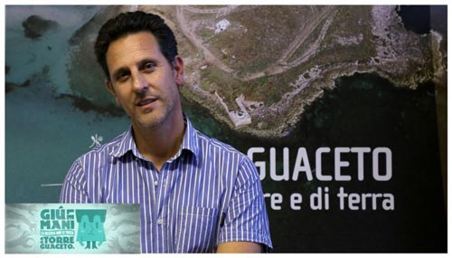
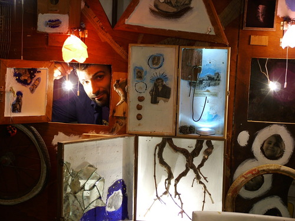

Oggi ho capito una grandissima cosa: quando sei in prossimità delle feste natalizie, reduce da tutta la stanchezza dell'anno, con gli occhi crepati che implorano riposo e la mente focalizzata unicamente sulla parola "ferie", cliccare la voce "Immagini" di Google non è una buona idea, specie se le parole che hai inserito nel motore di ricerca sono "Riserva Naturale di Torre Guaceto". È un po' come dire "Paradiso terrestre"...

Fate un esperimento e provate a digitare il nome della Riserva: visualizzerete tutta una serie di immagini incredibili che appartengono ad un'Italia selvaggia, marittima e meravigliosamente calda e soleggiata.

Insomma, la giornata di oggi è iniziata così, con un'enorme tazza di caffè fumante, una caterva di lavoro da sbrigare, la chiara consapevolezza di dover andare in ferie al più presto per non diventare un William "Bill" Foster (il personaggio interpretato da Michael Douglas nel film "Un giorno di ordinaria follia" di Joel Schumacher)...e tanta, tantissima voglia di visitare la Riserva Naturale di Torre Guaceto!

Qualche tempo fa, googlando in merito a questo paradiso, sono venuta a conoscenza di una bella cooperativa, Thalassia ([www.cooperativa-thalassia.it](http://www.cooperativa-thalassia.it)), nata come società di attività e servizi per il suddetto parco brindisino.

Visitando il loro sito si scopre che musicisti, attori, compagnie teatrali, maestri, guide naturalistiche, animatori, astrofili e tecnici ambientali collaborano per dar vita a tutta una serie di attività che spaziano dall'educazione ambientale alle attività escursionistiche, dal teatro all'ecoturismo.

E siccome questo connubio arte-ambiente m'intriga parecchio, ho pensato di intervistare Antonio Fiume, Amministratore Unico della cooperativa in questione nonché fotografo naturalista ed esperto di gestione aziendale e conduzione d'impresa.

Scopriamola un po' più nel dettaglio, questa Thalassia...

### Salve, Dott. Fiume, benvenuto su MyHumus. Ci dica, quando e come nasce la cooperativa Thalassia?

> "Ciao Anna. La cooperativa Thalassia nasce nel 2001 insieme all'istituzione della [Riserva di Torre Guaceto](http://www.riservaditorreguaceto.it) proprio come società di attività e servizi per il parco brindisino.
> 
> Negli anni cresce e si evolve fino ad occuparsi, professionalmente e con passione, su scala nazionale e non solo, di progetti connessi alle tematiche dello sviluppo sostenibile, dell'educazione ambientale e della cittadinanza attiva nelle sue diverse forme e linguaggi.
> 
> La cooperativa ha ottenuto, nel 2007, la Certificazione DNV per il proprio sistema di gestione della qualità nella progettazione ed erogazione di servizi informativi, educativi e turistici relativamente alle tematiche ambientali".

### Certificazione DNV sta per...?

> "Si tratta della certificazione di qualità relativa ai processi di funzione della cooperativa. Nel 2012, però, abbiamo l'abbandonata".

### Di cosa vi occupate, esattamente?

> "Ci occupiamo di educazione ambientale, di teatro ambientale, di turismo sostenibile e di vendita al dettaglio di prodotti provenienti da agricoltura biologica".

### Da quali figure professionali è composto il vostro team?

> "La nostra squadra consta di un amministratore, di attori, scrittori, tecnici e guide naturalistiche, nonché di addetti alla segreteria e alle vendite".

### Per quanto concerne l'ecoturismo e l'educazione ambientale, che cosa propone Thalassia?

> "Proponiamo visite guidate nella Riserva di Torre Guaceto e nei parchi limitrofi. Organizziamo anche tour di più giorni.
>
> L'educazione ambientale si esercita tanto attraverso progetti rivolte alle scuole di ogni ordine e grado quanto tramite eventi naturalistici.
> 
> E poi ci sono gli spettacoli teatrali...".

[

### Consultando il sito, infatti, ho notato anche la voce "Teatro, arte, cittadinanza": mi piacerebbe saperne di più...

> "Il teatro, per noi, è uno strumento per parlare all'anima e al cuore e, sul nostro sito, c'è una [pagina](http://www.cooperativa-thalassia.it/teatroedeventiambientali.aspx) totalmente dedicata a questo tema e alle diverse produzioni.
> 
> Il teatro è anche uno strumento di partecipazione, di memoria e di nutrimento dei luoghi.
> 
> Crediamo molto nella cura delle storie quale humus che tiene vivo il paesaggio nella sua complessità".

### In quali studi ambientali siete coinvolti?

> "Abbiamo realizzato diverse mappe biocenotiche di tratti di costa del litorale pugliese e diversi studi legati all'avifauna".

### Cosa riservano i prossimi mesi?

> "Siamo impegnati nel [Teatro Comunale di Mesagne](http://www.teatropubblicopugliese.it/teatro/teatro-comunale_38.html) con una rassegna che si chiama [Rapimenti](http://www.cooperativa-thalassia.it/Home/tabid/88/aid/64/Default.aspx), dal momento che,al termine di ogni spettacolo, "rapiamo" letteralmente 16 persone del pubblico per far vivere loro un'esperienza segreta di bellezza e resistenza: un'esperienza unica per sperimentare un nuovo modo di essere e per essere spettatori non solo passivi.
> 
> Inoltre, porteremo il nostro progetto teatrale *La Grande Foresta* oltreoceano, in Cile".

